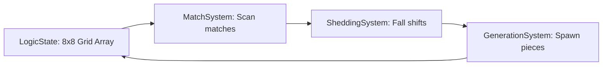

# Custom Skill: Godot Mobile Match-3 Development & CI/CD Automation

Этот навык предоставляет специализированные инструкции, шаблоны конфигураций и архитектурные паттерны для сборки, развертывания и проектирования высокопроизводительного, независимого от движка ядра Match-3 игры **Neo Soft Frost** на Godot 4.

---

## 1. Системы автоматизации и мобильный CI/CD

Автоматический экспорт избавляет от необходимости ручной настройки Android/iOS сред на локальной машине и обеспечивает мгновенное тестирование Web/Android сборок.

### 1.1 abarichello/godot-ci (GitHub Actions Workflow)
Создайте `.github/workflows/godot-ci.yml` для автоматической сборки Web и Android:

```yaml
name: "Godot CI/CD Mobile Build"
on:
  push:
    branches:
      - main
      - dev

jobs:
  export-web-android:
    runs-on: ubuntu-latest
    container:
      image: abarichello/godot-ci:4.5.1
    steps:
      - name: Checkout Code
        uses: actions/checkout@v4

      - name: Setup Godot Export Templates
        run: |
          mkdir -p ~/.local/share/godot/export_templates/
          mv /root/.local/share/godot/export_templates/${{ env.GODOT_VERSION }}.stable ~/.local/share/godot/export_templates/${{ env.GODOT_VERSION }}.stable

      - name: Export Web
        run: |
          mkdir -p build/web
          godot --headless --export-release "Web" build/web/index.html

      - name: Export Android APK
        run: |
          mkdir -p build/android
          # Требуется настроенный keystore в export_presets.cfg
          godot --headless --export-release "Android" build/android/NeoSoftFrost.apk

      - name: Archive Web Artifacts
        uses: actions/actions/upload-artifact@v4
        with:
          name: web-build
          path: build/web

      - name: Archive Android Artifacts
        uses: actions/actions/upload-artifact@v4
        with:
          name: android-apk
          path: build/android
```

### 1.2 firebelley/godot-export (Альтернативный экшен)
Позволяет гибко управлять релизами и экспортировать файлы напрямую через готовые экшены:

```yaml
      - name: Godot Android Export Action
        uses: firebelley/godot-export@v3.0.0
        with:
          godot_executable_download_url: https://downloads.tuxfamily.org/godotengine/4.5.1/Godot_v4.5.1-stable_linux_x186_64.zip
          export_preset_name: Android
          export_path: build/android/NeoSoftFrost.apk
```

### 1.3 Автоматический деплой демо-сборок на itch.io (butler-publish)
Используйте API Butler для автоматической загрузки Web/Android билдов в канал тестирования itch.io:

```yaml
      - name: Publish Web to itch.io
        uses: manleydev/butler-publish-itchio-action@master
        env:
          BUTLER_CREDENTIALS: ${{ secrets.ITCH_IO_BUTLER_TOKEN }}
          CHANNEL: web
          ITCH_GAME: neo-soft-frost
          ITCH_USER: deushare
          PACKAGE: build/web/
```

---

## 2. Архитектура: Controller-First Design (Шаблон Four Games)

Паттерн гарантирует строгую развязку отображения и логики. 
`Controller` является единственным источником мутаций и оркестрирует состояние игрового поля, в то время как `Views` (сцены фишек) не знают о координатах сетки и лишь отражают визуальные сдвиги на основе событий от шины `EventBus`.

### 2.1 Контракт Контроллера (GDScript 2.0)
```gdscript
extends RefCounted
class_name BoardController

signal match_resolved(matches_data: Array)
signal cascade_resolved(fall_movements: Array)
signal board_stabilized

var board_model: BoardModel
var match_system: MatchSystem
var gravity_system: SheddingSystem

func _init(model: BoardModel) -> void:
	board_model = model
	match_system = MatchSystem.new(board_model)
	gravity_system = SheddingSystem.new(board_model)

func handle_gem_swap(from: Vector2i, to: Vector2i) -> void:
	if not board_model.is_adjacent(from, to):
		return
		
	# Мгновенная логическая мутация модели в памяти
	board_model.swap_pieces(from, to)
	
	# Проверка совпадений
	var matches := match_system.find_matches()
	if matches.is_empty():
		# Отмена хода (Undo)
		board_model.swap_pieces(from, to)
		EventBus.emit_signal("swap_failed", from, to)
	else:
		EventBus.emit_signal("swap_approved", from, to, matches)
		_resolve_cascades()

func _resolve_cascades() -> void:
	var processing := true
	while processing:
		var matches := match_system.find_matches()
		if not matches.is_empty():
			# 1. Удаление логических гемов
			match_system.clear_matches(matches)
			EventBus.emit_signal("matches_cleared", matches)
			
			# 2. Применение гравитации (осыпание)
			var falls := gravity_system.apply_gravity()
			EventBus.emit_signal("gems_collapsed", falls)
			
			# 3. Спавн новых гемов на верхних границах
			var spawns := gravity_system.fill_empty_slots()
			EventBus.emit_signal("gems_spawned", spawns)
		else:
			processing = false
	EventBus.emit_signal("board_stabilized")
```

---

## 3. Математическое ядро Match-3 (Отвязанное от движка)

Для реализации непрерывного геймплея и автобалансировки уровней, математическое ядро полностью абстрагировано от визуальных нод и сцен.

### 3.1 Архитектура M3Engine
Игровое поле состоит из независимых систем, обрабатывающих логическое состояние (`LogicState`):



- **LogicState**: Плоский одномерный или двумерный массив целых чисел (ID фишек), содержащий также состояния препятствий (лед, стекло).
- **MatchSystem**: Алгоритмы поиска линий (Line Match-3, L-Match, T-Match). Сканирует поле за $O(N)$ проходов без аллокаций.
- **SheddingSystem (Осыпание)**: Расчет смещения столбцов вниз. Вместо физических сдвигов вычисляет индексы `from_cell -> to_cell` в плоском массиве данных.

---

## 4. Симуляции MCTS (Monte Carlo Tree Search)

Автобалансировка 10 уровней сложности достигается с помощью headless-симулятора игрока. Агент на каждом шаге строит дерево возможных ходов и оценивает вероятность победы с помощью MCTS алгоритма.

### 4.1 Алгоритм MCTS симулятора (Python 3 Референс / GDScript-эквивалент)
```python
class MCTSNode:
    def __init__(self, state, parent=None):
        self.state = state  # Логический слепок поля
        self.parent = parent
        self.children = []
        self.visits = 0
        self.wins = 0

    def select(self):
        # Алгоритм UCB1 для выбора лучшей ветки
        return max(self.children, key=lambda c: (c.wins / c.visits) + 1.41 * math.sqrt(math.log(self.visits) / c.visits))

    def expand(self, possible_swaps):
        for swap in possible_swaps:
            next_state = self.state.simulate_swap(swap)
            self.children.append(MCTSNode(next_state, parent=self))
```

### 4.2 Преимущества Headless-валидации в Godot
- Прогон 10 000 симуляций уровня занимает менее 3 секунд.
- Позволяет строить графики «проходимости» (Win Rate %) каждого уровня.
- Точная калибровка: если Win Rate уровня 1 составляет 98%, а уровня 10 — 22%, баланс считается соответствующим кривой удержания игрока.
