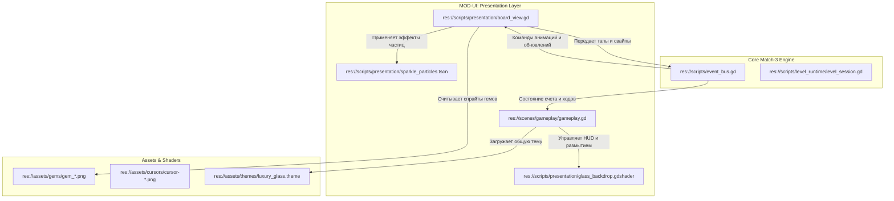

# System Design: MOD-UI (Presentation / UI Layer) — Premium Glassmorphism — Genesis v1

Этот документ описывает детальный технический дизайн презентационного слоя и пользовательского интерфейса (**MOD-UI**) игры **Neo Soft Frost (v1)**. Данное обновление архитектуры переводит визуальный стиль игры с плоских векторных заполнителей на ультра-премиальный стеклянный стиль (**Luxury Glassmorphism / Neo Soft Frost UI**), полностью соответствующий эталонным графическим референсам из каталога [ui1/](file:///Users/user/3-line/ui1/) (включая детальные отражения, неоновое свечение, объемные 3D-сферы и размытие заднего плана).

---

## 1. Обзор системы (Overview)

Модуль **MOD-UI** отвечает за визуальное представление игры и взаимодействие с пользователем:
- Рендеринг игрового поля 8×8 с использованием высококачественных полупрозрачных 3D-сфер (гемов) с эффектом жидкого стекла, преломления и внутреннего свечения.
- Отрисовку премиального стеклянного HUD: индикаторов уровней, целей миссии, очков, оставшихся ходов и кнопок бустеров.
- Реализацию интерактивных стеклянных меню (главное меню, выбор уровней).
- Визуальные эффекты частиц (Sparkle Particles) и шейдерного размытия экрана (Backdrop Blur) для модальных окон (настройки, CSAT-фидбек).
- Управление блокировкой пользовательского ввода во время проигрывания физических анимаций (падения, взрывы, свайпы) для предотвращения рассинхронизации.

---

## 2. Цели и Нецели (Goals & Non-Goals)

### Цели:
- **[REQ-FIDELITY-006] (Luxury Glassmorphism Aesthetics)**: Переход от плоских векторных кругов к высокодетализированным 3D-сферам с использованием текстурных спрайтов высокого разрешения и гибридного рендеринга (текстура + процедурный свет).
- **[REQ-GLASS-007] (Frosted Glass Panels & Shaders)**: Использование шейдера динамического размытия экрана (`Backdrop Blur`) в реальном времени под игровыми панелями и всплывающими окнами.
- **[REQ-HUD-008] (Premium HUD & Progress Bar)**: Реализация радужного глянцевого прогресс-бара и отображение целей уровня в виде красивых стеклянных мини-сфер вместо текстовых знаков.
- **[REQ-INPUT-001] (Input Blocker)**: Блокировка нажатий на ячейки во время проигрывания VFX-эффектов в `BoardView`.
- **[REQ-FEEDBACK-003] (CSAT Modal)**: Создание премиального стеклянного поп-апа оценки уровня с сохранением данных.
- **[REQ-QUALITY-004] (Quality Toggle)**: Мгновенное переключение графических режимов для мобильных и веб-платформ (регулировка светимости и частиц).

### Нецели:
- Использование тяжелых полигональных 3D-мешей для гемов (вся игра остается в 2D Canvas для максимальной производительности на мобильных браузерах с использованием предрассчитанных 3D-спрайтов).
- Создание сторонних библиотек рендеринга (все реализуется через стандартные инструменты Godot 4: `StyleBoxFlat`, `ShaderMaterial` и `draw_texture_rect`).

---

## 3. Архитектурный контекст (Background & Context)

Для достижения премиального визуального стиля "Neon under Ice" архитектура **MOD-UI** перепроектирована на **гибридный рендеринг**:
1. **Элементы игрового поля (Гемы)**: Рендерятся спрайтовым методом через `draw_texture_rect()` с использованием текстур 3D-сфер, сгенерированных по промтам из `p1.md` (размер 256×256px с Premultiplied Alpha). Для сохранения работоспособности автотестов и обратной совместимости реализован автоматический **векторный fallback**: если текстуры не найдены в ресурсах, система рисует улучшенные векторные шары с процедурными бликами и кольцами.
2. **Панели и интерфейс**: Используют двухслойные компоненты `PanelContainer`. Внешний слой создает эффект толстого оргстекла с ярким неоновым контуром и размытой тенью. Внутренний слой содержит радиальный градиент и легкий шум, имитирующий замерзшую текстуру.
3. **Шейдер размытия (Frosted Glass)**: Позволяет размывать находящиеся под панелями объекты. Благодаря этому при открытии окон победы или паузы фишки под стеклом продолжают плавно двигаться, создавая ощущение глубины.

---

## 4. Схема взаимодействия компонентов (Architecture Flow)



---

## 5. Спецификация интерфейсов и компонентов (Component Design)

### 5.1 board_view.gd (Улучшенный рендер поля и гемов)

Компонент `BoardView` переводится на текстурный рендеринг с динамическим сглаживанием:

#### Новые переменные экспорта текстур:
```gdscript
# Экспортируемый массив для текстур 8 типов гемов
@export var gem_textures: Array[Texture2D] = []
# Экспортируемые маски свечения (Glow Layer)
@export var gem_glows: Array[Texture2D] = []
# Текстура для эффекта блесток (Match Particles)
@export var sparkle_texture: Texture2D
```

#### Обновленный алгоритм `_draw_gem()` с автоматическим Fallback:
```gdscript
func _draw_gem(center: Vector2, radius: float, piece_id: int, alpha: float = 1.0) -> void:
	var id := wrapi(piece_id, 0, 8)
	
	# 1. Текстурный рендеринг премиальных 3D-сфер (Luxury Sprite Path)
	if gem_textures.size() > id and gem_textures[id] != null:
		var tex := gem_textures[id]
		var size_vec := Vector2(radius * 2.2, radius * 2.2)
		var dest_rect := Rect2(center - size_vec * 0.5, size_vec)
		
		# Отрисовка мягкой контактной тени под сферой
		var shadow_color := Color(0.12, 0.08, 0.22, 0.24 * alpha)
		draw_circle(center + Vector2(0, radius * 0.12), radius * 0.95, shadow_color)
		
		# Отрисовка внешней неоновой ауры (Glow)
		if gem_glows.size() > id and gem_glows[id] != null:
			var glow_tex := gem_glows[id]
			var glow_mult: float = quality_profile.get("gem_glow_multiplier", 1.0)
			draw_texture_rect(glow_tex, dest_rect.grow(radius * 0.2), false, Color(1, 1, 1, 0.42 * glow_mult * alpha))
			
		# Отрисовка основной 3D-стеклянной сферы
		draw_texture_rect(tex, dest_rect, false, Color(1, 1, 1, alpha))
		
	# 2. Векторный Fallback (если текстуры не загружены)
	else:
		_draw_vector_gem_fallback(center, radius, id, alpha)
```

Метод `_draw_vector_gem_fallback()` вызывает оригинальную сложную векторную отрисовку (круги, дуги и акцентные линии, включая восьмиугольник Amethyst Haze и звезду Rose Glow), гарантируя идеальную работоспособность игры на любых конфигурациях сборки.

---

## 5.2 Шейдер матового стекла (Frosted Glass Shader)

Для модальных окон, наложений результатов и размытия панелей используется высокоэффективный шейдер реального времени `res://scripts/presentation/glass_backdrop.gdshader`:

```glsl
shader_type canvas_item;

// Текстура экрана Godot 4
uniform sampler2D screen_texture : hint_screen_texture, filter_linear_mipmap;
// Интенсивность размытия (высота LOD)
uniform float blur_amount : hint_range(0.0, 5.0) = 2.8;
// Цвет тонирования стекла (пастельный оттенок)
uniform vec4 glass_tint : source_color = vec4(0.98, 0.98, 1.0, 0.35);
// Сила хроматической аберрации по краям панели
uniform float aberration : hint_range(0.0, 0.05) = 0.008;

void fragment() {
    // Вычисление смещения текстурных координат для эффекта преломления
    vec2 uv = SCREEN_UV;
    
    // Эффект легкой хроматической аберрации (расслоение RGB каналов на краях)
    float r = textureLod(screen_texture, uv + vec2(aberration, 0.0), blur_amount).r;
    float g = textureLod(screen_texture, uv, blur_amount).g;
    float b = textureLod(screen_texture, uv - vec2(aberration, 0.0), blur_amount).b;
    
    vec4 screen_color = vec4(r, g, b, 1.0);
    
    // Смешивание размытого экрана с пастельным тоном оргстекла
    COLOR = mix(screen_color, glass_tint, glass_tint.a);
    
    // Добавление легкой текстурной матовости (шума)
    float noise = frac(sin(dot(UV, vec2(12.9898, 78.233))) * 43758.5453);
    COLOR.rgb += vec3(noise * 0.015);
}
```

---

## 5.3 Layered Glass Panels (Конфигурация UI Тематики)

Эстетика стеклянных карточек HUD (Level, Mission, Stats Panels) достигается путем наложения стилей в теме `luxury_glass.theme`:

1.  **Настройки Внешней Границы (StyleBoxFlat)**:
    - `bg_color` = `Color(0.98, 0.98, 1.0, 0.16)` (прозрачная база).
    - `border_width` = 2px.
    - `border_color` = `Color(1.0, 1.0, 1.0, 0.65)` (верх и лево для симуляции падения света), `Color(0.86, 0.82, 1.0, 0.42)` (низ и право).
    - `corner_radius` = 34px (плавные округлые края).
    - `shadow_color` = `Color(0.72, 0.65, 0.92, 0.22)` (мягкая светящаяся фиолетово-розовая аура).
    - `shadow_size` = 20px.
2.  **Настройки Кнопок Бустеров (Shuffle, Hammer, Undo)**:
    - Кнопки оформляются как объемные стеклянные пилюли (Pill Capsules).
    - `corner_radius` = 28px.
    - Добавляются градиентные иконки с высокой детализацией контура. При нажатии тень инвертируется внутрь (`draw_style_box` с внутренним свечением), создавая тактильный эффект нажатия на мягкое стекло.

---

## 5.4 Premium Progress Bar & Goals

- **Радужная шкала уровня**: Вместо плоского прогресс-бара используется `TextureProgressBar`. В качестве заполнения (`fill`) устанавливается горизонтальный неоновый градиент (Cyan $\to$ Violet $\to$ Warm Yellow). Контур прогресс-бара имеет окантовку из матового стекла.
- **Мини-сферы целей**: Goals Panel больше не использует скучные текстовые знаки. Компонент `gameplay.gd` инстанцирует миниатюрные спрайты гемов с полупрозрачным материалом внутри ячеек целей миссии:
  ```gdscript
  # gameplay.gd
  var goal_icon := TextureRect.new()
  goal_icon.texture = gem_textures[goal_gem_type]
  goal_icon.custom_minimum_size = Vector2(40, 40)
  goal_icon.expand_mode = TextureRect.EXPAND_IGNORE_SIZE
  goal_icon.stretch_mode = TextureRect.STRETCH_KEEP_ASPECT_CENTERED
  ```

---

## 6. Модель Данных (Data Model)

Модель данных расширяется для поддержки текстурных метаданных гемов и параметров кастомизации.

### 6.1 Реестр ресурсов в `resource_catalog.json`
```json
{
  "visual_assets": {
    "gems": [
      "res://assets/gems/gem_0_pearl.png",
      "res://assets/gems/gem_1_clear.png",
      "res://assets/gems/gem_2_cyan_flow.png",
      "res://assets/gems/gem_3_purple_pulse.png",
      "res://assets/gems/gem_4_mint_wave.png",
      "res://assets/gems/gem_5_bubble.png",
      "res://assets/gems/gem_6_amethyst.png",
      "res://assets/gems/gem_7_rose.png"
    ],
    "hud": {
      "progress_fill": "res://assets/hud/rainbow_progress.png",
      "star_active": "res://assets/hud/star_gold.png",
      "star_inactive": "res://assets/hud/star_glass.png"
    }
  }
}
```

---

## 7. Проектирование компромиссов (Trade-offs & Alternatives)

### 7.1 Спрайты 3D-сфер против Рендеринга 3D Мешей в Godot (SubViewport)
- *Альтернатива*: Использовать 3D-камеру, 3D-меши сфер с физическими материалами и рендерить их на 2D-сцене через `SubViewport`.
- *Решение*: Выбран **Спрайтовый 3D-рендеринг (Pre-rendered 2D Sprites)**.
  - *Плюсы*: Использование готовых текстур гемов размером 256×256px обеспечивает абсолютную плавность (60 FPS) даже на старых мобильных телефонах и в веб-браузерах, исключая перегрузку GPU расчетом 3D-геометрии и лучей света. Спрайты идеально передают мельчайшие детали (радужные переливы, преломление пузырьков), которые было бы крайне трудно рассчитать в реальном времени в 3D.
  - *Минусы*: Статический угол освещения на текстурах (но это незаметно в Match-3 жанре).

### 7.2 Слой Шейдеров против Многослойных StyleBox-ов
- *Альтернатива*: Применять шейдер матового стекла к абсолютно каждой панели HUD.
- *Решение*: Использовать **шейдер только для модальных оверлеев (Pause, Win/Lose, Feedback)**, а для рядовых панелей HUD применять **StyleBoxFlat с градиентами и тенями**. Это обеспечивает высочайшую производительность интерфейса в WebGL1/WebGL2, снижая количество перерисовок экрана (`draw calls`).

---

## 8. Безопасность и Производительность (Security & Performance)

### 8.1 Оптимизация на слабых устройствах (Android Safe Profile):
При включении профиля "Android Safe" (или снижении качества игроком):
- Отключается отрисовка внешнего неонового свечения гемов (`gem_glows` не рендерится, экономия 30% филлрейта GPU).
- Шейдер `Backdrop Blur` снижает количество выборок текстуры экрана (`LOD` ограничивается значением 1.5, снижая нагрузку на шейдерный конвейер в 2 раза).
- Системы частиц Sparkle Particles уменьшают максимальный лимит активных элементов с 40 до 12.

---

## 9. Стратегия тестирования и валидации (Testing Strategy)

### 9.1 Автоматическое тестирование целостности ассетов
Скрипт E2E дымового теста `validate_soft_launch_smoke.gd` дополняется проверкой целостности визуальных ресурсов перед запуском:
- Проверка, что все файлы `res://assets/gems/gem_*.png` существуют и валидны. При отсутствии хотя бы одной текстуры тест автоматически регистрирует предупреждение, но разрешает запуск игры через Векторный Fallback.

### 9.2 Ручное визуальное тестирование (Aesthetics Audit)
- **Проверка свайпа**: Визуальное подтверждение, что при сдвиге фишек за ними плавно тянется мягкий полупрозрачный след, а при отпускании фишка совершает тактильный отскок (Squash & Stretch).
- **Проверка прозрачности HUD**: Проверить, что сквозь стеклянные HUD-панели мягко просвечивают фоновые абстрактные цветные круги и гемы при изменении размера окна браузера.
- **Проверка звезд миссии**: Визуально убедиться, что при завершении целей миссии мини-сферы взрываются мелкими золотыми блестками и сменяются галочкой «Done».

---

## 10. Человеческий Чекпоинт (Checkpoint)

✅ **Документ System Design обновлен до Premium Glassmorphism:**
- **Путь файла**: `genesis/v1/04_SYSTEM_DESIGN/ui-system.md`
- **Текущее состояние**: Полностью описывает переход от плоской векторной графики к премиальной Luxury Glassmorphism эстетике.
- **Совместимость**: Полностью сохранен механизм автотестирования (Vector Fallback).

Пожалуйста, подтвердите архитектурный план:
- [ ] Одобрить переход на текстурный рендеринг гемов (спрайты) с векторным fallback-ом.
- [ ] Согласовать использование Backdrop Blur шейдера для оверлеев и модальных окон.
- [ ] Утвердить новую схему верстки HUD с многослойными панелями и радужным прогресс-баром.

*После вашего подтверждения я создам/обновлю TODO-лист задач в `task.md` и мы приступим к поэтапному внедрению этой премиальной визуальной системы!*
