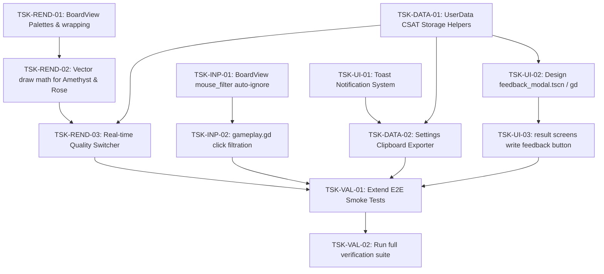

# Work Breakdown Structure (WBS) — Genesis v1

Этот документ содержит пошаговый, детальный план реализации задач (WBS) для доведения игры **Neo Soft Frost** до стабильного выпуска MVP релиза-кандидата (v1), готового к тестированию пользователями.

---

## 1. Обзор фаз разработки (Phase Overview)

Весь объем работ разделен на 5 последовательных фаз, от настройки базового визуального рендеринга до интеграции тестов:
- **Фаза 1: Визуальный рендеринг и Качество (Core Rendering & Quality)** — поддержка 8 фишек на доске и динамическое переключение графики.
- **Фаза 2: Синхронизация ввода (Input Safety)** — блокировка кликов во время проигрывания эффектов для исключения багов с рассинхронизацией.
- **Фаза 3: Локальная телеметрия (Telemetry Utility)** — сохранение CSAT-отзывов и копирование логов сессии в буфер обмена с HUD-тостами.
- **Фаза 4: Диалог обратной связи (CSAT Feedback UI)** — стеклянный модальный поп-ап с размытием заднего плана.
- **Фаза 5: Сквозное QA-тестирование (E2E Validation)** — расширение автотестов и финальный MCTS-прогон.

---

## 2. Граф зависимостей задач (Dependency Diagram)

Ниже представлен визуальный порядок выполнения задач. Стрелки указывают на блокирующие зависимости (блокирующая задача должна быть выполнена первой).

---

## 3. Детальный список задач (WBS Task List)

### Фаза 1: Визуальный рендеринг и Качество (Core Rendering & Quality)

#### [ ] **[TSK-REND-01] Подготовка BoardView к 8 видам фишек**
- **Цель**: Расширить внутренний маппинг `board_view.gd` и подготовить цветовые палитры для гемов 6 и 7, устраняя усечение до первых 6 видов фишек (High-риск S1).
- **Вход**: Спецификация [ADR_003_8_GEM_SUPPORT.md](file:///Users/user/3-line/genesis/v1/03_ADR/ADR_003_8_GEM_SUPPORT.md) и скрипт [board_view.gd](file:///Users/user/3-line/scripts/presentation/board_view.gd).
- **Выход**: Модифицированный скрипт `scripts/presentation/board_view.gd` (методы `_draw_gem` и `_get_palette`).
- **Верификация**: В методах `_draw_gem` и `_get_palette` функция `wrapi` заменена с `wrapi(piece_id, 0, 6)` на `wrapi(piece_id, 0, 8)`. Метод `_get_palette` возвращает валидные палитры для индексов 6 и 7.
- **Зависимости**: Нет.

#### [ ] **[TSK-REND-02] Векторная отрисовка Amethyst Haze & Rose Glow**
- **Цель**: Реализовать процедурное рисование контуров лавандового восьмиугольника с пульсирующими кольцами (ID 6) и спиральной розы (ID 7) в `board_view.gd`.
- **Вход**: Спецификации [ui-system.md](file:///Users/user/3-line/genesis/v1/04_SYSTEM_DESIGN/ui-system.md) и [gem_view.gd](file:///Users/user/3-line/scripts/presentation/gem_view.gd).
- **Выход**: Скрипт `scripts/presentation/board_view.gd` (методы `_draw_octagon_rings()`, `_draw_rose_spiral()`).
- **Верификация**: Запуск тестовой сцены подтверждает, что при генерации гемов 6 и 7 рисуются восьмиугольник с кольцом и роза с вращением соответственно, а не круги с пылью.
- **Зависимости**: [TSK-REND-01].

#### [ ] **[TSK-REND-03] Переключатель графических профилей в реальном времени**
- **Цель**: Связать переключатель графики в меню настроек с изменением Glow-альфы в `BoardView` для повышения FPS на Web и Android (REQ-QUALITY-004).
- **Вход**: Спецификация [01_PRD.md](file:///Users/user/3-line/genesis/v1/01_PRD.md) и файл [soft_launch_config.json](file:///Users/user/3-line/config/soft_launch_config.json).
- **Выход**: Скрипты `scripts/presentation/board_view.gd` (метод `set_quality_profile`) и UI настройки качества.
- **Верификация**: Вызов `set_quality_profile` с мобильным профилем (`Android Safe`) мгновенно снижает `gem_glow_multiplier` на 28%, фоновые альфа-эффекты на 22%, и вызывает `queue_redraw()`.
- **Зависимости**: [TSK-REND-02], [TSK-DATA-01].

---

### Фаза 2: Синхронизация ввода (Input Safety)

#### [ ] **[TSK-INP-01] Авто-mouse_filter блокировка в BoardView**
- **Цель**: Реализовать автоматическое переключение состояния `mouse_filter` в `BoardView` при наличии активных визуальных эффектов обрушения фишек (High-риск R1).
- **Вход**: Спецификация [ADR_002_INPUT_BLOCKING.md](file:///Users/user/3-line/genesis/v1/03_ADR/ADR_002_INPUT_BLOCKING.md) и метод `_has_active_effects()` в `board_view.gd`.
- **Выход**: Дополнение в `_process(delta)` в `scripts/presentation/board_view.gd`.
- **Верификация**: Во время проигрывания эффектов спавна, падения или взрыва гемов, `mouse_filter` переводится в `MOUSE_FILTER_IGNORE`, курсор руки сбрасывается. По окончании эффектов возвращается в `MOUSE_FILTER_STOP`.
- **Зависимости**: Нет.

#### [ ] **[TSK-INP-02] Фильтрация тапов ячеек в gameplay.gd**
- **Цель**: Заблокировать вызовы логических ходов в `gameplay.gd`, если презентационный слой доски находится в процессе проигрывания анимаций.
- **Вход**: Спецификация [01_PRD.md](file:///Users/user/3-line/genesis/v1/01_PRD.md) и скрипт [gameplay.gd](file:///Users/user/3-line/scenes/gameplay/gameplay.gd).
- **Выход**: Обновление метода `_on_board_cell_pressed` в `scenes/gameplay/gameplay.gd`.
- **Верификация**: Если `board_visual._has_active_effects()` возвращает `true`, клик по ячейке сбрасывается и не генерирует сигналы в `EventBus`.
- **Зависимости**: [TSK-INP-01].

---

### Фаза 3: Локальная телеметрия (Telemetry Utility)

#### [ ] **[TSK-DATA-01] Методы сохранения отзывов в UserData**
- **Цель**: Расширить логику `UserData` для сохранения CSAT-оценок и формирования агрегированного JSON-пакета тестера.
- **Вход**: Спецификация [ADR_004_CSAT_FEEDBACK.md](file:///Users/user/3-line/genesis/v1/03_ADR/ADR_004_CSAT_FEEDBACK.md) и скрипт `scripts/level_runtime/user_data.gd`.
- **Выход**: Обновление скрипта `scripts/level_runtime/user_data.gd`.
- **Верификация**: Вызов `UserData.save_feedback(1, 5, "Nice!")` успешно записывает данные в секцию `feedback` файла `user://save_data.cfg`.
- **Зависимости**: Нет.

#### [ ] **[TSK-UI-01] HUD-система тост-уведомлений (Toast Notification)**
- **Цель**: Создать премиальный стеклянный UI-компонент Toast для вывода коротких статусных сообщений (например, "Logs copied!").
- **Вход**: Визуальные референсы из [ui1/](file:///Users/user/3-line/ui1/).
- **Выход**: Сцена `scenes/menus/toast_notification.tscn` / `toast_notification.gd`.
- **Верификация**: Инстанцирование тоста выводит красивую размытую плашку с текстом, которая плавно исчезает (fade-out) через 2.0 секунды и удаляется из дерева.
- **Зависимости**: Нет.

#### [ ] **[TSK-DATA-02] Локальный экспортер логов в буфер обмена**
- **Цель**: Добавить в меню настроек кнопку копирования телеметрии и CSAT отзывов в системный буфер обмена в один клик.
- **Вход**: Спецификация [01_PRD.md](file:///Users/user/3-line/genesis/v1/01_PRD.md) и `DisplayServer.clipboard_set`.
- **Выход**: Кнопка «Export Logs» в настройках, привязанная к `UserData.get_formatted_test_logs()`.
- **Верификация**: Нажатие кнопки считывает `analytics_events.jsonl` + CSAT, копирует JSON в буфер обмена и спавнит Toast "Logs copied!".
- **Зависимости**: [TSK-DATA-01], [TSK-UI-01].

---

### Фаза 4: Диалог обратной связи (CSAT Feedback UI)

#### [ ] **[TSK-UI-02] Создание модального окна feedback_modal.tscn**
- **Цель**: Спроектировать сцену модального стеклянного окна обратной связи с выбором 5 звезд и полем ввода отзыва тестера.
- **Вход**: Дизайн-контракт [ui-system.md](file:///Users/user/3-line/genesis/v1/04_SYSTEM_DESIGN/ui-system.md) и референсы [ui1/](file:///Users/user/3-line/ui1/).
- **Выход**: Сцена `scenes/menus/feedback_modal.tscn` / `feedback_modal.gd` со Screen-reading blur шейдером на заднике.
- **Верификация**: Показ окна красиво размывает игровой процесс под ним. Выбор звезд (1-5) подсвечивает их желтым тоном. Нажатие «Submit» сохраняет данные и закрывает окно.
- **Зависимости**: [TSK-DATA-01].

#### [ ] **[TSK-UI-03] Интеграция кнопки фидбека в Win/Lose экраны**
- **Цель**: Добавить стеклянную кнопку «Write Feedback» на экраны результатов завершения уровня.
- **Вход**: Сценарии использования [01_PRD.md](file:///Users/user/3-line/genesis/v1/01_PRD.md) и скрипт [gameplay.gd](file:///Users/user/3-line/scenes/gameplay/gameplay.gd).
- **Выход**: Кнопка фидбека в сценах результатов победы/поражения.
- **Верификация**: При проигрыше или победе на уровне отображается кнопка «Write Feedback». При нажатии открывается `feedback_modal`.
- **Зависимости**: [TSK-UI-02].

---

### Фаза 5: Сквозное QA-тестирование (E2E Validation)

#### [ ] **[TSK-VAL-01] Расширение E2E автотеста для новых MVP фич**
- **Цель**: Добавить в дымовой автотест `validate_soft_launch_smoke.gd` имитацию тапов во время анимаций (проверка блокировки ввода) и триггер выгрузки логов.
- **Вход**: Скрипт `scripts/validation/validate_soft_launch_smoke.gd`.
- **Выход**: Обновленный автоматический E2E сценарий.
- **Верификация**: Запуск Godot в headless режиме с флагом дымового теста проходит успешно без зависаний шины EventBus.
- **Зависимости**: [TSK-REND-03], [TSK-INP-02], [TSK-DATA-02], [TSK-UI-03].

#### [ ] **[TSK-VAL-02] Финальный прогон балансировочного пакета и верификация**
- **Цель**: Прогнать полный комплект локальных автотестов, MCTS симуляторов и зафиксировать отсутствие регрессий сборки Web.
- **Вход**: Скрипт `simulate_levels.gd` и пайплайн валидации.
- **Выход**: Успешный отчет верификации, готовность к сборке релиз-кандидата MVP v1.
- **Верификация**: `simulate_levels.gd` проходит все 10 уровней с успешным балансом. Web-версия компилируется без предупреждений.
- **Зависимости**: [TSK-VAL-01].

---

## 4. Стратегия выполнения и распараллеливание (Execution Strategy)

### Критический путь (Critical Path):
`[TSK-REND-01]` → `[TSK-REND-02]` → `[TSK-REND-03]` → `[TSK-VAL-01]` → `[TSK-VAL-02]`

### Возможности для параллельной разработки:
Если над проектом работают два разработчика или агента одновременно, они могут разделить задачи следующим образом:
- **Поток А (Визуальный & Качество)**: Выполняет Фазу 1 (`REND-01` → `REND-02` → `REND-03`) и Фазу 2 (`INP-01` → `INP-02`).
- **Поток Б (Инструменты данных & CSAT UI)**: Выполняет Фазу 3 (`DATA-01` → `UI-01` → `DATA-02`) и Фазу 4 (`UI-02` → `UI-03`).
- **Слияние**: Объединяются в Фазе 5 (`VAL-01` → `VAL-02`) для полной сквозной приемки.
