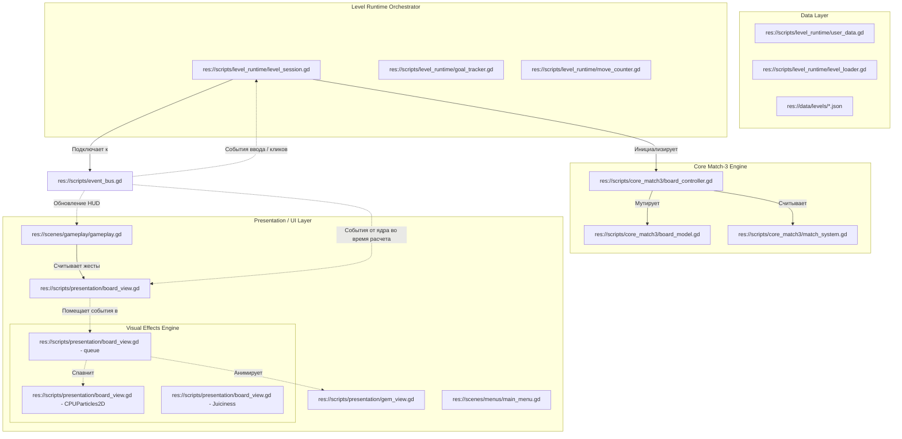

# Architecture Overview — Genesis v2

Этот документ описывает декомпозицию системы на независимые модули, их зоны ответственности и физическую структуру кодовой базы игры **Neo Soft Frost** для версии 2.0 (Premium UX/UI).

---

## 1. Декомпозиция системы (Separation of Concerns)

В соответствии с правилом `RULE-005` (Архитектурные запреты), игра разделена на 4 изолированных слоя, взаимодействие между которыми происходит исключительно через асинхронные события шины `EventBus`. 

В версии 2.0 в слой **Presentation** вводится **VisualEventQueue** — очередь визуальных шагов, которая считывает мгновенные синхронные события от ядра и разворачивает их во времени в виде плавных последовательных анимаций с паузами и комбо-эффектами.



### 1.1 Модули и Зоны ответственности

| Идентификатор | Модуль | Классы / Файлы | Зона ответственности | Зависимости |
|---|---|---|---|---|
| **MOD-CORE** | Core Match-3 | `board_model.gd`, `board_controller.gd`, `match_system.gd`, `swap_system.gd` | Чистая логика игрового поля. Полностью синхронен и изолирован от отрисовки и таймеров. Быстрый расчет ходов и обрушений. | Нет (Изолирован) |
| **MOD-RUN** | Level Runtime | `level_session.gd`, `goal_tracker.gd`, `move_counter.gd`, `score_system.gd` | Оркестрация матча: подсчет очков, лимит ходов, отслеживание целей, ведение снимков истории для отмены хода (Undo). | MOD-CORE, MOD-DATA |
| **MOD-DATA** | Data Layer | `user_data.gd`, `level_loader.gd`, `scoring.json`, `levels/*.json` | Персистентность: локальные сохранения, настройки качества, профиль пользователя, загрузка уровней. | Нет |
| **MOD-UI** | Presentation | `gameplay.gd`, `board_view.gd`, `gem_view.gd`, `main_menu.gd`, `sound_manager.gd` | Отрисовка UI, параллакс-меню, векторная процедурная визуализация игрового поля и анимированных сфер, взрывы сфер через CPUParticles2D, асинхронная очередь `VisualEventQueue` для воспроизведения каскадов с комбо-акцентами. | MOD-DATA (только чтение) |

---

## 2. Архитектура визуальной очереди (VisualEventQueue)

Для обеспечения пошаговой комбо-механики с паузами без нарушения синхронности ядра (что критично для симуляций), в `BoardView` интегрируется реактивный планировщик:

1.  **Накопление**: При прохождении хода ядро генерирует цепочку событий (`matches_resolved`, `board_collapsed`, `pieces_generated`) за одну миллисекунду. `BoardView` перехватывает их и помещает в массив `visual_queue` в виде структурированных задач.
2.  **Последовательное исполнение (Coroutine-based)**:
    *   При поступлении задач `BoardView` блокирует ввод (`InputBlocker` переводится в режим ожидания).
    *   Задачи извлекаются по принципу FIFO (First-In, First-Out).
    *   Каждый тип задачи (Match, Collapse, Refill) запускает свою визуализацию и приостанавливает выполнение очереди через `await get_tree().create_timer(duration).timeout` с добавлением пауз-задержек.
    *   После исчерпания очереди ввод разблокируется.
3.  **Комбо-счетчик**: Во время обработки `matches_resolved` отслеживается количество последовательных взрывов в пределах одного хода. Начиная с комбо x2, запускаются эффекты `ComboEmphasis` (тряска поля, неоновые лейблы, повышение pitch в звуках).

---

## 3. Физическая структура проекта (ASCII Tree)

```text
/Users/user/3-line/
├── config/
│   ├── resource_manifest.tsv     # Манифест внешних ресурсов
│   └── soft_launch_config.json   # Конфигурация Soft Launch (профили качества)
├── data/
│   ├── balance/
│   │   ├── research_backlog.json # Накопленный научный бэклог (Phases A-F)
│   │   └── scoring.json          # Константы начисления очков
│   └── levels/
│       ├── level_001.json        # Базовый обучающий уровень
│       └── ...                   # Уровни 002-010
├── docs/
│   ├── foundation/
│   │   ├── 07_CHALLENGE_REPORT.md # Отчет Challenger-а с фиксацией багов
│   │   ├── architecture.md       # Описание общей архитектуры
│   │   ├── master-blueprint-rules.md # 7 операционных правил разработки
│   │   └── mvp-mapping.md        # Маппинг фич на модули и NotebookLM источники
│   └── research/
│       └── stage-source-map.md   # Карта научных источников NotebookLM
├── genesis/
│   └── v2/                       # Новая архитектурная ветка MVP v2 (Premium UX/UI)
│       ├── 00_MANIFEST.md        # Манифест версии 2.0
│       ├── concept_model.json    # Модель понятий
│       ├── 01_PRD.md             # Продуктовые требования v2
│       ├── 02_ARCHITECTURE_OVERVIEW.md # Этот документ
│       ├── 03_ADR/               # Решения по архитектуре (ADR)
│       │   ├── ADR_001_TECH_STACK.md
│       │   ├── ADR_002_INPUT_BLOCKING.md
│       │   ├── ADR_003_8_GEM_SUPPORT.md
│       │   ├── ADR_004_CSAT_FEEDBACK.md
│       │   ├── ADR_005_CASCADE_SEQUENCING.md  # [NEW] Решение по очереди каскадов
│       │   ├── ADR_006_VFX_AND_SPHERE_AESTHETICS.md # [NEW] Решение по анимации сфер и VFX
│       │   └── ADR_007_PREMIUM_MENU.md        # [NEW] Решение по параллаксу и меню
│       ├── 06_CHANGELOG.md       # Журнал изменений версии
│       └── 07_INSTALLED_SKILLS.md # Установленные плагины
├── scenes/
│   ├── boot/
│   │   └── boot.tscn             # Сцена первой загрузки и E2E тестов
│   ├── gameplay/
│   │   ├── gameplay.gd           # Контроллер игрового HUD и наложения меню
│   │   └── gameplay_soft_frost.tscn # Игровая сцена в премиальном стиле
│   └── menus/
│       ├── main_menu.gd          # Контроллер премиум-меню с параллаксом слоев
│       ├── main_menu.tscn        # Главное меню с адаптивным интерфейсом
│       └── level_select.tscn     # Карта выбора 10 уровней
└── scripts/
    ├── core_match3/              # MOD-CORE:GDScript логика
    ├── level_runtime/            # MOD-RUN & MOD-DATA GDScript логика
    ├── presentation/             # MOD-UI:Векторная графика, звук, CPUParticles
    └── validation/               # QA-Гейты: MCTS симуляции и тесты читаемости
```
