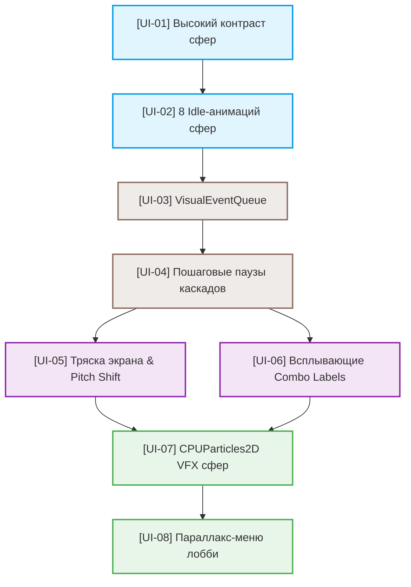

# Игровой план задач (WBS) — Версия 2.0 (Premium UX/UI & Combo System)

Этот документ содержит пошаговый план разработки (Work Breakdown Structure) для реализации Premium UX/UI и динамической комбо-системы. Все задачи разбиты на 4 последовательные фазы, имеют независимые критерии приемки, методы верификации и четко определенный граф зависимостей.

---

## 1. Обзор фаз разработки (Phases Overview)

- **Фаза 1: Премиальный визуальный стиль сфер (Aesthetics & Idle)**
  * Улучшение контрастности, добавление теней, бликов и сочных HSL-палитр для всех 8 видов сфер.
  * Реализация 8 уникальных сценариев десинхронизированного "живого" дыхания сфер в состоянии покоя.
- **Фаза 2: Очередь визуальных каскадов (VisualEventQueue)**
  * Создание планировщика очереди визуальных событий `VisualEventQueue` в `BoardView`.
  * Реализация пошагового выполнения взрывов, падений иRefill-спавнов сфер с задержками и блокировкой ввода.
- **Фаза 3: Сочные комбо-акценты (Juice & Immersive Feedbacks)**
  * Добавление Screen Shake (вибрации камеры) при взрывах, растущей с уровнем комбо.
  * Реализация нарастания тона звуков (Pitch Shift +15% за шаг) и неонового всплывающего лейбла Combo Label.
- **Фаза 4: Уникальные VFX взрывы и премиальное лобби (Particles & Parallax Lobby)**
  * Процедурный спавн индивидуальных `CPUParticles2D` частиц разрушения под стихию каждого гема.
  * Переработка главного меню: 3-слойный мышиный параллакс фона и стеклянные интерактивные кнопки.

---

## 2. Граф зависимостей задач (Mermaid Dependency Graph)

---

## 3. Детальный список задач (WBS Task List)

### Фаза 1: Премиальный визуальный стиль сфер (Aesthetics & Idle)

- [ ] **[UI-01] Высокий контраст и четкость силуэтов сфер**
  * **Цель**: Повысить читаемость и сделать силуэты всех 8 видов сфер сочными на любом фоне, добавив объемные тени, ободки и блики.
  * **Вход**: Спецификация [01_PRD.md](file:///Users/user/3-line/genesis/v2/01_PRD.md) и код [board_view.gd](file:///Users/user/3-line/scripts/presentation/board_view.gd).
  * **Выход**: Обновленный метод `_draw_gem()` и HSL-палитра `_get_palette()` в [board_view.gd](file:///Users/user/3-line/scripts/presentation/board_view.gd).
  * **Верификация**: Запустить readability-тест через `godot --headless -s scripts/presentation/readability_test.gd` и визуально подтвердить четкость границ сфер на светлом фоне.
  * **Зависимости**: Нет

- [ ] **[UI-02] 8 сценариев асинхронных Idle-анимаций покоя**
  * **Цель**: Оживить игровое поле, наделив каждый тип сферы индивидуальным, асинхронным и десинхронизированным (через `randf_range`) циклом анимации покоя (пульсация, вращение ротора, пузырьки).
  * **Вход**: Спецификация [01_PRD.md](file:///Users/user/3-line/genesis/v2/01_PRD.md) и примеры из `gem_view.gd` (0-7 типы).
  * **Выход**: Интеграция сценариев Idle в метод `_draw_gem()` в [board_view.gd](file:///Users/user/3-line/scripts/presentation/board_view.gd).
  * **Верификация**: Запустить игровой превью и убедиться, что гем Amethyst Haze медленно вращает орбиты, гем Rose Glow крутит розу, а Frost Pearl испускает пузырьки, и все они пульсируют не синхронно друг с другом.
  * **Зависимости**: [UI-01]

---

### Фаза 2: Очередь визуальных каскадов (VisualEventQueue)

- [ ] **[UI-03] Создание VisualEventQueue планировщика событий**
  * **Цель**: Внедрить асинхронный планировщик `visual_queue` в `BoardView`, перехватывающий синхронные события от ядра для их последующей пошаговой анимации.
  * **Вход**: Архитектурный обзор [02_ARCHITECTURE_OVERVIEW.md](file:///Users/user/3-line/genesis/v2/02_ARCHITECTURE_OVERVIEW.md#L42-L60) и [board_view.gd](file:///Users/user/3-line/scripts/presentation/board_view.gd).
  * **Выход**: Переменная `visual_queue: Array[Dictionary]`, методы `_queue_visual_event()` и `_process_visual_queue()` в [board_view.gd](file:///Users/user/3-line/scripts/presentation/board_view.gd).
  * **Верификация**: Навесить `print_debug` логи в очередь; совершить свайп и убедиться, что взрывы, падения и Refill-спавны последовательно складываются в очередь FIFO, а не проигрываются параллельно.
  * **Зависимости**: [UI-02]

- [ ] **[UI-04] Пошаговые паузы каскадов и Input Blocker**
  * **Цель**: Разделить анимации каскада на четкие фазы с временными задержками (взрыв: 0.38s + пауза 0.25s, падение: 0.28s, спавн: 0.34s + пауза 0.15s), блокируя ввод игрока на протяжении всего цикла каскадов.
  * **Вход**: Спецификация [01_PRD.md](file:///Users/user/3-line/genesis/v2/01_PRD.md) (Cascade Sequencer).
  * **Выход**: Доработка асинхронного цикла прокрутки очереди `_process_visual_queue()` с использованием `await get_tree().create_timer().timeout` в [board_view.gd](file:///Users/user/3-line/scripts/presentation/board_view.gd).
  * **Верификация**: Собрать линию совпадений, убедиться, что геймплей плавно "замирает" на 0.25 сек во время взрыва, давая игроку рассмотреть образовавшийся матч, затем сферы падают, и через 0.15 сек залетают новые. Быстрые клики по полю во время каскадов должны полностью блокироваться.
  * **Зависимости**: [UI-03]

---

### Фаза 3: Сочные комбо-акценты (Juice & Immersive Feedbacks)

- [ ] **[UI-05] Тряска экрана (Screen Shake) и Combo Pitch Shift**
  * **Цель**: Создать сочную отдачу от автоматических цепных каскадов, добавляя вибрацию поля и повышая тональность звука взрывов и приземлений сфер на +15% за уровень комбо.
  * **Вход**: Спецификация [01_PRD.md](file:///Users/user/3-line/genesis/v2/01_PRD.md) (Combo Juice).
  * **Выход**: Переменная `combo_index: int`, логика тряски доски `_apply_screen_shake()` в [board_view.gd](file:///Users/user/3-line/scripts/presentation/board_view.gd) и Pitch-Scaling в [sound_manager.gd](file:///Users/user/3-line/scripts/sound_manager.gd).
  * **Верификация**: Вызвать двойное комбо, услышать прогрессивное нарастание высоты тона звуков приземлений (с 1.0 до 1.15 и 1.3), и зафиксировать мягкую тряску игрового поля на шаге 2 (комбо x2) и шаге 3 (комбо x3).
  * **Зависимости**: [UI-04]

- [ ] **[UI-06] Всплывающие неоновые надписи (Combo Labels)**
  * **Цель**: Оповещать игрока о сочных комбо с помощью красивого всплывающего текста ("Combo x2! Nice!", "Combo x3! Spectacular!") с неоновым фиолетовым свечением в центре игрового поля.
  * **Вход**: Спецификация [01_PRD.md](file:///Users/user/3-line/genesis/v2/01_PRD.md) (Combo Label).
  * **Выход**: Процедурный спавн и Tween-анимация масштаба/альфы всплывающего лейбла в [board_view.gd](file:///Users/user/3-line/scripts/presentation/board_view.gd).
  * **Верификация**: Достичь комбо x2 и увидеть, как в центре доски на 1.0 сек плавно вылетает и растворяется текст "Combo x2! Nice!".
  * **Зависимости**: [UI-04]

---

### Фаза 4: Уникальные VFX взрывы и премиальное лобби (Particles & Parallax Lobby)

- [ ] **[UI-07] Уникальные стихийные VFX взрывы через CPUParticles2D**
  * **Цель**: Создать тактильную иммерсию разрушения сфер, спавня для каждого из 8 типов гемов индивидуальный процедурный эффект CPUParticles2D (вихрь лепестков роз, россыпь ледяных кристаллов, водяные брызги).
  * **Вход**: Спецификация [01_PRD.md](file:///Users/user/3-line/genesis/v2/01_PRD.md) (REQ-VFX-009) и цветовые палитры сфер.
  * **Выход**: Метод `_spawn_unique_vfx(position, gem_type)` в [board_view.gd](file:///Users/user/3-line/scripts/presentation/board_view.gd), генерирующий и автоматически удаляющий настроенную ноду `CPUParticles2D`.
  * **Верификация**: Взорвать Rose Glow (7) и увидеть спиральный разлет 16 коралловых лепестков. Взорвать Ice Spark (2) и зафиксировать острые бьющие осколки. Все системы частиц должны автоматически делать `queue_free()` через 0.6 секунд.
  * **Зависимости**: [UI-05], [UI-06]

- [ ] **[UI-08] Премиальное главное меню с глубоким мышиным параллаксом**
  * **Цель**: Впечатлить игрока с первого кадра, заменив старое меню на роскошное лобби с трехслойным интерактивным параллаксом фона (Gradient -> Clouds -> Stars), сдвигающимся за мышью, и глянцевыми стеклянными кнопками.
  * **Вход**: Спецификация [01_PRD.md](file:///Users/user/3-line/genesis/v2/01_PRD.md) (REQ-MENU-010) и код [main_menu.gd](file:///Users/user/3-line/scenes/menus/main_menu.gd).
  * **Выход**: Обновленный [main_menu.gd](file:///Users/user/3-line/scenes/menus/main_menu.gd) и [main_menu.tscn](file:///Users/user/3-line/scenes/menus/main_menu.tscn).
  * **Верификация**: Запустить меню, поводить мышкой. Слои облаков и звезд должны смещаться с разной скоростью в противоположную от курсора сторону. При наведении на "Play" кнопка должна мягко увеличиваться, подсвечиваться золотом и проигрывать звук наведения.
  * **Зависимости**: [UI-07]

---

## 4. Стратегия выполнения (Execution Strategy)

1.  **Последовательное внедрение**:
    *   Рекомендуется выполнять задачи в строгом порядке `UI-01` $\to$ `UI-08`. Это гарантирует отсутствие "поломок" на стыке визуальных слоев и логики.
2.  **Обратная совместимость (Vector Fallback)**:
    *   Все Idle-анимации и рендеринг должны корректно работать как на растровых спрайтах, так и на процедурных векторных шейпах (fallback), предотвращая падение автотестов при отсутствии картинок.
3.  **Оптимизация под Web**:
    *   Процедурный спавн `CPUParticles2D` должен строго контролироваться, ограничивая количество частиц до 20 для предотвращения просадок кадров в браузерах.
