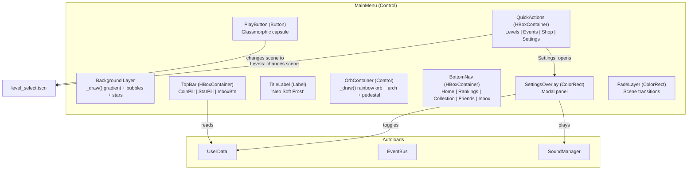

# Architecture Overview — Genesis v3 (Main Menu Redesign)

Этот документ описывает архитектуру переработанного главного меню игры **Neo Soft Frost** для версии 3.0 (Pastel Glassmorphism). Фокус — полная визуальная трансформация меню по референсному дизайну при сохранении существующей игровой архитектуры (MOD-CORE, MOD-RUN, MOD-DATA из v2).

---

## 1. Scope изменений

Версия 3 затрагивает **исключительно модуль MOD-UI (Presentation)**:

| Файл | Действие | Описание |
|---|---|---|
| `scenes/menus/main_menu.tscn` | **MODIFY** | Полная перестройка дерева нод: TopBar, OrbContainer, QuickActions, BottomNav |
| `scenes/menus/main_menu.gd` | **MODIFY** | Полная переработка: пастельная палитра, процедурный фон, радужная сфера, навигационные компоненты |

Все остальные модули (core_match3, level_runtime, data, boot, gameplay) **не затрагиваются**.

---

## 2. Архитектура UI-компонентов



---

## 3. Процедурный рендеринг `_draw()`

Вся графика главного меню отрисовывается процедурно без текстур:

### 3.1 Фон

```text
Layer 0: Вертикальный градиент (lavender → pink)
  └─ draw_rect() с интерполированным цветом по вертикали

Layer 1: Мягкие глоу-круги (3-4 штуки)
  └─ draw_circle() с parallax offset * 0.4
  └─ Цвета: лавандовый, голубой, розовый (alpha 0.08-0.15)

Layer 2: Радужные пузыри (6-8 штук)
  └─ draw_circle() + draw_arc() для iridescent rim
  └─ Parallax offset * 0.6-1.0
  └─ Медленный drift по синусоиде

Layer 3: Мерцающие крестовидные звёзды (12+ штук)
  └─ draw_line() крестом + draw_circle() центр
  └─ Пульсация яркости по sin(time + phase)
  └─ Parallax offset * 1.1

Layer 4: Подвесные ромбы на линиях
  └─ draw_line() вертикаль + draw_colored_polygon() ромб
  └─ Лёгкое покачивание по sin(time)
```

### 3.2 Центральная сфера (OrbContainer._draw)

```text
Base:      draw_circle() r=130, пастельный лавандовый
Rainbow 1: draw_circle() r=120, розовый (alpha 0.35, rotating offset)
Rainbow 2: draw_circle() r=110, голубой (alpha 0.3, counter-rotating)
Rainbow 3: draw_circle() r=100, жёлтый (alpha 0.25, pulsating)
Highlight: draw_circle() r=40, белый (alpha 0.65, top-left)
Rim glow:  draw_arc() r=135, белый (alpha 0.3)
Pedestal:  draw_ellipse emulation via scaled draw_circle()
Arch:      draw_arc() r=155, белый (alpha 0.2, top semicircle)
Sparkles:  8x draw_circle() r=2, белый (pulsating around orb)
```

---

## 4. Навигационная модель

```text
Main Menu
  ├─ Play → LevelSelect scene
  ├─ Levels → LevelSelect scene
  ├─ Events → Toast "Coming Soon"
  ├─ Shop → Toast "Coming Soon"
  ├─ Settings → Settings Overlay (modal)
  │   ├─ Sound Toggle
  │   ├─ Music Toggle
  │   ├─ Quality Toggle
  │   ├─ Export Logs
  │   └─ Close
  ├─ Home (active tab, noop)
  ├─ Rankings → Toast "Coming Soon"
  ├─ Collection → Toast "Coming Soon"
  ├─ Friends → Toast "Coming Soon"
  └─ Inbox → Toast "Coming Soon"
```

---

## 5. Физическая структура (изменения v3)

```text
scenes/menus/
├── main_menu.tscn        # [MODIFY] Полная перестройка дерева нод
├── main_menu.gd          # [MODIFY] Полная переработка скрипта
├── level_select.tscn     # Без изменений
├── level_select.gd       # Без изменений
├── feedback_modal.tscn   # Без изменений
├── toast_notification.*  # Без изменений
```

---

## 6. Совместимость и границы

- **UserData API**: Используется readonly (coins, level_stars, sound_enabled, music_enabled, quality_profile)
- **SoundManager API**: Используется для play("tap"), play("open"), play("close")
- **EventBus**: Не используется в меню (меню не генерирует игровых событий)
- **LevelLoader**: get_available_level_count() для progress summary
- **GemView**: Переиспользуется для floating decorations без изменений

---

## 7. Профили качества (наследование v2)

| Профиль | Параллакс | Частицы BG | Floating Gems | Звёзды |
|---|---|---|---|---|
| `web_default` | 3 слоя, mouse tracking | 35 particles | 7 gems | 12 stars |
| `android_safe` | 2 слоя, static | 15 particles | 4 gems | 6 stars |
