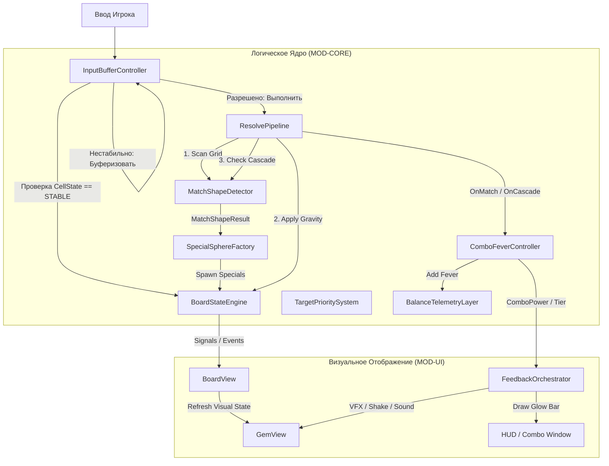

# Architecture Overview — Genesis v4 (Combo Fever Engine)

Этот документ описывает системную архитектуру **Combo Fever Engine (CFE)** — основного слоя реального времени для Match-3 игры **Neo Soft Frost**. Фокус версии 4.0 — отвязка логического состояния поля от визуальных нод движка, введение модели состояний ячеек, безопасная буферизация параллельного ввода игрока во время каскадов и построение системы аудиовизуальных градаций (Feedback Tier Ladder).

---

## 1. Системная декомпозиция (System Decomposition)

Combo Fever Engine состоит из 9 взаимосвязанных подсистем:

```text
ComboFeverEngine
├─ BoardStateEngine          — Логическая сетка, управление состояниями ячеек (Stable/Locked/Falling)
├─ MatchShapeDetector        — Математическое сканирование совпадений (линии, L/T, квадрат, крест, 6+, 7+)
├─ SpecialSphereFactory      — Фабрика для генерации и размещения спец-сфер на основе фигур
├─ ResolvePipeline           — FSM-автомат (Swap -> Match -> Resolve -> Gravity -> Cascade -> Stabilize)
├─ InputBufferController     — Валидация и буферизация ходов игрока (queued moves) во время анимаций
├─ TargetPrioritySystem      — Алгоритм выбора интеллектуальных целей для наводящихся эффектов
├─ ComboFeverController      — Отслеживание Combo Window, Fever Meter, расчет ComboPower по формуле
├─ FeedbackOrchestrator      — Аудиовизуальный микшер (VFX/SFX/UI Tier Ladder) и лимиты частиц
└─ BalanceTelemetryLayer     — Сборщик метрик игрового процесса и конфиг балансировки
```

---

## 2. Архитектура взаимодействия компонентов

Ниже представлена схема взаимодействия компонентов Combo Fever Engine во время игрового цикла:



---

## 3. Физическая структура кода

Новые и изменённые файлы распределены по следующим путям:

```text
/Users/user/3-line/
├── genesis/v4/                    # Документация архитектуры
│   ├── 00_MANIFEST.md
│   ├── concept_model.json
│   ├── 01_PRD.md
│   ├── 02_ARCHITECTURE_OVERVIEW.md
│   ├── 03_ADR/                    # Решения по подсистемам
│   ├── 04_SYSTEM_DESIGN/
│   │   └── combo_fever_engine.md  # Детальный дизайн
│   ├── 06_CHANGELOG.md
│   └── 07_INSTALLED_SKILLS.md
├── scripts/
│   ├── core_match3/               # Математическое ядро (Engine-Agnostic)
│   │   ├── cell_state.gd          # [NEW] Enum состояний ячейки
│   │   ├── board_state_engine.gd  # [NEW] Логическая сетка и состояния
│   │   ├── match_shape_detector.gd# [NEW] Распознаватель сложных фигур
│   │   ├── special_sphere_factory.gd # [NEW] Создание спец-элементов
│   │   ├── resolve_pipeline.gd    # [NEW] FSM-цепочка взрывов и каскадов
│   │   ├── input_buffer_controller.gd # [NEW] Буферизацияqueued moves
│   │   ├── combo_fever_controller.gd # [NEW] Combo Window и Fever Mode
│   │   ├── target_priority_system.gd # [NEW] Наведение на цели уровня
│   │   ├── feedback_orchestrator.gd # [NEW] Оркестратор эффектов (Tiers)
│   │   └── balance_telemetry_layer.gd # [NEW] Сбор метрик
│   └── level_runtime/             # Рантайм уровня
│       └── level_session.gd       # [MODIFY] Интеграция с CFE
└── scenes/
    └── gameplay/
        ├── gameplay.gd            # [MODIFY] Обработка HUD, Combo Window UI
        ├── gameplay.tscn          # [MODIFY] Добавление Combo Frame
        ├── board_visual.gd        # [MODIFY] Рендеринг и анимации ячеек
        └── gem_view.gd            # [MODIFY] VFX, шейдеры спец-сфер
```

---

## 4. Контракты интерфейсов (API Contracts)

### 4.1. BoardStateEngine (`board_state_engine.gd`)
```gdscript
# cell_state.gd
enum CellState {
    STABLE,      # Стабильна, готова к свайпу
    LOCKED,      # Участвует во взрыве
    FALLING,     # Находится в движении вниз
    SPAWNING,    # Создается новая сфера
    RESOLVING,   # Обрабатывается матч системой
    RESERVED,    # Зарезервированаqueued ходом
    BLOCKED,     # Препятствие
    TARGET       # Цель уровня
}

# board_state_engine.gd
class_name BoardStateEngine
extends RefCounted

signal cell_state_changed(cell: Vector2i, old_state: CellState, new_state: CellState)

var width: int
var height: int
var grid: Array # Двумерный массив ID сфер
var states: Array # Двумерный массив CellState

func is_cell_stable(cell: Vector2i) -> bool:
    return get_cell_state(cell) == CellState.STABLE

func set_cell_state(cell: Vector2i, state: CellState) -> void:
    # Установка состояния с эмитом сигнала
    ...
```

### 4.2. InputBufferController (`input_buffer_controller.gd`)
```gdscript
# input_buffer_controller.gd
class_name InputBufferController
extends RefCounted

struct QueuedMove:
    var from_cell: Vector2i
    var to_cell: Vector2i
    var created_at: float
    var expires_at: float
    var expected_from_gem_id: int
    var expected_to_gem_id: int

var queue: Array[QueuedMove] = []
var max_queue_size: int = 1
var buffer_lifetime: float = 0.5 # секунд

func enqueue_move(from: Vector2i, to: Vector2i, grid: BoardStateEngine) -> bool:
    # Буферизовать, если ячейки сейчас нестабильны, но освободятся
    ...
```

---

## 5. Модель совместимости (Backward Compatibility)
1. **Поддержка стандартных 3-матч ходов**: Если игрок не делает быстрых вводов, CFE работает как стандартная пошаговая Match-3 система.
2. **Интеграция с существующим LevelSession**: `LevelSession` делегирует управление матчами и каскадами новому `ResolvePipeline`, получая сигналы о начисленных очках, ходах и целях.
3. **Безопасный Fallback по производительности**: Слабые устройства (`android_safe`) отключают шейдеры преломления и снижают лимит VFX в `FeedbackOrchestrator` без изменения логики игры.
