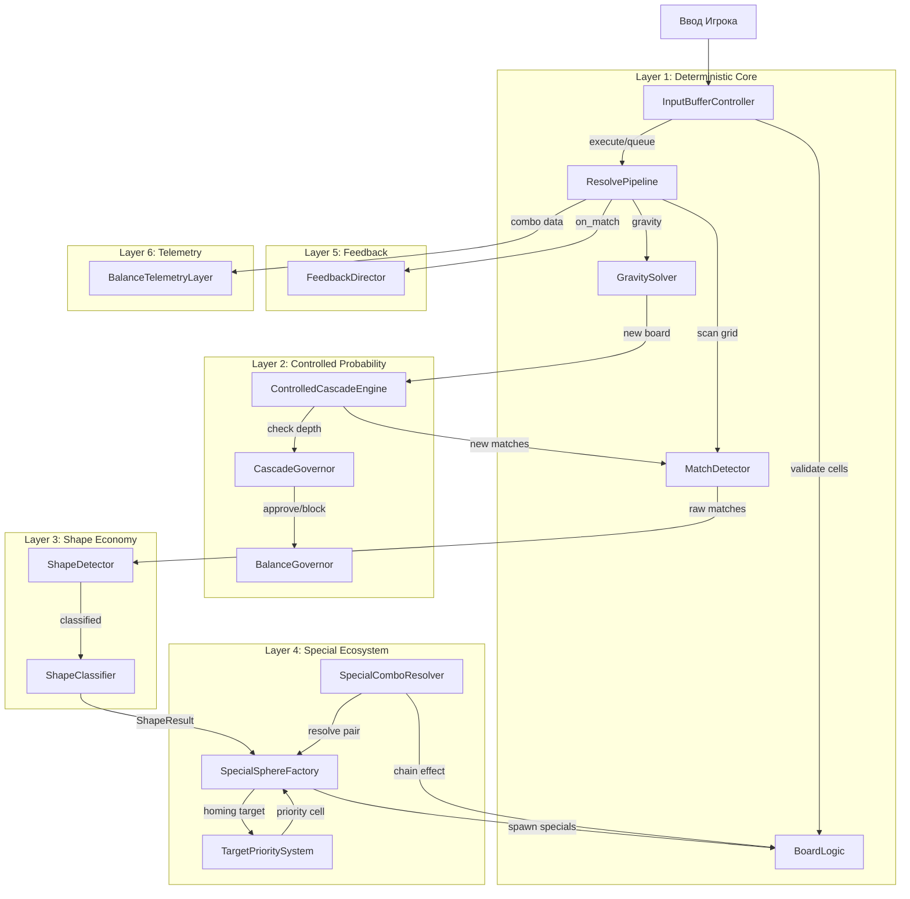

# Architecture Overview — Genesis v5 (Controlled Cascade Pleasure Engine)

Этот документ описывает системную архитектуру **Controlled Cascade Pleasure Engine (CCPE)** — production-ready эволюции Combo Fever Engine (v4) для Match-3 игры **Neo Soft Frost**. Фокус v5 — 6-слойная архитектура, расширенная экономика спец-сфер, контролируемые каскады, balance governance и UI/UX система из 10 экранов.

---

## 1. 6-Layer Architecture

```text
┌─────────────────────────────────────────────────────────┐
│                Layer 6: Telemetry + Auto-Balance         │
│   BalanceTelemetryLayer, MetricsCollector, AutoTuner     │
├─────────────────────────────────────────────────────────┤
│                Layer 5: Juicy Feedback Director           │
│   VfxDirector, SfxDirector, CameraJuiceDirector,         │
│   HapticsDirector, FloatingTitleDirector                 │
├─────────────────────────────────────────────────────────┤
│              Layer 4: Special Sphere Ecosystem            │
│   SpecialSphereFactory, SpecialComboResolver,            │
│   TargetPrioritySystem, SpecialActivationResolver        │
├─────────────────────────────────────────────────────────┤
│              Layer 3: Shape Economy                       │
│   ShapeDetector, ShapeClassifier, ShapeValueTable,       │
│   ProgressiveShapeUnlocker                               │
├─────────────────────────────────────────────────────────┤
│            Layer 2: Controlled Probability                │
│   ControlledCascadeEngine, DropRngController,            │
│   CascadeGovernor, BalanceGovernor                       │
├─────────────────────────────────────────────────────────┤
│              Layer 1: Deterministic Core                  │
│   BoardLogic, BoardState, BoardCell, GravitySolver,      │
│   MatchDetector, ResolvePipeline, InputBufferController   │
├─────────────────────────────────────────────────────────┤
│                     UI/UX Layer                           │
│   10 Screens: Loading, MainMenu, WorldMap, LevelPreview, │
│   GameplayHUD, Pause, LevelComplete, OutOfMoves,         │
│   DailyRewards, Shop                                     │
└─────────────────────────────────────────────────────────┘
```

---

## 2. Системная декомпозиция (15 подсистем)

### Layer 1: Deterministic Core
| ID | Система | Файл | Ответственность |
|---|---|---|---|
| SYS-01 | BoardLogic | `board_logic.gd` | Source of truth, состояния ячеек, валидация |
| SYS-02 | GravitySolver | `gravity_solver.gd` | Расчёт падений, gravity direction |
| SYS-03 | MatchDetector | `match_detector.gd` | Нахождение 3+ совпадений |
| SYS-04 | ResolvePipeline | `resolve_pipeline.gd` | FSM транзакционного цикла (v4 upgrade) |
| SYS-05 | InputBufferController | `input_buffer_controller.gd` | Queued input, combo window (v4 upgrade) |

### Layer 2: Controlled Probability
| ID | Система | Файл | Ответственность |
|---|---|---|---|
| SYS-06 | ControlledCascadeEngine | `controlled_cascade_engine.gd` | Natural/Assisted/Cinematic drop logic |
| SYS-07 | CascadeGovernor | `cascade_governor.gd` | Cascade depth limits, anti-infinite |
| SYS-08 | BalanceGovernor | `balance_governor.gd` | Lucky drop caps, anti-fake, anti-auto-win |

### Layer 3: Shape Economy
| ID | Система | Файл | Ответственность |
|---|---|---|---|
| SYS-09 | ShapeDetector | `shape_detector.gd` | 11 типов форм (upgrade from match_shape_detector) |
| SYS-10 | ShapeClassifier | `shape_classifier.gd` | Классификация, weight, complexity_score |

### Layer 4: Special Sphere Ecosystem
| ID | Система | Файл | Ответственность |
|---|---|---|---|
| SYS-11 | SpecialSphereFactory | `special_sphere_factory.gd` | 10 типов спец-сфер (upgrade) |
| SYS-12 | SpecialComboResolver | `special_combo_resolver.gd` | 15 комбинаций power-up+power-up |
| SYS-13 | TargetPrioritySystem | `target_priority_system.gd` | 10-level priority table (upgrade) |

### Layer 5: Juicy Feedback Director
| ID | Система | Файл | Ответственность |
|---|---|---|---|
| SYS-14 | FeedbackDirector | `feedback_director.gd` | VFX/SFX/Camera/Haptics cascade ladder |

### Layer 6: Telemetry + Auto-Balance
| ID | Система | Файл | Ответственность |
|---|---|---|---|
| SYS-15 | BalanceTelemetryLayer | `balance_telemetry_layer.gd` | Расширенные метрики (upgrade) |

### UI/UX System
| ID | Система | Ответственность |
|---|---|---|
| UI-01 | UIScreenManager | Управление переходами между экранами |
| UI-02 | 10 Screen Scenes | Loading, MainMenu, WorldMap, LevelPreview, Gameplay, Pause, LevelComplete, OutOfMoves, DailyRewards, Shop |

---

## 3. Архитектура взаимодействия (Event Pipeline)



---

## 4. Physical Code Structure

```text
/Users/user/3-line/
├── genesis/v5/                           # Architecture Docs
│   ├── 00_MANIFEST.md
│   ├── concept_model.json
│   ├── 01_PRD.md
│   ├── 02_ARCHITECTURE_OVERVIEW.md       # This file
│   ├── 03_ADR/
│   │   ├── ADR_001_TECH_STACK.md         # Inherited from v4
│   │   ├── ADR_002_RESOLVER_PIPELINE.md  # Inherited from v4
│   │   ├── ADR_003_INPUT_BUFFER_CONTROLLER.md
│   │   ├── ADR_004_MATCH_SHAPE_DETECTOR.md
│   │   ├── ADR_005_TARGET_PRIORITY_SYSTEM.md
│   │   ├── ADR_006_FEEDBACK_ORCHESTRATOR.md
│   │   ├── ADR_007_TELEMETRY_BALANCE_SYSTEM.md
│   │   ├── ADR_008_CONTROLLED_CASCADE.md   # [NEW]
│   │   ├── ADR_009_BALANCE_GOVERNOR.md     # [NEW]
│   │   └── ADR_010_UI_UX_SYSTEM.md         # [NEW]
│   ├── 04_SYSTEM_DESIGN/
│   │   ├── combo_fever_engine.md           # Inherited
│   │   ├── controlled_cascade_engine.md    # [NEW]
│   │   └── ui_ux_system.md                 # [NEW]
│   ├── 06_CHANGELOG.md
│   └── 07_INSTALLED_SKILLS.md
│
├── scripts/
│   ├── core_match3/                        # Layer 1-4 Logic
│   │   ├── cell_state.gd
│   │   ├── board_state_engine.gd          → board_logic.gd [RENAME]
│   │   ├── match_shape_detector.gd        → shape_detector.gd [UPGRADE]
│   │   ├── shape_classifier.gd            # [NEW]
│   │   ├── special_sphere_factory.gd      # [UPGRADE]
│   │   ├── special_combo_resolver.gd      # [NEW]
│   │   ├── controlled_cascade_engine.gd   # [NEW]
│   │   ├── cascade_governor.gd            # [NEW]
│   │   ├── balance_governor.gd            # [NEW]
│   │   ├── drop_rng_controller.gd         # [NEW]
│   │   ├── resolve_pipeline.gd            # [UPGRADE]
│   │   ├── input_buffer_controller.gd
│   │   ├── combo_fever_controller.gd
│   │   ├── target_priority_system.gd      # [UPGRADE]
│   │   ├── feedback_director.gd           # [UPGRADE from feedback_orchestrator]
│   │   ├── balance_telemetry_layer.gd     # [UPGRADE]
│   │   └── cascade_telemetry.gd           # [NEW]
│   └── level_runtime/
│       └── level_session.gd               # [MODIFY]
│
├── scenes/
│   ├── boot/
│   │   └── loading_screen.tscn            # [NEW/UPGRADE]
│   ├── menus/
│   │   ├── main_menu.tscn                 # [UPGRADE]
│   │   ├── world_map.tscn                 # [NEW]
│   │   ├── level_preview.tscn             # [NEW]
│   │   ├── daily_rewards.tscn             # [NEW]
│   │   └── shop.tscn                      # [NEW]
│   ├── gameplay/
│   │   ├── gameplay.tscn                  # [UPGRADE]
│   │   ├── gameplay.gd                    # [UPGRADE]
│   │   ├── board_visual.gd               # [UPGRADE]
│   │   ├── gem_view.gd
│   │   ├── pause_menu.tscn               # [NEW]
│   │   ├── level_complete.tscn            # [NEW]
│   │   └── out_of_moves.tscn             # [NEW]
│   └── ui/
│       ├── combo_window_ring.tscn
│       ├── fever_overlay.tscn
│       ├── cascade_title.tscn             # [NEW]
│       └── hud_panel.tscn                 # [NEW]
│
├── data/                                  # Configs (renamed from res://data)
│   ├── cascade_rules.json                 # [NEW]
│   ├── shape_rules.json                   # [NEW]
│   ├── special_spheres.json               # [UPGRADE from combo_special_matrix]
│   ├── combo_vfx_tiers.json              # [UPGRADE]
│   ├── level_balance_profiles.json        # [NEW]
│   ├── combo_fever_config.json
│   └── difficulty_profiles.json
│
├── debug/
│   └── telemetry_schema.json              # [UPGRADE]
│
├── tests/
│   ├── core_match3/
│   │   ├── test_board_state_engine.gd
│   │   ├── test_match_shape_detector.gd
│   │   ├── test_shape_classifier.gd       # [NEW]
│   │   ├── test_special_sphere_factory.gd
│   │   ├── test_special_combo_resolver.gd # [NEW]
│   │   ├── test_controlled_cascade.gd     # [NEW]
│   │   ├── test_cascade_governor.gd       # [NEW]
│   │   ├── test_balance_governor.gd       # [NEW]
│   │   ├── test_target_priority_system.gd
│   │   ├── test_combo_fever_controller.gd
│   │   ├── test_input_buffer_controller.gd
│   │   ├── test_resolve_pipeline.gd
│   │   └── test_feedback_director.gd      # [NEW]
│   └── e2e/
│       └── test_ccpe_e2e.gd               # [NEW]
│
└── ui1/
    └── screens 01/                        # Reference UI mockups (10 images)
```

---

## 5. Event Flow (Main Game Loop)

```text
PlayerSwapRequested
→ InputBufferController validates (CellState == STABLE?)
  → If STABLE: execute immediately via ResolvePipeline
  → If unstable: queue with expected_gem_id
→ ResolvePipeline enters MATCH_SCANNING
→ MatchDetector finds matches
→ ShapeDetector classifies pattern
→ ShapeClassifier returns ShapeResult (type, cells, center, weight)
→ SpecialSphereFactory decides spawn (shape → special, spawn_rule)
→ ResolvePipeline enters EFFECT_RESOLVING
  → If special combo swap: SpecialComboResolver handles
→ MatchResolver clears cells
→ FeedbackDirector plays tiered VFX/SFX (cascade ladder x1–x5+)
→ GravitySolver drops spheres
→ ControlledCascadeEngine evaluates new matches
  → DropRngController rolls (Natural/Assisted/Cinematic)
  → CascadeGovernor checks depth vs max
  → BalanceGovernor approves/blocks assisted
→ ComboFeverController receives charge
→ BalanceTelemetryLayer logs outcome
→ Board stabilizes
→ If queued move exists → execute next
```

---

## 6. Separation Rules

```text
BoardLogic = Source of Truth.
BoardLogic не знает про красоту.
VfxDirector не решает механику.
CascadeEngine не нарушает валидность поля.
BalanceGovernor может остановить любую цепь.
Visual никогда не мутирует логическое состояние.
Все числа баланса — в JSON.
Все risky-системы — за feature flags.
```

---

## 7. Backward Compatibility with v4

1. Все v4 подсистемы сохранены как base (BoardStateEngine → BoardLogic rename)
2. ResolvePipeline FSM расширен новыми states (CASCADE_GOVERNED, DROP_CONTROLLED)
3. v4 API contracts сохранены, новые сигналы добавляются аддитивно
4. Feature flags позволяют откатить v5 features к v4 поведению
5. Существующие тесты остаются валидными
