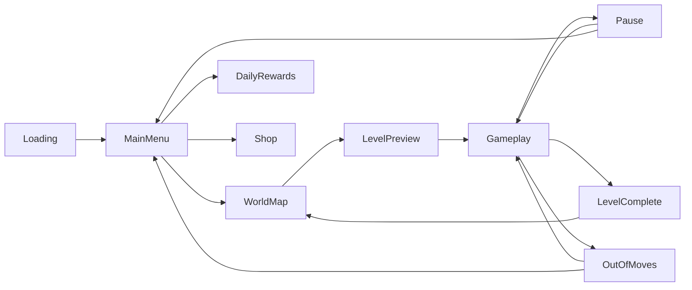

# ADR 010: UI/UX System Design

**Status**: Accepted
**Date**: 2026-05-26
**Context**: v5 CCPE — UI/UX для Neo Soft Frost

## Контекст

Neo Soft Frost имеет premium эстетику "мягкого морозного luxe" — glassmorphism, holographic сферы, dreamy palette (lavender/pink/ice-blue). Необходима система из 10 экранов, воспроизводящая этот стиль в Godot 4.x.

## Решение

Реализовать UI/UX как отдельную систему (UIScreenManager) с 10 экранами, описанными в reference mockups `ui1/screens 01/`.

### Design System Tokens

```yaml
colors:
  primary_lavender: "#D8CCFF"
  soft_pink: "#FFD4E8"
  ice_blue: "#CCECFF"
  warm_gold: "#FFD700"
  crystal_white: "#F8F6FF"
  deep_purple: "#8B7FBF"
  gradient_button: "linear(#D8CCFF → #FFD4E8 → #FFD700)"

typography:
  title_font: "Rounded sans-serif (Nunito/Comfortaa/Quicksand)"
  body_font: "Inter or system rounded"
  title_size: 48-72px
  body_size: 16-24px

ui_components:
  glassmorphic_panel:
    background: "rgba(255,255,255,0.15)"
    blur: 20px
    border: "1px solid rgba(255,255,255,0.3)"
    border_radius: 20px
    shadow: "0 8px 32px rgba(0,0,0,0.1)"

  pill_button:
    shape: "stadium/pill"
    gradient: "primary → pink → gold"
    glow: "outer soft bloom"
    height: 60-80px
    font_weight: bold

  icon_card:
    shape: "rounded square"
    background: glassmorphic_panel
    icon_style: "holographic, outlined"
    size: 80-100px

  nav_bar:
    background: glassmorphic_panel
    items: 5
    active_indicator: "small diamond marker"
    icon_style: "line icons"

decorations:
  floating_bubbles: true
  diamond_crystals: true
  sparkle_particles: true
  dreamy_clouds: true
  iridescent_borders: true
```

### 10 Screens

| # | Screen | Scene File | Description |
|---|---|---|---|
| 1 | Loading | `boot/loading_screen.tscn` | Logo + sphere + progress bar + "Tap to Start" |
| 2 | Main Menu | `menus/main_menu.tscn` | Play + 4 quick-access + top bar + nav |
| 3 | World Map | `menus/world_map.tscn` | Dreamy path, sphere nodes, stars, Next World |
| 4 | Level Preview | `menus/level_preview.tscn` | Target + grid preview + boosters + Start |
| 5 | Gameplay HUD | `gameplay/gameplay.tscn` | Board + HUD + boosters + combo window |
| 6 | Pause | `gameplay/pause_menu.tscn` | Modal: Resume/Restart/Home + Audio |
| 7 | Level Complete | `gameplay/level_complete.tscn` | Stars + score + rewards + Next Level |
| 8 | Out of Moves | `gameplay/out_of_moves.tscn` | Retry + Add Moves + Home |
| 9 | Daily Rewards | `menus/daily_rewards.tscn` | 7-day calendar + quests |
| 10 | Shop | `menus/shop.tscn` | Coins + Boosters + Specials tabs |

### Transition Flow



## Альтернативы

1. **Web-based UI (HTML overlay)** — лагает, нет интеграции с game signals
2. **Процедурный UI через _draw()** — сложно поддерживать, нет Layout
3. **Godot Control Nodes** ✅ — нативный, Layout, Theme, анимации

## Trade-offs

| Критерий | Godot Control | HTML Overlay | Procedural _draw |
|---|---|---|---|
| Performance | ✅ Нативный | ⚠️ Overhead | ✅ Быстрый |
| Maintainability | ✅ Scenes | ⚠️ Separate stack | ❌ Сложно |
| Animation | ✅ Tween/AnimPlayer | ⚠️ CSS/JS | ⚠️ Manual |
| Theme System | ✅ Built-in | ❌ Нет | ❌ Manual |

## Последствия

- Все экраны используют Godot Control nodes + Theme resource
- Glassmorphism достигается через ShaderMaterial (blur + alpha)
- Transitions через SceneTree.change_scene_to_packed() с AnimationPlayer fade
- Reference mockups в `ui1/screens 01/` — source of truth для visual design
