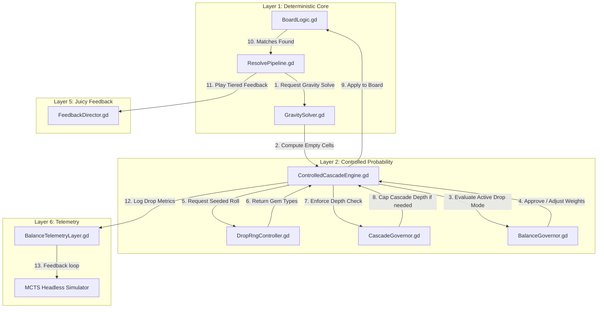

# System Design — Controlled Cascade Pleasure Engine (CCPE)

## Layer 2: Controlled Probability — Godot 4.x Production Specification

> **System ID**: `controlled-cascade-engine`  
> **Related Requirements**: `[REQ-CCPE-501]`, `[REQ-CCPE-502]`, `[REQ-CCPE-506]`, `[REQ-CCPE-507]`, `[REQ-CCPE-510]`, `[REQ-CCPE-511]`, `[REQ-CCPE-512]`  
> **Status**: APPROVED for Production Implementation

---

## 1. Архитектурный обзор (Architectural Integration)

**Controlled Cascade Pleasure Engine (CCPE)** — это управляющая система вероятностей второго уровня (Layer 2), которая заменяет классическое "слепое" случайное заполнение пустых ячеек (RNG drop) на интеллектуальное распределение, максимизирующее вовлечение игрока (pleasure flow) без нарушения детерминизма и спортивного баланса игры.

CCPE располагается между низкоуровневым физико-логическим симулятором поля (`GravitySolver`, `BoardLogic`) и высокоуровневой транзакционной машиной состояний (`ResolvePipeline`). Она напрямую контролируется системами `CascadeGovernor` и `BalanceGovernor`, чтобы предотвратить бесконечные циклы ("игра играет сама") и автоматические победы.

### Диаграмма взаимодействия компонентов (Layer 2 Topology)



---

## 2. Форматы конфигурационных файлов (JSON Schemas)

Все параметры калибровки каскадов, вероятностных диапазонов и лимитов балансировки вынесены во внешние конфигурационные файлы.

### 2.1 `data/cascade_rules.json`
Определяет базовые правила работы каскадного движка для всех режимов.

```json
{
  "system_id": "controlled-cascade-engine",
  "version": "5.0",
  "default_settings": {
    "max_cascade_depth_default": 5,
    "max_cascade_depth_fever": 8,
    "assisted_drop_cooldown_turns": 3,
    "assisted_drop_max_per_level": 4,
    "cinematic_drop_max_per_level": 1,
    "lucky_drop_max_per_level": 2,
    "lucky_drop_min_turn_gap": 5
  },
  "probability_bands": {
    "basic_move": {
      "min_chance": 0.10,
      "max_chance": 0.18,
      "assist_weight_multiplier": 1.0
    },
    "line_4_or_square_2x2": {
      "min_chance": 0.20,
      "max_chance": 0.30,
      "assist_weight_multiplier": 1.2
    },
    "l_t_or_line_5": {
      "min_chance": 0.30,
      "max_chance": 0.45,
      "assist_weight_multiplier": 1.5
    },
    "fever": {
      "min_chance": 0.45,
      "max_chance": 0.65,
      "assist_weight_multiplier": 1.8
    },
    "final_near_goal": {
      "min_chance": 0.50,
      "max_chance": 0.75,
      "assist_weight_multiplier": 2.2,
      "max_triggers_per_level": 1
    }
  },
  "anti_fake_rules": {
    "never_guarantee_paid_recovery": true,
    "never_force_loss_state": true,
    "never_auto_complete_major_objective": true,
    "max_objective_clearance_by_cascade_pct": 40.0
  }
}
```

### 2.2 `data/level_balance_profiles.json`
Специфицирует балансовые профили сложности для интеграции с headless-симулятором.

```json
{
  "difficulty_profiles": {
    "easy_tier_1": {
      "target_win_rate": 0.95,
      "mcts_max_iterations": 1000,
      "assisted_drop_enabled": true,
      "lucky_drop_enabled": true,
      "cascade_depth_cap": 7,
      "combo_window_sec": 2.0,
      "fever_threshold_score": 1000,
      "fail_streak_assist_trigger": 1
    },
    "medium_tier_2": {
      "target_win_rate": 0.55,
      "mcts_max_iterations": 2000,
      "assisted_drop_enabled": true,
      "lucky_drop_enabled": true,
      "cascade_depth_cap": 5,
      "combo_window_sec": 1.5,
      "fever_threshold_score": 2500,
      "fail_streak_assist_trigger": 2
    },
    "hard_tier_3": {
      "target_win_rate": 0.25,
      "mcts_max_iterations": 5000,
      "assisted_drop_enabled": true,
      "lucky_drop_enabled": false,
      "cascade_depth_cap": 4,
      "combo_window_sec": 1.1,
      "fever_threshold_score": 4000,
      "fail_streak_assist_trigger": 3
    }
  }
}
```

---

## 3. API контракты компонентов (GDScript)

### 3.1 `scripts/core_match3/controlled_cascade_engine.gd`
Основной координатор Layer 2.

```gdscript
# /Users/user/3-line/scripts/core_match3/controlled_cascade_engine.gd
class_name ControlledCascadeEngine
extends RefCounted

signal cascade_calculated(step_index: int, drop_mode: int, generated_gems: Array)
signal cascade_blocked_by_governor(reason: String)

enum DropMode {
	NATURAL = 0,   # Полностью случайные и честные падения
	ASSISTED = 1,  # Умная помощь игроку при хорошем ходе или проигрышах
	CINEMATIC = 2  # Драматический каскад (Fever, финальные ходы)
}

var current_mode: int = DropMode.NATURAL
var assisted_cooldown_counter: int = 0
var assisted_triggers_this_level: int = 0
var cinematic_triggers_this_level: int = 0

var _rng_ctrl: DropRngController
var _casc_gov: CascadeGovernor
var _bal_gov: BalanceGovernor
var _rules: Dictionary = {}

func initialize(rules_json: Dictionary, seed_val: int) -> void:
	self._rules = rules_json
	self._rng_ctrl = DropRngController.new(seed_val)
	self._casc_gov = CascadeGovernor.new(rules_json.get("default_settings", {}))
	self._bal_gov = BalanceGovernor.new(rules_json)

func prepare_for_level(difficulty_profile: Dictionary) -> void:
	self.current_mode = DropMode.NATURAL
	self.assisted_cooldown_counter = 0
	self.assisted_triggers_this_level = 0
	self.cinematic_triggers_this_level = 0
	_rng_ctrl.reset()
	_casc_gov.reset()
	_bal_gov.configure_for_level(difficulty_profile)

# Заполняет пустые ячейки после сдвига гравитации
func fill_empty_cells(board_state: Array, empty_cells: Array[Vector2i], last_move_meta: Dictionary) -> Array[Dictionary]:
	var result: Array[Dictionary] = []
	
	# 1. Запрашиваем режим падения у BalanceGovernor
	var mode = _bal_gov.determine_drop_mode(last_move_meta, assisted_triggers_this_level, assisted_cooldown_counter)
	self.current_mode = mode
	
	# 2. Проверяем лимиты CascadeGovernor
	if not _casc_gov.allow_next_step():
		emit_signal("cascade_blocked_by_governor", "Max depth cap reached")
		mode = DropMode.NATURAL # Откат к честному заполнению без матчей
	
	# 3. Рассчитываем веса цветов для генерации
	var color_weights = _calculate_color_weights(board_state, empty_cells, mode, last_move_meta)
	
	# 4. Генерируем элементы
	for cell in empty_cells:
		var gem_type = _rng_ctrl.roll_gem_type(color_weights)
		result.append({
			"position": cell,
			"gem_type": gem_type,
			"is_assisted": (mode == DropMode.ASSISTED or mode == DropMode.CINEMATIC)
		})
	
	# 5. Увеличиваем счетчики и кулдауны
	if mode == DropMode.ASSISTED:
		assisted_triggers_this_level += 1
		assisted_cooldown_counter = _rules.get("default_settings", {}).get("assisted_drop_cooldown_turns", 3)
	elif mode == DropMode.CINEMATIC:
		cinematic_triggers_this_level += 1
	
	if assisted_cooldown_counter > 0 and mode == DropMode.NATURAL:
		assisted_cooldown_counter -= 1
		
	_casc_gov.increment_depth()
	emit_signal("cascade_calculated", _casc_gov.current_depth, mode, result)
	return result

func notify_turn_ended() -> void:
	_casc_gov.reset()

func _calculate_color_weights(board_state: Array, empty_cells: Array[Vector2i], mode: int, last_move_meta: Dictionary) -> Dictionary:
	var default_weights = {"red": 1.0, "blue": 1.0, "green": 1.0, "yellow": 1.0, "purple": 1.0}
	
	if mode == DropMode.NATURAL:
		return default_weights
		
	# Для ASSISTED/CINEMATIC вызываем генератор интеллектуальных весов в BalanceGovernor
	return _bal_gov.get_biased_weights(board_state, empty_cells, default_weights, last_move_meta)
```

### 3.2 `scripts/core_match3/drop_rng_controller.gd`
Детерминированный генератор псевдослучайных чисел для честного воспроизведения симуляций MCTS.

```gdscript
# /Users/user/3-line/scripts/core_match3/drop_rng_controller.gd
class_name DropRngController
extends RefCounted

var _rng: RandomNumberGenerator
var _initial_seed: int

func _init(seed_val: int) -> void:
	_rng = RandomNumberGenerator.new()
	_initial_seed = seed_val
	_rng.seed = seed_val

func reset() -> void:
	_rng.seed = _initial_seed

func roll_gem_type(weights: Dictionary) -> String:
	var total_weight: float = 0.0
	for w in weights.values():
		total_weight += w
		
	var roll = _rng.randf_range(0.0, total_weight)
	var current_sum: float = 0.0
	
	for key in weights.keys():
		current_sum += weights[key]
		if roll <= current_sum:
			return key
			
	return weights.keys()[0] # Fallback
```

### 3.3 `scripts/core_match3/cascade_governor.gd`
Система сдерживания каскадного взрыва.

```gdscript
# /Users/user/3-line/scripts/core_match3/cascade_governor.gd
class_name CascadeGovernor
extends RefCounted

var current_depth: int = 0
var max_depth_limit: int = 5
var is_fever_active: bool = false

func _init(settings: Dictionary) -> void:
	max_depth_limit = settings.get("max_cascade_depth_default", 5)

func configure_fever(active: bool, settings: Dictionary) -> void:
	is_fever_active = active
	if active:
		max_depth_limit = settings.get("max_cascade_depth_fever", 8)
	else:
		max_depth_limit = settings.get("max_cascade_depth_default", 5)

func reset() -> void:
	current_depth = 0

func increment_depth() -> void:
	current_depth += 1

func allow_next_step() -> bool:
	return current_depth < max_depth_limit
```

### 3.4 `scripts/core_match3/balance_governor.gd`
Полицейский регулятор баланса, блокирующий "дешевые триггеры" и защищающий от ощущения фейка.

```gdscript
# /Users/user/3-line/scripts/core_match3/balance_governor.gd
class_name BalanceGovernor
extends RefCounted

var _rules: Dictionary
var _diff_profile: Dictionary
var _fail_streak: int = 0
var _objective_cascade_destruction_count: int = 0

func _init(rules: Dictionary) -> void:
	self._rules = rules

func configure_for_level(difficulty_profile: Dictionary) -> void:
	self._diff_profile = difficulty_profile
	self._objective_cascade_destruction_count = 0

func update_fail_streak(streak: int) -> void:
	_fail_streak = streak

# Определяет, допустима ли помощь в этом ходу
func determine_drop_mode(last_move_meta: Dictionary, triggers_count: int, cooldown: int) -> int:
	if not _diff_profile.get("assisted_drop_enabled", true):
		return ControlledCascadeEngine.DropMode.NATURAL
		
	# Условие для Cinematic Drop (например, Fever или последний драматичный ход)
	if last_move_meta.get("is_fever_active", false) or last_move_meta.get("is_last_move_drama", false):
		return ControlledCascadeEngine.DropMode.CINEMATIC
		
	# Проверка лимитов для Assisted Drop
	var max_assisted = _rules.get("default_settings", {}).get("assisted_drop_max_per_level", 4)
	if triggers_count >= max_assisted:
		return ControlledCascadeEngine.DropMode.NATURAL
		
	if cooldown > 0:
		return ControlledCascadeEngine.DropMode.NATURAL
		
	# Алгоритм проверки "достойности" хода для ассиста
	var shape_type = last_move_meta.get("shape_type", "line_3")
	var is_complex_shape = shape_type != "line_3"
	var fail_streak_trigger = _fail_streak >= _diff_profile.get("fail_streak_assist_trigger", 2)
	
	if is_complex_shape or fail_streak_trigger:
		# Anti-auto-win check: если игрок уже собрал каскадом слишком много целей, отключаем помощь
		if _objective_cascade_destruction_count >= _rules.get("anti_fake_rules", {}).get("max_objective_clearance_by_cascade_pct", 40.0):
			return ControlledCascadeEngine.DropMode.NATURAL
		return ControlledCascadeEngine.DropMode.ASSISTED
		
	return ControlledCascadeEngine.DropMode.NATURAL

# Подмешивает веса для создания вероятных совпадений (Assisted Drop)
func get_biased_weights(board_state: Array, empty_cells: Array[Vector2i], default_weights: Dictionary, last_move_meta: Dictionary) -> Dictionary:
	var biased_weights = default_weights.duplicate()
	
	# Для создания ассиста находим, какие типы гемов находятся под пустыми клетками
	# и увеличиваем шанс их выпадения на 25-45% в зависимости от Band.
	var dominant_color = last_move_meta.get("dominant_color", "")
	if dominant_color != "" and biased_weights.has(dominant_color):
		var multiplier = 1.2
		var shape = last_move_meta.get("shape_type", "line_3")
		
		# Выбираем множитель в соответствии с Probability Bands
		if shape == "line_4" or shape == "square_2x2":
			multiplier = 1.2
		elif shape == "l_5" or shape == "t_5" or shape == "line_5":
			multiplier = 1.5
		elif last_move_meta.get("is_fever_active", false):
			multiplier = 1.8
			
		biased_weights[dominant_color] = default_weights[dominant_color] * multiplier
		
	return biased_weights

func register_objective_destroyed_by_cascade() -> void:
	_objective_cascade_destruction_count += 1
```

---

## 4. Алгоритмические спецификации (Algorithms & Pseudocode)

### 4.1 Алгоритм Assisted Drop с контролем фейка (RNG Weight Biasing)

Алгоритм предназначен для мягкого стимулирования продолжения каскада. Важное условие: **помощь не должна создавать очевидного фейка**, когда с экрана падают готовые комбинации 4-в-ряд или Т-формы сами по себе. Помощь должна лишь *повышать* шанс образования естественного 3-match на дне или в средних слоях.

```text
ALGORITHM GenerateBiasedCascade:
  INPUT: BoardState, EmptyCells, LastMoveMeta, DifficultyProfile
  OUTPUT: List of (Cell, GemType)

  1. Find dominant color involved in player's manual match (e.g. "blue").
  2. Compute probability band based on LastMoveMeta:
     IF FeverMode is active:
        TargetProbability = RandomBetween(0.45, 0.65)
     ELSE IF PlayerShape is L/T or Line-5:
        TargetProbability = RandomBetween(0.30, 0.45)
     ELSE IF PlayerShape is Line-4 or Square:
        TargetProbability = RandomBetween(0.20, 0.30)
     ELSE:
        TargetProbability = RandomBetween(0.10, 0.18)

  3. FOR each empty cell starting from bottom row to top:
        A. Scan neighbors (left, right, bottom) to identify potential Match-3 setup.
        B. IF neighbor color matches DominantColor AND roll <= TargetProbability:
              BiasWeights[DominantColor] = DefaultWeight * multiplier
           ELSE:
              BiasWeights = DefaultWeights
              
        C. Roll Random Color using Seeded RNG with BiasWeights.
        D. Validate candidate gem:
           # Anti-Fake Check: Убедиться, что новый гем НЕ создает мгновенный Match-4 или Match-5 без участия игрока
           IF WillCreateMatchDepth4Plus(cell, candidate_gem, BoardState):
              # Откат к случайному цвету, не совпадающему с соседями
              candidate_gem = RollAlternativeGem(cell, BoardState)
           
           E. Set Cell.gem_type = candidate_gem
           F. Update BoardState with candidate_gem
           
  4. RETURN Generated List
```

### 4.2 Проверка лимитов каскада (CascadeGovernor Loop)

```text
ALGORITHM EnforceCascadeDepthLimits:
  INPUT: CurrentDepth, MaxLimit
  
  1. IF CurrentDepth >= MaxLimit:
        Log "Governor clamp active. Forced stabilization."
        Clear assisted generation.
        Set all subsequent drops to RANDOM_FLAT_DISTRIBUTION (no biases).
        Inject color buffer that guarantees zero matches (Interlocking Colors).
        RETURN BLOCK_CASCADES
  2. RETURN ALLOW_CASCADES
```

### 4.3 Интерлокинг цветов для принудительной стабилизации (Color Interlocking)

При достижении лимита каскадов движок гарантирует стабилизацию за 1 ход путём генерации чередующихся цветов, исключающих совпадения.

```gdscript
func generate_interlocking_gems(board_state: Array, empty_cells: Array[Vector2i]) -> Dictionary:
	var locked_gems = {}
	for cell in empty_cells:
		# Находим цвета левого и нижнего соседа
		var forbidden_colors = []
		var left_neighbor = board_state[cell.y][cell.x - 1] if cell.x > 0 else null
		var down_neighbor = board_state[cell.y + 1][cell.x] if cell.y < board_state.size() - 1 else null
		
		if left_neighbor:
			forbidden_colors.append(left_neighbor.color)
		if down_neighbor:
			forbidden_colors.append(down_neighbor.color)
			
		# Выбираем первый цвет из списка доступных, которого нет в запрещенных
		var safe_color = "red"
		for color in ["red", "blue", "green", "yellow", "purple"]:
			if not color in forbidden_colors:
				safe_color = color
				break
		locked_gems[cell] = safe_color
	return locked_gems
```

---

## 5. Интеграция с MCTS и симулятором автобаланса

Для Headless-валидации уровней и автоматической калибровки сложности CCPE предоставляет API детерминированной симуляции.

```text
┌────────────────────────────────────────────────────────┐
│               MCTS Headless Runner                     │
│  - Sets level seed                                     │
│  - Executes 10,000 matches per difficulty config       │
└───────────────────────────┬────────────────────────────┘
                            │
                            ▼ (Inject seed)
┌────────────────────────────────────────────────────────┐
│               DropRngController                        │
│  - Freezes RNG state                                   │
│  - Guarantees same board drops for same moves          │
└───────────────────────────┬────────────────────────────┘
                            │
                            ▼ (Compare metrics)
┌────────────────────────────────────────────────────────┐
│               BalanceTelemetryLayer                    │
│  - cascade_depth_average: target <= 3.2                │
│  - player_idle_time: reduction >= 60%                  │
│  - assisted_triggers_rate                              │
└────────────────────────────────────────────────────────┘
```

### Детерминированный тестовый сценарий (Unit/Integration Test)

```gdscript
# /Users/user/3-line/tests/core_match3/test_controlled_cascade.gd
extends GutTest

var engine: ControlledCascadeEngine
var mock_rules = {
	"default_settings": {
		"max_cascade_depth_default": 3, # Занижаем для быстрого теста лимита
		"assisted_drop_cooldown_turns": 2,
		"assisted_drop_max_per_level": 3
	},
	"anti_fake_rules": {
		"max_objective_clearance_by_cascade_pct": 40.0
	}
}

func setup():
	engine = ControlledCascadeEngine.new()
	engine.initialize(mock_rules, 42) # Фиксированный сид 42

func test_deterministic_drop_reproducibility():
	var empty_cells: Array[Vector2i] = [Vector2i(0, 0), Vector2i(1, 0), Vector2i(2, 0)]
	var board = [] # Mock board
	var meta = {"shape_type": "line_3", "dominant_color": "blue"}
	
	# Первый запуск
	engine.prepare_for_level({"assisted_drop_enabled": true})
	var drop1 = engine.fill_empty_cells(board, empty_cells, meta)
	
	# Второй запуск с тем же сидом
	engine.prepare_for_level({"assisted_drop_enabled": true})
	var drop2 = engine.fill_empty_cells(board, empty_cells, meta)
	
	assert_eq(drop1.size(), drop2.size(), "Drop sizes must match")
	for i in range(drop1.size()):
		assert_eq(drop1[i].gem_type, drop2[i].gem_type, "Gem colors must be identical (deterministic)")

func test_cascade_depth_governor_limit():
	var empty_cells: Array[Vector2i] = [Vector2i(0, 0)]
	var board = []
	var meta = {"shape_type": "line_3", "dominant_color": "blue"}
	
	engine.prepare_for_level({"assisted_drop_enabled": true})
	
	# Симулируем 4 каскада подряд (лимит установлен в 3)
	var d1 = engine.fill_empty_cells(board, empty_cells, meta)
	var d2 = engine.fill_empty_cells(board, empty_cells, meta)
	var d3 = engine.fill_empty_cells(board, empty_cells, meta)
	
	# Четвертый шаг должен быть заблокирован/откачен к NATURAL без ассиста
	var was_blocked = false
	engine.cascade_blocked_by_governor.connect(func(reason):
		was_blocked = true
	)
	
	var d4 = engine.fill_empty_cells(board, empty_cells, meta)
	assert_true(was_blocked, "Governor must block 4th cascade level")
```

---

## 6. Интеграция с ResolvePipeline (FSM Transitions)

ResolvePipeline расширен новыми состояниями `CASCADE_EVALUATING` и `CASCADE_GOVERNED` для безопасной обработки лимитов.

```text
                  +--------------------------------+
                  |            RESOLVING           |
                  +---------------+----------------+
                                  |
                                  | (Clear matches)
                                  v
                  +--------------------------------+
                  |         GRAVITY_SOLVING        |
                  +---------------+----------------+
                                  |
                                  | (Empty cells found)
                                  v
                  +--------------------------------+
                  |       CASCADE_EVALUATING       |
                  +-------+----------------+-------+
                          |                |
         (Within limits)  |                | (Depth exceeded)
                          v                v
                  +-------+--------+  +----+---------------+
                  |  APPLY_DROP    |  |  CASCADE_GOVERNED  |
                  +-------+--------+  +----+---------------+
                          |                |
                          |                | (Force Interlock)
                          v                v
                  +-------+----------------+-------+
                  |             STABLE             |
                  +--------------------------------+
```

### Таблица переходов FSM с учётом CCPE

| Исходное состояние | Входное событие | Целевое состояние | Действие CCPE |
|---|---|---|---|
| **GRAVITY_SOLVING** | `gravity_completed` | **CASCADE_EVALUATING** | GravitySolver опустил существующие сферы, выявил координаты пустот. |
| **CASCADE_EVALUATING** | `governor_approved` | **APPLY_DROP** | Запуск генерации цвета с использованием `Biased RNG` для создания ассиста. |
| **CASCADE_EVALUATING** | `depth_limit_reached` | **CASCADE_GOVERNED** | Превышен лимит каскадов. Логирование инцидента. |
| **CASCADE_GOVERNED** | `apply_interlocking` | **APPLY_DROP** | Генерация чередующихся цветов для гарантированной стабилизации поля. |
| **APPLY_DROP** | `gems_dropped_on_board` | **RESOLVING** | Новые сферы упали на поле. Запуск MatchDetector для проверки авто-совпадений. |

---

## 7. Juicy Feedback & Эскалационная лестница (FeedbackDirector)

Каскады напрямую управляют аудиовизуальным удовольствием. Каждый шаг каскада увеличивает множитель и накаляет эффекты по **лестнице VFX/SFX (x1–x5+)**.

```text
x5+ [FEVER SPARK] ──> Sound: Epic Drop Choir + Bass Blast ──> FX: Full-board Glow Aura + Haptic Impact Heavy
x4  [CASCADE SURGE] ─> Sound: Cinematic Bass Impact ───────> FX: Neon Energy Trails + Screen Shake Med
x3  [CHAIN REACTION] ─> Sound: Rising Musical Arpeggio ────> FX: Ripple Ring + Camera Shake Subtle
x2  [COMBO TIME] ───> Sound: Rich Layered Chime ───────────> FX: Sparkle Particles + Score Slide Up
x1  [NICE MATCH] ───> Sound: Playful Soft Ping ────────────> FX: Small Glow Flash
```

### Реализация эскалации в `FeedbackDirector.gd`

```gdscript
# /Users/user/3-line/scripts/core_match3/feedback_director.gd
class_name FeedbackDirector
extends Node

@export var audio_player_pool: Node
@export var camera_juice: Node # Управляет shake/zoom

var _vfx_tiers_config: Dictionary = {}

func play_cascade_feedback(cascade_index: int, match_center: Vector2) -> void:
	var tier = clamp(cascade_index, 1, 5)
	
	match tier:
		1:
			_play_sound("nice_ping")
			_spawn_particles("spark_flash", match_center)
			_trigger_haptic("light")
		2:
			_play_sound("combo_chime")
			_spawn_particles("ripple_wave", match_center)
			_trigger_haptic("medium")
		3:
			_play_sound("rising_arpeggio")
			_spawn_particles("board_pulse", match_center)
			camera_juice.shake(0.2, 5.0) # 0.2 сек, сила 5.0
			_trigger_haptic("medium_heavy")
		4:
			_play_sound("bass_impact")
			_spawn_particles("energy_lines", match_center)
			camera_juice.shake(0.4, 10.0)
			_trigger_haptic("heavy")
		5:
			_play_sound("epic_choir_blast")
			_spawn_particles("fever_aura", match_center)
			camera_juice.shake(0.6, 15.0)
			camera_juice.pulse_zoom(0.95, 0.3) # Легкое прижатие камеры
			_trigger_haptic("extreme")
			_show_onscreen_title("FEVER SPARK!")

func _play_sound(sound_name: String) -> void:
	# Интеграция с AudioManager
	pass

func _spawn_particles(vfx_name: String, pos: Vector2) -> void:
	# Спавн Node2D частиц с ограничением бюджета (max 40 систем)
	pass

func _trigger_haptic(type: String) -> void:
	# iOS / Android haptic feedback
	pass

func _show_onscreen_title(text: String) -> void:
	# Анимированный вылет текста (e.g. Cascade Surge)
	pass
```

---

## 8. Гарантии стабильности и защиты от отказов (Fail-Safe Invariants)

Для предотвращения зависаний игры на мобильных устройствах при непредвиденных ошибках в CCPE заложено 3 уровня аппаратной защиты:

1. **Гарантия завершения транзакции (Resolve Invariant)**:  
   В случае, если `ResolvePipeline` зависает в состоянии `CASCADE_EVALUATING` более чем на `2.0` секунды (например, из-за бага анимации или потери сигнала), автоматически срабатывает хардварный таймер `ResolvePipelineTimer`, который переводит ячейки из `FALLING`/`RESOLVING` в `STABLE`, принудительно очищает очередь буфера ввода и передаёт ход игроку.
2. **Абсолютный лимит глубины (Absolute Cascade Ceiling)**:  
   Даже если `Fever Mode` активен и включен `Cinematic Drop`, глубина каскада никогда не может превысить **10 шагов**. На 10-м шаге `CascadeGovernor` безусловно включает режим `Color Interlocking`, делая дальнейшие совпадения невозможными.
3. **Безопасность MCTS симулятора**:  
   При запуске симуляций в безголовом (headless) режиме все визуальные таймеры, анимации и вызовы `FeedbackDirector` полностью отключаются через глобальный переключатель `JuiceSettings.is_headless = true`. Это исключает утечки памяти и падения тредов рендеринга.
