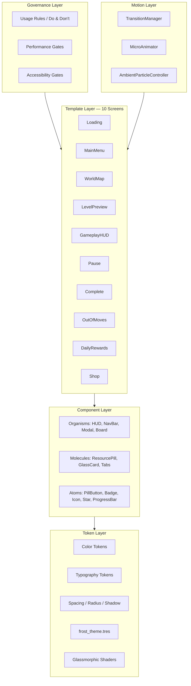

# System Design — UI/UX Design System

## Neo Soft Frost Design System v1.0 — Godot 4.x Production Implementation

> **System ID**: `ui-ux-design-system`
> **Related Requirements**: [REQ-UI-601]–[REQ-UI-610], [REQ-CCPE-508], [REQ-CCPE-509], [REQ-CCPE-510]
> **ADR**: [ADR-010 UI/UX System Design](file:///Users/user/3-line/genesis/v5/03_ADR/ADR_010_UI_UX_SYSTEM.md)
> **Reference Mockups**: [screens 01](file:///Users/user/3-line/ui1/screens%2001)

---

## 1. Overview

Этот документ определяет **полную дизайн-систему** Neo Soft Frost для Godot 4.x:
- **Token Layer** — цвета, градиенты, типографика, spacing, радиусы, тени
- **Component Layer** — атомы → молекулы → организмы
- **Template Layer** — 10 экранов
- **Motion Layer** — переходы, микро-анимации, ambient particles
- **Accessibility Layer** — WCAG 2.2 AA compliance, contrast fixes
- **Governance Layer** — правила использования, anti-drift, performance gates

---

## 2. Goals & Non-Goals

### Goals
- Воспроизвести premium "мягкий морозный luxe" из reference mockups
- Обеспечить WCAG 2.2 AA accessibility (contrast ≥4.5:1 normal, ≥3:1 large)
- Поддержать performance tiers (high / mid / android_safe)
- Предотвратить design drift через token enforcement
- Обеспечить responsive layout для 16:9, 18:9, 20:9

### Non-Goals
- 3D UI rendering
- Dynamic theme switching в runtime (dark mode — future v6)
- Web/HTML fallback
- Procedural _draw() для UI

---

## 3. Architecture

### 3.1 Layer Model



### 3.2 Physical File Structure

```text
res://ui/
├── theme/
│   ├── frost_theme.tres                 # Master Godot Theme resource
│   ├── theme_tokens.gd                  # Autoload: Color/spacing/radius constants
│   ├── fonts/
│   │   ├── NunitoSans-Bold.ttf
│   │   ├── NunitoSans-SemiBold.ttf
│   │   ├── Inter-Medium.ttf
│   │   └── Inter-Regular.ttf
│   └── shaders/
│       ├── glassmorphic_blur.gdshader   # Frosted glass effect
│       ├── gradient_text.gdshader       # Iridescent title shader
│       ├── iridescent_border.gdshader   # Animated glass border
│       └── gradient_fill.gdshader       # Gradient for buttons/progress
│
├── components/
│   ├── atoms/
│   │   ├── pill_button.tscn             # PillButton (5 variants)
│   │   ├── pill_button.gd
│   │   ├── icon_card.tscn              # IconCard (Levels, Events, Shop, Settings)
│   │   ├── icon_card.gd
│   │   ├── badge.tscn                  # Badge (notification, quantity, claimed, locked, ribbon)
│   │   ├── badge.gd
│   │   ├── star_rating.tscn            # StarRating (0-3 stars)
│   │   ├── star_rating.gd
│   │   ├── frost_progress_bar.tscn     # FrostProgressBar (gradient fill)
│   │   ├── frost_progress_bar.gd
│   │   ├── diamond_separator.tscn      # ◇ decorative divider
│   │   └── frost_slider.tscn           # Rainbow slider for settings
│   │
│   ├── molecules/
│   │   ├── resource_pill.tscn          # 🪙 12,450 [+] currency display
│   │   ├── resource_pill.gd
│   │   ├── glass_card.tscn             # GlassCard (3 surface levels)
│   │   ├── glass_card.gd
│   │   ├── segmented_tabs.tscn         # Tab bar (Coins/Boosters/Specials)
│   │   ├── segmented_tabs.gd
│   │   ├── booster_card.tscn           # Booster selection card
│   │   ├── mission_target_row.tscn     # Sphere icon + count
│   │   └── quest_row.tscn              # Quest item with progress
│   │
│   └── organisms/
│       ├── top_currency_bar.tscn       # HUD: coins + stars + inbox
│       ├── top_currency_bar.gd
│       ├── bottom_nav_bar.tscn         # 5-item navigation
│       ├── bottom_nav_bar.gd
│       ├── modal_container.tscn        # Scrim + glassmorphic panel + focus trap
│       ├── modal_container.gd
│       ├── game_board_frame.tscn       # Glassmorphic board wrapper
│       └── combo_window_ring.tscn      # Radial glow overlay
│
├── screens/
│   ├── loading_screen.tscn/.gd         # [REQ-UI-601]
│   ├── main_menu.tscn/.gd              # [REQ-UI-602]
│   ├── world_map.tscn/.gd              # [REQ-UI-603]
│   ├── level_preview.tscn/.gd          # [REQ-UI-604]
│   ├── gameplay_hud.tscn/.gd           # [REQ-UI-605]
│   ├── pause_menu.tscn/.gd             # [REQ-UI-606]
│   ├── level_complete.tscn/.gd         # [REQ-UI-607]
│   ├── out_of_moves.tscn/.gd           # [REQ-UI-608]
│   ├── daily_rewards.tscn/.gd          # [REQ-UI-609]
│   └── shop.tscn/.gd                   # [REQ-UI-610]
│
├── particles/
│   ├── floating_bubbles.tscn           # Ambient bubble particles
│   ├── sparkle_dust.tscn               # Sparkle particles
│   ├── confetti_burst.tscn             # Level complete confetti
│   └── diamond_crystals.tscn           # Hanging crystal decorations
│
└── managers/
    ├── transition_manager.gd            # Screen change controller (autoload)
    ├── micro_animator.gd                # Tap/hover/focus animations
    └── ambient_controller.gd            # Particle budget controller
```

---

## 4. Token Layer — Godot Implementation

### 4.1 Color Tokens

```gdscript
# theme_tokens.gd — AUTOLOAD
class_name ThemeTokens
extends Node

# ═══════════════════════════════════════════
# PRIMARY PALETTE
# ═══════════════════════════════════════════
const PRIMARY_50  = Color("#F7EDF3")  # app background
const PRIMARY_100 = Color("#E6E3F6")  # frost surface
const PRIMARY_200 = Color("#D5CDF1")  # elevated panel
const PRIMARY_300 = Color("#C8C0E9")  # border / disabled
const PRIMARY_500 = Color("#9D9ACF")  # brand lavender

# ═══════════════════════════════════════════
# TEXT (high-contrast, WCAG 2.2 AA compliant)
# ═══════════════════════════════════════════
const TEXT_PRIMARY   = Color("#302E57")  # main readable text (≥4.5:1)
const TEXT_SECONDARY = Color("#4B517F")  # supporting text
const TEXT_MUTED     = Color("#6D6D8B")  # inactive labels

# ═══════════════════════════════════════════
# ACCENTS
# ═══════════════════════════════════════════
const ACCENT_PINK = Color("#E4B4F0")  # magic highlight
const ACCENT_CYAN = Color("#A8F5FF")  # focus / ice glow
const ACCENT_GOLD = Color("#F1B95D")  # coins / stars

# ═══════════════════════════════════════════
# SEMANTIC
# ═══════════════════════════════════════════
const SUCCESS = Color("#6ED46D")  # claimed / complete
const ERROR   = Color("#D9658F")  # out of moves
const WARNING = Color("#F1B95D")  # medium difficulty
const INFO    = Color("#7FB7FF")  # hints

# ═══════════════════════════════════════════
# SURFACES (glassmorphism)
# ═══════════════════════════════════════════
const GLASS_BG         = Color(1.0, 1.0, 1.0, 0.42)   # surface/1
const GLASS_BG_STRONG  = Color(1.0, 1.0, 1.0, 0.58)   # surface/2
const GLASS_BG_ACTIVE  = Color(1.0, 1.0, 1.0, 0.72)   # surface/3
const GLASS_BORDER     = Color(1.0, 1.0, 1.0, 0.72)
const FROST_BORDER     = Color(0.56, 0.55, 1.0, 0.38)
const SHADOW_COLOR     = Color(0.37, 0.36, 0.56, 0.18)
const SCRIM_COLOR      = Color(0.098, 0.098, 0.18, 0.68)

# ═══════════════════════════════════════════
# FOCUS
# ═══════════════════════════════════════════
const FOCUS_RING = Color("#80F1FF")

# ═══════════════════════════════════════════
# SPACING SCALE (4px base)
# ═══════════════════════════════════════════
const SPACE_1  = 4    # micro
const SPACE_2  = 8    # icon-label gap
const SPACE_3  = 12   # compact card padding
const SPACE_4  = 16   # default padding
const SPACE_6  = 24   # section gap
const SPACE_8  = 32   # major block gap
const SPACE_10 = 40   # hero rhythm
const SPACE_12 = 48   # large gap
const SPACE_16 = 64   # screen rhythm

# ═══════════════════════════════════════════
# BORDER RADIUS
# ═══════════════════════════════════════════
const RADIUS_SM   = 8    # chips, badges
const RADIUS_MD   = 16   # tiles, small cards
const RADIUS_LG   = 24   # cards
const RADIUS_XL   = 32   # panels
const RADIUS_PILL = 999  # CTA buttons, HUD pills

# ═══════════════════════════════════════════
# TOUCH TARGET MINIMUMS (WCAG 2.2)
# ═══════════════════════════════════════════
const TOUCH_MIN       = 44   # absolute minimum
const TOUCH_PREFERRED = 56   # CTA buttons
const TOUCH_ICON      = 48   # icon-only controls

# ═══════════════════════════════════════════
# MOTION DURATIONS (seconds)
# ═══════════════════════════════════════════
const MOTION_TAP       = 0.12   # tap feedback
const MOTION_HOVER     = 0.18   # hover/focus
const MOTION_CARD      = 0.26   # card transition
const MOTION_MODAL     = 0.30   # modal entrance (0.26–0.42)
const MOTION_MATCH     = 0.42   # match clear (gameplay max)
const MOTION_REWARD    = 0.75   # reward burst (0.6–0.9)

# ═══════════════════════════════════════════
# EASING CURVES
# ═══════════════════════════════════════════
const EASE_SPRING = Tween.EASE_OUT   # for tap/pop
const EASE_SMOOTH = Tween.EASE_IN_OUT # for transitions
```

### 4.2 Gradient Definitions

```gdscript
# gradient_presets.gd
class_name GradientPresets

## Hero background gradient
static func hero_gradient() -> Gradient:
    var g = Gradient.new()
    g.set_color(0, Color("#F7EDF3"))
    g.add_point(0.42, Color("#E6E3F6"))
    g.set_color(1, Color("#C8CAF4"))
    return g

## CTA button gradient (Play / Start / Claim)
static func cta_gradient() -> Gradient:
    var g = Gradient.new()
    g.set_color(0, Color("#F5DBB2"))
    g.add_point(0.45, Color("#E4B4F0"))
    g.set_color(1, Color("#A8F5FF"))
    return g

## Reward gradient (coins / stars)
static func reward_gradient() -> Gradient:
    var g = Gradient.new()
    g.set_color(0, Color("#FFF7B0"))
    g.add_point(0.55, Color("#F1B95D"))
    g.set_color(1, Color("#C87B1B"))
    return g

## Orb / bubble radial gradient
static func orb_gradient() -> Gradient:
    var g = Gradient.new()
    g.set_color(0, Color("#FFFFFF"))
    g.add_point(0.24, Color("#F0D8ED"))
    g.add_point(0.58, Color("#B9BBEF"))
    g.set_color(1, Color("#A8F5FF"))
    return g

## Progress bar fill gradient
static func progress_gradient() -> Gradient:
    var g = Gradient.new()
    g.set_color(0, Color("#A8F5FF"))
    g.add_point(0.5, Color("#E4B4F0"))
    g.set_color(1, Color("#F1B95D"))
    return g
```

### 4.3 Typography (Font Resources)

```gdscript
# In frost_theme.tres setup:

# Display (72px) — Splash, Level Complete
#   Font: NunitoSans-Bold, size 72, line_spacing 1.02, letter_spacing -0.04em
#   Decorative glow ALLOWED

# H1 (48px) — Screen title
#   Font: NunitoSans-Bold, size 48, line_spacing 1.08
#   Decorative glow ALLOWED

# H2 (34px) — Section title
#   Font: NunitoSans-SemiBold, size 34, line_spacing 1.15
#   NO glow

# H3 (24px) — Cards, modal title
#   Font: Inter-Medium, size 24, line_spacing 1.25
#   NO glow

# Body (18px) — Readable text
#   Font: Inter-Medium, size 18, line_spacing 1.5
#   NO glow — MUST be readable without effects

# Body-sm (15px) — Labels
#   Font: Inter-Medium, size 15, line_spacing 1.55

# Caption (12px) — Badges, counters
#   Font: Inter-SemiBold, size 12, line_spacing 1.4, letter_spacing 0.02em
```

> [!IMPORTANT]
> **Rule**: Декоративный glow разрешён ТОЛЬКО для `display` и `h1`. Все игровые значения (moves, score, mission target, price) — `body` или `h3` **без glow**.

### 4.4 Shadow Presets

```gdscript
# shadow_presets.gd
class_name ShadowPresets

## Glass small — default cards
# inset 0 1px 0 rgba(255,255,255,.80)
# 0 6px 18px rgba(94,91,142,.18)

## Glass medium — elevated panels
# inset 0 1px 1px rgba(255,255,255,.78)
# 0 14px 38px rgba(94,91,142,.24)

## Glow magic — active/featured elements
# 0 0 18px rgba(228,180,240,.62)
# 0 0 32px rgba(168,245,255,.36)

## Neumorphic soft — world map nodes
# 8px 8px 18px rgba(109,109,139,.18)
# -8px -8px 18px rgba(255,255,255,.62)
```

Godot implementation uses `StyleBoxFlat` with `shadow_color`, `shadow_offset`, `shadow_size`:

```gdscript
static func glass_stylebox_sm() -> StyleBoxFlat:
    var s = StyleBoxFlat.new()
    s.bg_color = ThemeTokens.GLASS_BG
    s.corner_radius_top_left = ThemeTokens.RADIUS_LG
    s.corner_radius_top_right = ThemeTokens.RADIUS_LG
    s.corner_radius_bottom_left = ThemeTokens.RADIUS_LG
    s.corner_radius_bottom_right = ThemeTokens.RADIUS_LG
    s.border_width_top = 1
    s.border_width_bottom = 1
    s.border_width_left = 1
    s.border_width_right = 1
    s.border_color = ThemeTokens.GLASS_BORDER
    s.shadow_color = ThemeTokens.SHADOW_COLOR
    s.shadow_offset = Vector2(0, 6)
    s.shadow_size = 18
    s.content_margin_top = ThemeTokens.SPACE_4
    s.content_margin_bottom = ThemeTokens.SPACE_4
    s.content_margin_left = ThemeTokens.SPACE_4
    s.content_margin_right = ThemeTokens.SPACE_4
    return s
```

---

## 5. Component Layer

### 5.1 Atoms

#### PillButton

```text
Scene tree:
  PillButton (Button)
    └─ HBoxContainer
        ├─ LeftSparkle (TextureRect) — optional ✦
        ├─ Label (Label)
        └─ RightSparkle (TextureRect) — optional ✦

Exported properties:
  @export var variant: StringName = "primary"  # primary/secondary/tertiary/danger/store
  @export var text: String
  @export var icon: Texture2D = null
  @export var show_sparkles: bool = true
```

| Variant | Background | Border | Text Color | Min Height |
|---|---|---|---|---|
| `primary` | CTA gradient | glass border + glow | TEXT_PRIMARY | 56px |
| `secondary` | GLASS_BG | glass border | TEXT_PRIMARY | 56px |
| `tertiary` | transparent | frost border | TEXT_SECONDARY | 44px |
| `danger` | ERROR (20%) | error border | ERROR | 56px |
| `store` | GLASS_BG_STRONG | glass border | TEXT_PRIMARY + gold icon | 56px |

**States**:
- `normal`: base appearance
- `pressed`: `scale(0.97)` via Tween, 120ms
- `focused`: 2px `FOCUS_RING` outline, offset 3px
- `disabled`: opacity 0.45, no interaction

#### StarRating

```text
Scene tree:
  StarRating (HBoxContainer)
    ├─ Star1 (TextureRect)
    ├─ Star2 (TextureRect)
    └─ Star3 (TextureRect)

Exported:
  @export var rating: int = 0  # 0-3
  @export var animated: bool = false
  @export var star_size: int = 40
```

**States**: empty (outline), filled (gold + glow), animated_fill (bounce-in, 0.3s stagger per star)

#### FrostProgressBar

```text
Scene tree:
  FrostProgressBar (Control)
    ├─ Background (ColorRect) — GLASS_BG, pill radius
    ├─ Fill (ColorRect) — gradient shader, animated width
    ├─ SparkleMarker (TextureRect) — diamond at fill edge
    └─ ValueLabel (Label) — "{current}/{total}"

Exported:
  @export var value: float = 0.0      # 0.0-1.0
  @export var show_label: bool = true
  @export var height: int = 14
```

#### Badge

| Type | Shape | Color | Min Size |
|---|---|---|---|
| notification | circle | ACCENT_PINK | 12px |
| quantity | circle | PRIMARY_500 | 28px |
| claimed | circle + ✓ | SUCCESS | 24px |
| locked | circle + 🔒 | TEXT_MUTED | 24px |
| ribbon | banner | ACCENT_PINK | 48×20px |

---

### 5.2 Molecules

#### ResourcePill

```text
Scene tree:
  ResourcePill (PanelContainer) — glass_stylebox_sm
    └─ HBoxContainer
        ├─ Icon (TextureRect) — 24x24 (coin/star)
        ├─ ValueLabel (Label) — tabular numbers, body weight
        └─ PlusButton (Button) — 36x36, icon-only, tertiary

Min height: 44px
```

**Rule**: Tabular (monospace) numbers for values. No particles behind numbers.

#### GlassCard

```text
Scene tree:
  GlassCard (PanelContainer) — stylebox based on surface_level
    └─ VBoxContainer
        ├─ HeaderLabel (Label) — h3
        ├─ ContentSlot (Control) — flexible content area
        └─ ActionSlot (Control) — optional button/footer

Exported:
  @export var surface_level: int = 1  # 1=42%, 2=58%, 3=72%+glow
  @export var header_text: String
```

| Level | Opacity | Use |
|---|---|---|
| 1 (surface/1) | 42% white | background panels |
| 2 (surface/2) | 58% white | standard cards |
| 3 (surface/3) | 72% white + magic glow | active / featured |

**Rule**: Max 3 surface levels. Never add a 4th.

#### SegmentedTabs

```text
Scene tree:
  SegmentedTabs (HBoxContainer)
    ├─ Tab1 (Button) — with icon + label
    ├─ Tab2 (Button)
    └─ Tab3 (Button)

States:
  selected:   gradient fill + icon glow + solid text
  unselected: translucent fill + muted text
  disabled:   opacity .45, no glow
```

---

### 5.3 Organisms

#### TopCurrencyBar

```text
Scene tree:
  TopCurrencyBar (HBoxContainer) — top safe-area + 24px
    ├─ CoinPill (ResourcePill) — gold icon
    ├─ StarPill (ResourcePill) — star icon
    └─ InboxButton (Button) — envelope icon + notification badge

Rules:
  - Same position on ALL screens that show it
  - No particles behind numbers
  - Top safe-area padding for notch devices
  - Z-index above all content except modals
```

#### BottomNavBar

```text
Scene tree:
  BottomNavBar (PanelContainer) — glass_stylebox_md
    └─ HBoxContainer
        ├─ NavItem1 (VBoxContainer) — icon + "Home"
        ├─ NavItem2 — icon + "Rankings"
        ├─ NavItem3 — icon + [context: "World" / "Collection"]
        ├─ NavItem4 — icon + "Friends" / "Collection"
        └─ NavItem5 — icon + "Inbox"

Active state:
  - Raised glass segment
  - Diamond marker below icon
  - Cyan/pink glow on icon
  - Font weight bold

Height: 72px
Items: 5 MAX
```

> [!IMPORTANT]
> **Rule**: NEVER rename or reorder nav items between screens. Vocabulary is frozen:
> `Home | Rankings | World | Collection | Inbox` (World Map)
> `Home | Rankings | Collection | Friends | Inbox` (other screens)

#### ModalContainer

```text
Scene tree:
  ModalContainer (CanvasLayer)
    ├─ Scrim (ColorRect) — SCRIM_COLOR, click-to-close optional
    └─ Panel (PanelContainer) — glass_stylebox_md, centered
        ├─ CloseButton (Button) — 48x48 touch target
        └─ ContentSlot (VBoxContainer)

Rules:
  - Scrim opacity 0.55–0.72
  - Close target ≥ 48px
  - Focus trap: Tab cycling stays within modal
  - ESC / back button support
  - Entrance: scale(0.96→1.0) + opacity(0→1), 260ms
  - Exit: scale(1.0→0.98) + opacity(1→0), 160ms
  - Ambient particles PAUSE behind modal
```

---

## 6. Glassmorphism Shader System

### 6.1 Blur Shader (Performance-Tiered)

```glsl
// glassmorphic_blur.gdshader
shader_type canvas_item;

uniform float blur_amount : hint_range(0.0, 40.0) = 18.0;
uniform float surface_alpha : hint_range(0.0, 1.0) = 0.42;
uniform vec4 surface_tint : source_color = vec4(1.0, 1.0, 1.0, 1.0);
uniform float saturation_boost : hint_range(0.8, 1.8) = 1.35;
uniform float border_alpha : hint_range(0.0, 1.0) = 0.72;
uniform float border_width : hint_range(0.0, 4.0) = 1.0;

// BackBufferCopy provides source
void fragment() {
    vec2 pixel_size = TEXTURE_PIXEL_SIZE;
    vec4 bg = vec4(0.0);

    // 9-tap Gaussian blur (performance-safe)
    for (int x = -1; x <= 1; x++) {
        for (int y = -1; y <= 1; y++) {
            vec2 offset = vec2(float(x), float(y)) * pixel_size * blur_amount;
            bg += texture(TEXTURE, UV + offset);
        }
    }
    bg /= 9.0;

    // Saturation boost
    float luminance = dot(bg.rgb, vec3(0.299, 0.587, 0.114));
    bg.rgb = mix(vec3(luminance), bg.rgb, saturation_boost);

    // Mix with tint
    vec4 result = mix(bg, surface_tint, surface_alpha);
    result.a = surface_alpha;

    COLOR = result;
}
```

### 6.2 Performance Tiers

```gdscript
# Performance profiles for blur
enum BlurProfile { HIGH, MID, SAFE }

static func get_blur_config(profile: BlurProfile) -> Dictionary:
    match profile:
        BlurProfile.HIGH:
            return {
                "blur_enabled": true,
                "blur_amount": 18.0,
                "backbuffer_resolution": 1.0,
                "max_blur_panels": 6
            }
        BlurProfile.MID:
            return {
                "blur_enabled": true,
                "blur_amount": 12.0,
                "backbuffer_resolution": 0.5,
                "max_blur_panels": 3
            }
        BlurProfile.SAFE:
            return {
                "blur_enabled": false,
                "blur_amount": 0.0,
                "backbuffer_resolution": 0.0,
                "max_blur_panels": 0,
                "fallback": "solid_frost_tint"
            }
```

> [!WARNING]
> На `android_safe` профиле blur отключается полностью. Glassmorphic panels заменяются на `StyleBoxFlat` с `GLASS_BG_STRONG` (solid 58% white). Это обязательное правило — shader blur на слабых устройствах вызывает FPS drops ниже 30.

---

## 7. Motion System

### 7.1 Transition Manager

```gdscript
# transition_manager.gd — AUTOLOAD
class_name TransitionManager
extends CanvasLayer

enum Type { FADE, SLIDE_LEFT, SLIDE_RIGHT, SCALE_UP }

@onready var overlay: ColorRect = $Overlay  # full-screen black/scrim

const DURATION = 0.30

func change_screen(scene_path: String, type: Type = Type.FADE) -> void:
    match type:
        Type.FADE:
            var tween = create_tween()
            tween.tween_property(overlay, "color:a", 1.0, DURATION * 0.5)
            await tween.finished
            get_tree().change_scene_to_file(scene_path)
            tween = create_tween()
            tween.tween_property(overlay, "color:a", 0.0, DURATION * 0.5)
```

### 7.2 Motion Timing Table

| Motion | Duration | Easing | Godot Implementation |
|---|---|---|---|
| Tap feedback | 120ms | ease_out | `Tween.scale(0.97).duration(0.12)` |
| Hover/focus | 180ms | ease_out | `Tween.modulate(glow).duration(0.18)` |
| Card transition | 260ms | cubic(0.16,1,0.3,1) | `Tween.parallel().opacity().y()` |
| Modal entrance | 260–420ms | ease_out | `Tween.scale(0.96→1).opacity(0→1)` |
| Modal exit | 160ms | ease_in | `Tween.scale(1→0.98).opacity(1→0)` |
| Match clear | ≤420ms | — | Gameplay budget (never exceed) |
| Reward burst | 600–900ms | bounce | Stars + confetti + score counter |
| Ambient bubbles | 4000–9000ms | linear | Continuous, pause behind modals |

### 7.3 Reduced Motion Support

```gdscript
# Check reduced motion preference
static func should_reduce_motion() -> bool:
    # User setting in game preferences
    return GameSettings.reduced_motion_enabled

static func animate_or_skip(node: Control, property: String, to: Variant, duration: float) -> void:
    if should_reduce_motion():
        node.set(property, to)
    else:
        var tween = node.create_tween()
        tween.tween_property(node, property, to, duration)
```

---

## 8. Screen Specifications

### 8.1 Loading Screen — [REQ-UI-601]

```text
┌─────────────────────────────────┐
│          Neo Soft Frost          │  ← display, gradient_text shader
│              ◇                   │  ← diamond separator
│    Match the magic.              │  ← body, TEXT_SECONDARY
│    Restore the light.            │
│                                  │
│          ╭─────────╮             │
│          │  ◯ orb  │             │  ← 300x300, orb_gradient, slow rotation
│          ╰─────────╯             │
│                                  │
│         LOADING...               │  ← caption
│     ━━━━━━━━━━━━▸ ✦             │  ← FrostProgressBar
│       ✦ Tap to Start ✦          │  ← body-sm, pulsing opacity
└─────────────────────────────────┘

Background: hero_gradient + floating_bubbles + diamond_crystals
```

### 8.2 Main Menu — [REQ-UI-602]

```text
┌─────────────────────────────────┐
│ [🪙 12,450 +] [⭐ 85 +]   [✉•] │  ← TopCurrencyBar
│                                  │
│          Neo Soft Frost          │  ← h1, gradient_text
│              ◇                   │
│          ╭─────────╮             │
│          │  ◯ orb  │             │  ← holographic sphere on podium
│          ╰─────────╯             │
│                                  │
│  ┌──────────────────────────┐    │
│  │          Play             │    │  ← PillButton primary
│  └──────────────────────────┘    │
│                                  │
│  [Levels] [Events] [Shop] [⚙]   │  ← 4 IconCards
│                                  │
│ 🏠 Home│🏆 Rank│📚 Coll│👥 Fr│✉ │  ← BottomNavBar
└─────────────────────────────────┘
```

### 8.3 World Map — [REQ-UI-603]

```text
┌─────────────────────────────────┐
│ [🪙 12,450 +] [⭐ 85 +]   [✉•] │
│                                  │
│ [📅Events]  Neo Soft Frost       │
│ [🏆Leader]   Dreamy Skies       │
│                                  │
│       ScrollContainer            │
│    (winding path of sphere       │
│     nodes: 1→2→3→...→12)        │
│    ★★★ under passed levels       │
│    🔒 on locked levels           │
│    "You are here" tooltip        │
│    Castle landmark mid-path      │
│                                  │
│              ┌──────────┐        │
│              │Next World │        │
│              │Crystal    │        │
│              │Vale ⭐0/36│        │
│              └──────────┘        │
│ 🏠│🏆│🌍 World*│📚│✉            │
└─────────────────────────────────┘
```

### 8.4–8.10 — See [ui_ux_system.md](file:///Users/user/3-line/genesis/v5/04_SYSTEM_DESIGN/ui_ux_system.md) for detailed layouts

---

## 9. Accessibility Compliance — WCAG 2.2 AA

### 9.1 Contrast Requirements

| Area | Minimum Ratio | Target |
|---|---|---|
| Normal text (≤24px) | ≥ 4.5:1 | TEXT_PRIMARY `#302E57` on GLASS_BG |
| Large text (≥24px bold, ≥19px) | ≥ 3:1 | h1/display on background |
| Important small text | ≥ 7:1 (AAA) | Score, Moves, Prices |
| Non-text controls | ≥ 3:1 | Buttons, sliders, focus rings |

### 9.2 Critical Fixes for Current Mockups

| Problem | Fix | Affected Screens |
|---|---|---|
| White text on pale glass | Use `TEXT_PRIMARY #302E57` or add contrast sub-surface | All |
| Glow particles behind HUD numbers | Remove particles behind score/moves/coins area | Gameplay, All HUD |
| Inconsistent nav labels | Freeze vocabulary: Home/Rankings/World/Collection/Inbox | All with nav |
| Shop cards all equally prominent | 1 featured offer (surface/3), rest calm (surface/1) | Shop |
| Board lost in ambient decoration | `ambient_opacity *= 0.6` during active gameplay | Gameplay |
| Modal scrim too transparent | `SCRIM_COLOR` opacity 0.62 + blur 14px | Pause, OutOfMoves |
| Color-only status indicators | Add icons/shapes alongside color (✓, 🔒, ★) | All |

### 9.3 Touch Target Rules

```text
- ALL interactive elements: min 44×44px
- CTA buttons (Play, Start, Claim): 56×56px preferred
- Icon-only controls: 48×48px minimum + accessible label
- Close (X) button: 48×48px
- Spacing between adjacent targets: ≥ 8px
```

### 9.4 Focus Management

```gdscript
# Modal focus trap
func _enter_modal(modal: Control) -> void:
    # Save previous focus
    _previous_focus = get_viewport().gui_get_focus_owner()
    # Set focus to first button in modal
    modal.find_child("ResumeButton").grab_focus()
    # Block focus escape
    _focus_trap_active = true

func _exit_modal() -> void:
    _focus_trap_active = false
    if _previous_focus:
        _previous_focus.grab_focus()
```

---

## 10. Governance — Usage Rules

### 10.1 DO ✅

| Rule | Reason |
|---|---|
| Use lavender frost (`PRIMARY_50`) as app background | Brand consistency |
| Gold (`ACCENT_GOLD`) ONLY for coins/stars/rewards | Economy reads faster |
| One dominant CTA per screen | Reduces cognitive load (Hick's Law) |
| Icon + label in navigation | Recognition > recall |
| Chunking for mission/boosters/rewards | Easier to scan (Miller's Law) |
| Reward motion at level end | Peak–end effect |
| All values through ThemeTokens | No design drift |
| Tabular numbers for game values | Prevents layout shift |

### 10.2 DON'T ❌

| Rule | Risk |
|---|---|
| Don't put text directly on bright bubbles | Contrast fail |
| Don't use more than 3 glass surface levels | Breaks hierarchy |
| Don't change bottom nav order between screens | Breaks mental model |
| Don't make glow the only focus indicator | Accessibility fail |
| Don't animate everything during gameplay | Distraction, performance |
| Don't highlight all shop offers equally | No salience |
| Don't hardcode color/spacing/shadow values | System drift — use tokens! |
| Don't place particles behind numeric values | Readability fail |

### 10.3 Performance Gates

```yaml
performance_gates:
  max_particle_systems_per_screen: 6
  max_blur_panels_high: 6
  max_blur_panels_mid: 3
  max_blur_panels_safe: 0  # solid fallback
  backbuffer_resolution_mid: 0.5
  match_clear_max_ms: 420
  modal_entrance_max_ms: 420
  ambient_pause_during_modal: true
  gameplay_ambient_opacity: 0.6
  font_preload: true
  adjacent_screen_preload: true
  texture_atlas_for_icons: true
```

### 10.4 Token Enforcement Checklist

```text
Before any UI PR merge:
  ☐ All colors reference ThemeTokens constants
  ☐ All spacing uses SPACE_N constants
  ☐ All radii use RADIUS_* constants
  ☐ All fonts from frost_theme.tres
  ☐ All shadows from ShadowPresets
  ☐ No magic numbers in UI code
  ☐ Touch targets ≥ 44px verified
  ☐ Contrast ratios verified for new text
  ☐ Reduced motion path exists
  ☐ Performance profile tested (high + safe)
```

---

## 11. Data Model

### 11.1 Screen State

```gdscript
class_name ScreenState
extends RefCounted

var screen_id: StringName           # "main_menu", "world_map", etc.
var previous_screen: StringName     # for back navigation
var transition_type: TransitionManager.Type
var data: Dictionary = {}           # screen-specific data
```

### 11.2 Nav Config

```gdscript
const NAV_CONFIGS = {
    "main_menu": {
        "top_bar": true,
        "bottom_nav": true,
        "nav_items": ["Home", "Rankings", "Collection", "Friends", "Inbox"],
        "active_item": "Home"
    },
    "world_map": {
        "top_bar": true,
        "bottom_nav": true,
        "nav_items": ["Home", "Rankings", "World", "Collection", "Inbox"],
        "active_item": "World"
    },
    "gameplay": {
        "top_bar": false,
        "bottom_nav": false,
        "nav_items": []
    }
}
```

---

## 12. Trade-offs & Alternatives

### T1: Blur Implementation

| Approach | Pros | Cons | Decision |
|---|---|---|---|
| BackBufferCopy + shader | Real frosted glass | Expensive on mobile | ✅ High/Mid tier |
| Pre-blurred texture swap | Cheap | Less accurate | Fallback |
| Solid frosted color | Zero cost | Loses glass feel | ✅ android_safe |

### T2: Theme Architecture

| Approach | Pros | Cons | Decision |
|---|---|---|---|
| Single global Theme.tres | Easy to maintain | Limited flexibility | — |
| Theme + per-component overrides | Best balance | More files | ✅ Chosen |
| All inline styling | Fast prototype | Unmaintainable | ❌ |

### T3: Font Strategy

| Approach | Pros | Cons | Decision |
|---|---|---|---|
| Embed Nunito Sans + Inter | Guaranteed consistency | +200KB | ✅ Chosen |
| System font fallback | 0KB size | Inconsistent cross-device | ❌ |

### T4: Component Reuse

| Approach | Pros | Cons | Decision |
|---|---|---|---|
| Atomic Design (atoms→organisms) | Maximum reuse, systematic | More initial files | ✅ Chosen |
| Per-screen isolated UI | Fast to build | Duplicate code, drift risk | ❌ |

---

## 13. Testing Strategy

### 13.1 Visual Regression

```text
- Screenshot comparison for each of 10 screens
- Compare against reference mockups in ui1/screens 01/
- Test at 3 aspect ratios: 16:9, 18:9, 20:9
```

### 13.2 Accessibility

```text
- Contrast ratio verification for all text styles
- Touch target size audit (min 44px)
- Focus traversal test per screen
- Modal focus trap test
- Reduced motion verification
```

### 13.3 Performance

```text
- FPS ≥ 60 on all screens with blur (high profile)
- FPS ≥ 60 on all screens without blur (safe profile)
- Particle count within budget per screen
- No layout shifts during animation
- Screen transition ≤ 300ms
```

### 13.4 Token Compliance

```text
- Static analysis: grep for hardcoded Color() not in ThemeTokens
- Static analysis: grep for hardcoded px values not in SPACE_* or RADIUS_*
- Visual audit: all components match frost_theme.tres
```

---

## 14. Implementation Priority

| Phase | Components | Dependency |
|---|---|---|
| **P1: Token Foundation** | `theme_tokens.gd`, `frost_theme.tres`, shaders, fonts | None |
| **P2: Atom Components** | PillButton, Badge, StarRating, FrostProgressBar | P1 |
| **P3: Molecule Components** | ResourcePill, GlassCard, SegmentedTabs | P1, P2 |
| **P4: Organism Components** | TopCurrencyBar, BottomNavBar, ModalContainer | P1-P3 |
| **P5: Core Screens** | Loading, MainMenu, WorldMap, Gameplay | P1-P4 |
| **P6: Secondary Screens** | LevelPreview, Pause, Complete, OutOfMoves | P1-P4 |
| **P7: Engagement Screens** | DailyRewards, Shop | P1-P4 |
| **P8: Motion & Polish** | TransitionManager, MicroAnimator, AmbientController | P5-P7 |
| **P9: A11y & Performance** | Contrast fixes, touch targets, blur profiles | All |

---

## 15. Appendix: Screen Reference Index

| # | Screen | Reference Image | PRD Req |
|---|---|---|---|
| 1 | Loading | [(10).png](file:///Users/user/3-line/ui1/screens%2001/ChatGPT%20Image%2026%20мая%202026%20г.,%2018_11_44%20(10).png) | [REQ-UI-601] |
| 2 | Main Menu | [(1).png](file:///Users/user/3-line/ui1/screens%2001/ChatGPT%20Image%2026%20мая%202026%20г.,%2018_11_37%20(1).png) | [REQ-UI-602] |
| 3 | World Map | [(2).png](file:///Users/user/3-line/ui1/screens%2001/ChatGPT%20Image%2026%20мая%202026%20г.,%2018_11_38%20(2).png) | [REQ-UI-603] |
| 4 | Level Preview | [(3).png](file:///Users/user/3-line/ui1/screens%2001/ChatGPT%20Image%2026%20мая%202026%20г.,%2018_11_38%20(3).png) | [REQ-UI-604] |
| 5 | Gameplay | [(4).png](file:///Users/user/3-line/ui1/screens%2001/ChatGPT%20Image%2026%20мая%202026%20г.,%2018_11_39%20(4).png) | [REQ-UI-605] |
| 6 | Pause | [(5).png](file:///Users/user/3-line/ui1/screens%2001/ChatGPT%20Image%2026%20мая%202026%20г.,%2018_11_39%20(5).png) | [REQ-UI-606] |
| 7 | Level Complete | [(6).png](file:///Users/user/3-line/ui1/screens%2001/ChatGPT%20Image%2026%20мая%202026%20г.,%2018_11_39%20(6).png) | [REQ-UI-607] |
| 8 | Out of Moves | [(7).png](file:///Users/user/3-line/ui1/screens%2001/ChatGPT%20Image%2026%20мая%202026%20г.,%2018_11_40%20(7).png) | [REQ-UI-608] |
| 9 | Daily Rewards | [(8).png](file:///Users/user/3-line/ui1/screens%2001/ChatGPT%20Image%2026%20мая%202026%20г.,%2018_11_40%20(8).png) | [REQ-UI-609] |
| 10 | Shop | [(9).png](file:///Users/user/3-line/ui1/screens%2001/ChatGPT%20Image%2026%20мая%202026%20г.,%2018_11_40%20(9).png) | [REQ-UI-610] |
