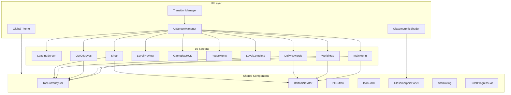

# System Design — UI/UX System

Детальный технический дизайн **UI/UX System** для Neo Soft Frost — 10 экранов в стиле "мягкий морозный luxe" (glassmorphism, holographic spheres, dreamy palette).

> **Reference Mockups**: `ui1/screens 01/` (10 PNG-файлов)

---

## 1. Overview

### Цель
Создать production-ready UI из 10 экранов, точно воспроизводящих дизайн из reference mockups, в Godot 4.x с использованием Control nodes, Theme resources, ShaderMaterial для glassmorphism и AnimationPlayer для transitions.

### Связанные требования
- [REQ-UI-601] — [REQ-UI-610] (PRD v5)
- [ADR-010] UI/UX System Design

---

## 2. Architecture



---

## 3. Design Tokens

### 3.1 Color Palette

```gdscript
# theme_tokens.gd
class_name ThemeTokens

const LAVENDER = Color("#D8CCFF")
const SOFT_PINK = Color("#FFD4E8")
const ICE_BLUE = Color("#CCECFF")
const WARM_GOLD = Color("#FFD700")
const CRYSTAL_WHITE = Color("#F8F6FF")
const DEEP_PURPLE = Color("#8B7FBF")
const FROST_BG = Color("#E8E0FF")
const GLASS_BG = Color(1, 1, 1, 0.15)
const GLASS_BORDER = Color(1, 1, 1, 0.3)
const SHADOW_COLOR = Color(0, 0, 0, 0.1)
```

### 3.2 Typography

```text
Title Large:  72px, Bold, Rounded (Nunito/Comfortaa)
Title Medium: 48px, Bold
Title Small:  36px, SemiBold
Body Large:   24px, Regular
Body Medium:  20px, Regular
Body Small:   16px, Regular
Label:        14px, Medium
Badge:        12px, Bold
```

### 3.3 Spacing System

```text
xs: 4px
sm: 8px
md: 16px
lg: 24px
xl: 32px
xxl: 48px
```

### 3.4 Border Radius

```text
pill: 999px (full stadium)
card: 20px
panel: 24px
button: 16px
badge: 8px
circle: 50%
```

---

## 4. Shared Components

### 4.1 GlassmorphicPanel

```text
Purpose: Основной контейнер для UI-элементов
Properties:
  - background: GLASS_BG (white 15% opacity)
  - blur: 20px (BackBufferCopy + ShaderMaterial)
  - border: 1px GLASS_BORDER
  - border_radius: 24px
  - shadow: 0 8px 32px SHADOW_COLOR
  - padding: lg (24px)
Implementation: StyleBoxFlat + ShaderMaterial для blur
```

### 4.2 TopCurrencyBar

```text
Purpose: Отображение валют (Coins, Stars) и Inbox
Layout: HBoxContainer
Children:
  - CoinPill: icon + count + "+" button
  - StarPill: icon + count + "+" button  
  - InboxButton: envelope icon + notification badge
Position: Top of screen, fixed
Height: 48px
```

### 4.3 BottomNavBar

```text
Purpose: Навигация между основными экранами
Layout: HBoxContainer (5 items)
Items: Home | Rankings | [Context] | Collection/Friends | Inbox
Active: diamond marker under active item
Background: GlassmorphicPanel
Height: 72px
Position: Bottom of screen, fixed
```

### 4.4 PillButton

```text
Purpose: Primary action button
Shape: Stadium/pill (border_radius: 999px)
Height: 60-80px
Background: Gradient (LAVENDER → SOFT_PINK → WARM_GOLD)
Border: 2px iridescent glow
Text: Bold, white, centered
Icons: sparkle diamonds on sides
Animation: hover scale 1.05, press scale 0.95, glow pulse
Variants: primary (gradient), secondary (outline), disabled (grey)
```

### 4.5 IconCard

```text
Purpose: Quick-access tiles (Levels, Events, Shop, Settings)
Shape: Rounded square (border_radius: 20px)
Size: 80-100px
Background: GlassmorphicPanel
Icon: Holographic, outlined, centered
Label: Below icon, Body Small
Badge: Optional count badge (top-right corner)
```

### 4.6 StarRating

```text
Purpose: Показ 0-3 звёзд
Layout: HBoxContainer (3 stars)
States: empty (outline), filled (gold glow), animated_fill (bounce-in)
Size: 32-48px per star
Animation: Sequential bounce with 0.1s delay
```

### 4.7 FrostProgressBar

```text
Purpose: Progress для целей уровня и Daily Quests
Background: Rounded bar, GLASS_BG
Fill: Gradient (ICE_BLUE → SOFT_PINK → WARM_GOLD)
Height: 12-16px
Border_radius: pill
Sparkle: Animated diamond at fill edge
Text: "{current}/{total}" right-aligned
```

---

## 5. Screen Specifications

### 5.1 Loading Screen (Screen 1)

```text
Reference: ui1/screens 01/ (10).png

Layout:
  VBoxContainer (centered, fill)
    - Title "Neo Soft Frost" (72px, gradient text shader)
    - Diamond separator
    - Subtitle "Match the magic. Restore the light." (20px)
    - [spacer]
    - Holographic sphere (TextureRect, 300x300, animated rotation)
    - [spacer]
    - "LOADING..." label (14px)
    - FrostProgressBar (width 60%)
    - "✦ Tap to Start ✦" (16px, pulsing opacity)

Background:
  - Gradient: ICE_BLUE → LAVENDER (vertical)
  - Floating bubbles particles
  - Diamond crystals hanging
  - Dreamy clouds (bottom)

Transitions:
  - Fade in on load
  - Progress bar fills during resource loading
  - Tap to Start appears after load complete
  - Fade out → Main Menu

Scene: scenes/boot/loading_screen.tscn
```

### 5.2 Main Menu (Screen 2)

```text
Reference: ui1/screens 01/ (1).png

Layout:
  VBoxContainer:
    - TopCurrencyBar (coins: 12,450 | stars: 85 | inbox)
    - Title "Neo Soft Frost" (72px, gradient)
    - Diamond separator line
    - Holographic sphere on glass podium (280x280)
    - PillButton "Play" (primary, full width)
    - HBoxContainer: 4 IconCards (Levels, Events, Shop, Settings)
    - BottomNavBar (Home*, Rankings, Collection, Friends, Inbox)

Background:
  - Same as Loading with subtle parallax
  - Floating bubbles, diamond crystals

Transitions:
  - Play → World Map (slide right)
  - IconCards → respective screens
  - NavBar items → switch screens

Scene: scenes/menus/main_menu.tscn
```

### 5.3 World Map (Screen 3)

```text
Reference: ui1/screens 01/ (2).png

Layout:
  - TopCurrencyBar
  - Title "Neo Soft Frost" + World name "Dreamy Skies"
  - ScrollContainer (vertical, free scroll):
    - Winding path with sphere-nodes (levels 1–12+)
    - Each node: glass sphere + level number + StarRating
    - Locked nodes: sphere + lock icon (dimmed)
    - "You are here" tooltip on current level
    - Castle/landmark at midpoint
  - Side: Events button, Leaderboard button
  - "Next World" card (bottom-right): preview sphere + name + star progress
  - BottomNavBar (Home, Rankings, World*, Collection, Inbox)

Background:
  - Dreamy sky gradient
  - Floating clouds, platforms
  - Distant bubbles

Interaction:
  - Tap level → Level Preview
  - Scroll to see more levels
  - Locked levels show lock, no tap

Scene: scenes/menus/world_map.tscn
```

### 5.4 Level Preview (Screen 4)

```text
Reference: ui1/screens 01/ (3).png

Layout:
  VBoxContainer:
    - TopCurrencyBar
    - Back button (←) + "Level N" (48px) + Difficulty badge
    - GlassmorphicPanel:
      - "Mission target" header
      - HBox: 3 sphere icons + target counts (60, 50, 40)
    - GlassmorphicPanel:
      - "Level preview" header
      - GridContainer: 7×4 mini board preview with blockers
    - GlassmorphicPanel:
      - "Select boosters" header
      - HBox: 3 booster cards (Shuffle ×12, Hammer ×15, Rainbow Orb ×8)
    - "Rewards" row: Coins 300 + Stars 3
    - PillButton "Start" (primary, gradient, bottom fixed)

Scene: scenes/menus/level_preview.tscn
```

### 5.5 Gameplay HUD (Screen 5)

```text
Reference: ui1/screens 01/ (4).png

Layout:
  - Top panel: "Neo Soft Frost" | Mission icons (3) + counts | "Moves: N" | "Score: N"
  - FrostProgressBar (rainbow gradient, 3 star markers)
  - Board frame: GlassmorphicPanel containing 8×8 game grid
    - Side diamond markers (left/right glow)
    - Combo Window ring overlay
  - Bottom target panel: 3 objectives with FrostProgressBar each
  - Bottom boosters: 3 booster buttons (Shuffle, Hammer, Undo) with badge counts

Overlay elements:
  - Combo Window: radial glow ring around board
  - Fever overlay: golden shimmer full-screen
  - Cascade titles: floating "Nice", "Combo", "Chain Reaction"...
  - Special sphere spawn effects

Scene: scenes/gameplay/gameplay.tscn (UPGRADE)
```

### 5.6 Pause Menu (Screen 6)

```text
Reference: ui1/screens 01/ (5).png

Layout:
  - Background: blurred gameplay (BackBufferCopy shader)
  - GlassmorphicPanel (centered modal):
    - Diamond separator
    - "✦ Paused ✦" title (48px)
    - Close (X) button (top-right)
    - PillButton "Resume" (icon ▶ + text + arrow)
    - PillButton "Restart" (icon ↻ + text + arrow)
    - PillButton "Home" (icon ⌂ + text + arrow)
    - Diamond separator
    - Settings section:
      - Music: label + rainbow slider + sphere knob
      - Sound: label + rainbow slider + sphere knob
      - Haptics: label + toggle switch
    - Diamond separator (bottom)

Interaction:
  - Resume → close modal, unpause
  - Restart → confirm → restart level
  - Home → confirm → main menu
  - Sliders → real-time audio adjustment

Scene: scenes/gameplay/pause_menu.tscn
```

### 5.7 Level Complete (Screen 7)

```text
Reference: ui1/screens 01/ (6).png

Layout:
  VBoxContainer (centered):
    - TopCurrencyBar
    - Title "Level Complete" (60px, gradient, slight bounce-in)
    - Confetti particles
    - GlassmorphicPanel:
      - StarRating (3 stars, animated sequential fill)
      - "Score" label + large score number (48px)
      - "Best Score: N" + "NEW BEST!" badge (pink)
    - GlassmorphicPanel:
      - "Rewards" header
      - HBox: Coin icon + count | Star icon + count
    - PillButton "Next Level >" (primary)
    - PillButton "Share 🔗" (secondary/outline)

Animation:
  - Stars bounce in one by one (0.3s delay each)
  - Score counts up (rolling number animation)
  - "NEW BEST!" badge slides in
  - Confetti burst on 3-star achievement

Scene: scenes/gameplay/level_complete.tscn
```

### 5.8 Out of Moves (Screen 8)

```text
Reference: ui1/screens 01/ (7).png

Layout:
  - Background: blurred + dimmed gameplay
  - GlassmorphicPanel (centered modal):
    - Sad star sphere icon (top, overlapping panel edge)
    - Title "Out of Moves" (48px)
    - Subtitle "You're so close!..." (18px)
    - Diamond separator
    - Mission target panel: 3 spheres with checkmarks
    - "All targets collected!" text (if applicable)
    - PillButton "Retry" (primary)
    - Secondary button "Add 5 Moves" (icon +5 + 🪙 900)
    - Tertiary button "Home" (outline)

Interaction:
  - Retry → restart level
  - Add 5 Moves → deduct coins, continue
  - Home → main menu

Scene: scenes/gameplay/out_of_moves.tscn
```

### 5.9 Daily Rewards (Screen 9)

```text
Reference: ui1/screens 01/ (8).png

Layout:
  VBoxContainer:
    - TopCurrencyBar
    - GlassmorphicPanel:
      - "✦ Daily Rewards ✦" title
      - "Log in every day to claim your rewards!"
      - HBox: 7 day cards (Day 1–7)
        - Each: icon + reward type + amount
        - States: claimed (dimmed, checkmark), current (glowing), future
      - "Today's Featured Reward" showcase:
        - Large sphere on podium (animated rotation)
        - "Day 7 Reward" + "Premium Bubble" name + description
        - PillButton "Claim" (primary)
    - GlassmorphicPanel:
      - "✦ Daily Quests ✦" title
      - "Complete quests to earn stars!"
      - 4 quest rows: icon + description + FrostProgressBar + star reward + "Go" button

  - BottomNavBar (Home*, Rankings, Collection, Friends, Inbox)

Scene: scenes/menus/daily_rewards.tscn
```

### 5.10 Shop (Screen 10)

```text
Reference: ui1/screens 01/ (9).png

Layout:
  VBoxContainer:
    - TopCurrencyBar
    - "Shop" title (48px, gradient)
    - Tab bar: [Coins] [Boosters] [Specials]
    - ScrollContainer:
      == Coins tab ==
      - "✦ Coin Packs ✦" header
      - GridContainer (2×2): 4 coin packs
        - Each: name + coin art + amount + price ($)
      - "✦ Booster Bundles ✦" header
      - HBox: 3 bundles (Starter/Power/Pro)
        - Each: name + icons + coin price
      - Featured section:
        - Rainbow Orb card (art + description + coin price)
        - "Blossom Season Pack" card (Limited Time! badge + "Best Value" badge)
    - BottomNavBar (Home, Rankings, Collection, Friends, Inbox)

Scene: scenes/menus/shop.tscn
```

---

## 6. Glassmorphism Shader

```gdscript
# glassmorphic_blur.gdshader
shader_type canvas_item;

uniform float blur_amount : hint_range(0.0, 40.0) = 20.0;
uniform float alpha : hint_range(0.0, 1.0) = 0.15;
uniform vec4 tint_color : source_color = vec4(1.0, 1.0, 1.0, 0.15);
uniform float border_width : hint_range(0.0, 5.0) = 1.0;
uniform vec4 border_color : source_color = vec4(1.0, 1.0, 1.0, 0.3);
uniform float corner_radius : hint_range(0.0, 50.0) = 24.0;

void fragment() {
    // BackBufferCopy provides blurred background
    vec4 bg = textureLod(SCREEN_TEXTURE, SCREEN_UV, blur_amount * 0.1);
    
    // Apply tint
    vec4 result = mix(bg, tint_color, alpha);
    
    // Apply border (simplified)
    vec2 uv = UV;
    float border_mask = step(border_width / 100.0, min(min(uv.x, 1.0 - uv.x), min(uv.y, 1.0 - uv.y)));
    result = mix(border_color, result, border_mask);
    
    COLOR = result;
}
```

---

## 7. Transition System

```gdscript
# transition_manager.gd
class_name TransitionManager
extends CanvasLayer

enum TransitionType { FADE, SLIDE_LEFT, SLIDE_RIGHT, SCALE_UP }

var transition_duration: float = 0.4

func change_screen(target_scene: PackedScene, type: TransitionType = TransitionType.FADE):
    match type:
        TransitionType.FADE:
            _fade_out()
            await get_tree().create_timer(transition_duration).timeout
            _load_scene(target_scene)
            _fade_in()
        TransitionType.SLIDE_LEFT:
            _slide_out(Vector2(-1, 0))
            await get_tree().create_timer(transition_duration).timeout
            _load_scene(target_scene)
            _slide_in(Vector2(1, 0))
```

---

## 8. Performance Considerations

```text
- Glassmorphism blur: Use BackBufferCopy with reduced resolution (0.5x)
- Particle systems: max 6 per screen (bubbles, sparkles, diamonds)
- Texture atlas: Group all UI icons into single atlas
- Font loading: Preload fonts in autoload
- Scene preloading: Preload next-likely screen
- Mobile safe: Disable blur on android_safe, use solid tint
```

---

## 9. Testing Strategy

```text
- Visual regression: Screenshot comparison per screen
- Navigation: All transitions work (10 screens × valid routes)
- Responsive: 16:9, 18:9, 20:9 aspect ratios
- Performance: FPS ≥ 60 on all screens (including blur)
- Accessibility: All interactive elements have unique IDs
- Theme consistency: All components use ThemeTokens
```
