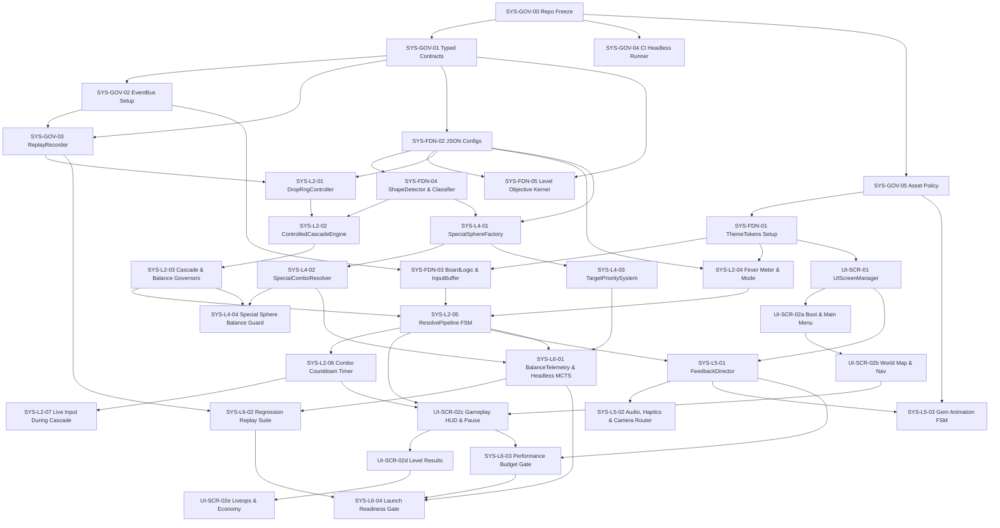

# Work Breakdown Structure — Genesis v5.1 Production Tasks

> **System Version**: `genesis/v5.1`  
> **Status**: READY FOR DEVELOPMENT AFTER PHASE 0 FREEZE  
> **Target Engine**: Godot 4.x  
> **Core Principle**: deterministic core, event-driven feedback, replayable balance, scalable UI/asset system  
> **Last Updated**: 2026-05-26  

---

## 1. Обзор фаз разработки (Phase Overview)

```text
Phase 0: Governance, Contracts, CI & Replay Foundation
  └─► Phase 1: Foundation Core, Tokens, Configs & Shape System
        └─► Phase 2: Controlled Cascade, Fever, Input & Resolve FSM
              ├─► Phase 3: Special Sphere Ecosystem & Target Intelligence
              ├─► Phase 4: UI/UX Screens, Feedback, VFX/SFX & Asset Pipeline
              └─► Phase 5: Telemetry, MCTS, Regression, Android Launch Gates
```

---

## 2. Глобальные правила архитектуры (Core Architecture Rules)

### Границы системных слоев (System Boundary)

* **`scripts/core_match3/`** — Только детерминированная логика геймплея (deterministic gameplay). Никакого UI, визуальных эффектов или звуков.
* **`scripts/ui/`** — Логика экранов, состояние UI, ThemeTokens.
* **`scripts/feedback/`** — Оркестрация VFX, SFX, тактильной отдачи (haptics) и движения камеры.
* **`scripts/telemetry/`** — Пассивное логгирование событий, replay-система, метрики баланса.
* **`data/`** — Только конфигурационные файлы JSON.
* **`tests/`** — GUT юнит, интеграционные, e2e, регрессионные и headless MCTS тесты.

### Запрещенные зависимости (Forbidden Couplings)

* **Запрещено**: `BoardLogic` вызывает методы UI напрямую.
* **Запрещено**: `ControlledCascadeEngine` напрямую инстанцирует или запускает визуальные частицы.
* **Запрещено**: `FeedbackDirector` мутирует логическое состояние доски (`board_logic`).
* **Запрещено**: UI-экраны напрямую спавнят или удаляют спец-сферы минуя ResolvePipeline.
* **Запрещено**: Telemetry-слой изменяет результаты матчей или ходов.

### Обязательный поток событий (Required Event Flow)

```text
Ввод игрока (Player Input)
  → InputBufferController
  → BoardLogic
  → ResolvePipeline FSM
  → ShapeDetector / ShapeClassifier
  → SpecialSphereFactory
  → ControlledCascadeEngine
  → Governors
  → EventBus (Signal Map)
  → FeedbackDirector / HUD / Telemetry
```

---

## 3. Граф зависимостей задач (Dependency Graph)



---

## 4. Детальный список задач (WBS Task List)

### Phase 0 — Governance, Contracts, CI & Replay Foundation

#### - [ ] **[SYS-GOV-00] Repository Architecture Freeze**
- **Goal**: Зафиксировать структуру каталогов проекта, границы ответственности системных слоев и запретить прямые перекрестные связи.
- **Input**: [02_ARCHITECTURE_OVERVIEW.md](file:///Users/user/3-line/genesis/v5/02_ARCHITECTURE_OVERVIEW.md)
- **Output**: 
  - `docs/architecture/project_structure.md`
  - `docs/architecture/layer_boundaries.md`
  - `docs/governance/dependency_rules.md`
- **Verification**: Все последующие задачи WBS ссылаются на утвержденные слои; в документах прописаны жесткие правила запрета неявных зависимостей.
- **Dependencies**: None

#### - [ ] **[SYS-GOV-01] Typed Gameplay Contracts Registry**
- **Goal**: Создать жестко типизированные классы-контракты событий и данных для core, UI, feedback и telemetry.
- **Input**: [01_PRD.md](file:///Users/user/3-line/genesis/v5/01_PRD.md), [02_ARCHITECTURE_OVERVIEW.md](file:///Users/user/3-line/genesis/v5/02_ARCHITECTURE_OVERVIEW.md)
- **Output**: 
  - `scripts/contracts/board_snapshot.gd`
  - `scripts/contracts/match_event.gd`
  - `scripts/contracts/cascade_step.gd`
  - `scripts/contracts/special_activation_event.gd`
  - `scripts/contracts/telemetry_event.gd`
  - `docs/contracts/gameplay_contracts.md`
- **Required Contracts**: `BoardSnapshot`, `CellState`, `SwapIntent`, `MatchEvent`, `ShapeClassification`, `SpecialSpawnRequest`, `SpecialActivationEvent`, `CascadeStep`, `FeverState`, `FeedbackCue`, `TelemetryEvent`.
- **Verification**: Тесты GUT проверяют создание, валидность и десериализацию каждого контракта. Ни один модуль не передает raw Dictionary во внешний слой.
- **Dependencies**: **[SYS-GOV-00]**

#### - [ ] **[SYS-GOV-02] EventBus / Signal Map**
- **Goal**: Ввести глобальную централизованную шину событий для передачи данных о состоянии геймплея без прямых перекрестных вызовов.
- **Input**: **[SYS-GOV-01]**
- **Output**: 
  - `scripts/system/game_event_bus.gd`
  - `docs/contracts/event_signal_map.md`
- **Required Events**: `swap_requested`, `input_queued`, `match_detected`, `shape_classified`, `special_spawned`, `special_activated`, `cascade_started`, `cascade_step_resolved`, `cascade_governed`, `fever_meter_changed`, `fever_started`, `fever_ended`, `level_result_resolved`.
- **Verification**: Написание GUT-теста с mock-подписчиком, который должен получить все зарегистрированные события в детерминированном порядке.
- **Dependencies**: **[SYS-GOV-01]**

#### - [ ] **[SYS-GOV-03] Deterministic ReplayRecorder**
- **Goal**: Разработать модуль захвата и воспроизведения игровых сессий (seed, входы игрока, снапшоты ходов, метаданные каскадов) для баг-репортов и симулятора баланса.
- **Input**: **[SYS-GOV-01]**, **[SYS-GOV-02]**
- **Output**: 
  - `scripts/debug/replay_recorder.gd`
  - `scripts/debug/replay_player.gd`
  - `artifacts/replays/.gitkeep`
  - `docs/debug/replay_protocol.md`
- **Verification**: Интеграционный тест: повторное воспроизведение записанного replay-файла дает идентичный финальный хеш доски.
- **Dependencies**: **[SYS-GOV-01]**, **[SYS-GOV-02]**

#### - [ ] **[SYS-GOV-04] CI Headless Test Runner**
- **Goal**: Настроить консольный шелл-скрипт для автозапуска всех тестов GUT в headless-режиме, формируя основу для CI-валидации.
- **Input**: **[SYS-GOV-00]**
- **Output**: 
  - `scripts/ci/run_all_tests.sh`
  - `scripts/ci/run_headless_tests.sh`
  - `docs/testing/test_commands.md`
- **Verification**: Запуск скрипта в терминале возвращает exit code 0 при успехе и exit code != 0 при падении любого критического теста.
- **Dependencies**: **[SYS-GOV-00]**

#### - [ ] **[SYS-GOV-05] Asset Manifest & Import Policy**
- **Goal**: Описать строгую политику ассетов (PNG, WebP, spritesheets, SFX, шрифты) с автоматическим подставлением fallback-заглушек в случае отсутствия физических файлов.
- **Input**: **[SYS-GOV-00]**
- **Output**: 
  - `data/assets/asset_manifest.json`
  - `docs/assets/asset_pipeline.md`
  - `docs/assets/naming_conventions.md`
- **Verification**: Временное удаление текстуры сферы не приводит к вылету игры, а плавно заменяется на дефолтный белый круг с логом ошибки.
- **Dependencies**: **[SYS-GOV-00]**

---

### Phase 1 — Foundation Core, Tokens, Configs & Shape System

#### - [ ] **[SYS-FDN-01] ThemeTokens Autoload & Resource Setup**
- **Goal**: Создать основу визуальной дизайн-системы — токенов цветов, шрифтов, анимаций, звуков и настроек производительности (shader profiles).
- **Input**: [ui-ux-design-system.md](file:///Users/user/3-line/genesis/v5/04_SYSTEM_DESIGN/ui-ux-design-system.md), **[SYS-GOV-05]**
- **Output**: 
  - `scripts/ui/ThemeTokens.gd`
  - `ui/theme/frost_theme.tres`
  - `data/ui/theme_tokens.json`
- **Verification**: Проверка чтения `ThemeTokens.colors.primary` и `ThemeTokens.performance.shader_quality` без ошибок.
- **Dependencies**: **[SYS-GOV-05]**

#### - [ ] **[SYS-FDN-02] Balance JSON Configuration Setup + Schema Validation**
- **Goal**: Подготовить все внешние JSON-конфигурации баланса со строгой валидацией по JSON Schema и поддержкой версионирования.
- **Input**: [controlled_cascade_engine.md](file:///Users/user/3-line/genesis/v5/04_SYSTEM_DESIGN/controlled_cascade_engine.md), **[SYS-GOV-01]**
- **Output**: 
  - `data/cascade_rules.json`, `data/shape_rules.json`, `data/special_spheres.json`, `data/combo_vfx_tiers.json`, `data/level_balance_profiles.json`
  - `data/schemas/*.schema.json`
  - `scripts/config/config_loader.gd`, `scripts/config/config_validator.gd`
- **Verification**: Тест GUT передает невалидный JSON; система отклоняет его, логирует ошибку схемы и загружает безопасный `fallback_profile`.
- **Dependencies**: **[SYS-GOV-01]**

#### - [ ] **[SYS-FDN-03] BoardLogic & InputBufferController**
- **Goal**: Переименовать `board_state_engine.gd` в `board_logic.gd` и расширить `input_buffer_controller.gd` очередью свайпов (до 3 штук) с приоритетом живого ввода игрока поверх анимаций.
- **Input**: [ui_ux_system.md](file:///Users/user/3-line/genesis/v5/04_SYSTEM_DESIGN/ui_ux_system.md), [combo_fever_engine.md](file:///Users/user/3-line/genesis/v5/04_SYSTEM_DESIGN/combo_fever_engine.md), **[SYS-GOV-02]**
- **Output**: 
  - `scripts/core_match3/board_logic.gd`
  - `scripts/core_match3/input_buffer_controller.gd`
- **Verification**: Тест GUT симулирует 4 быстрых ввода свайпа подряд во время `CellState.RESERVED`; 3 свайпа ставятся в очередь, 4-й отбрасывается без краша FSM.
- **Dependencies**: **[SYS-FDN-01]**, **[SYS-GOV-02]**

#### - [ ] **[SYS-FDN-04] Layer 1 Core: ShapeDetector & Classifier Upgrades**
- **Goal**: Обновить распознавание форм с 7 базовых до 11 продвинутых геометрических паттернов с разрешением конфликтов наложения форм по приоритету.
- **Input**: **[SYS-FDN-02]**, [01_PRD.md](file:///Users/user/3-line/genesis/v5/01_PRD.md)
- **Output**: 
  - `scripts/core_match3/shape_detector.gd`
  - `scripts/core_match3/shape_classifier.gd`
- **Required Shapes**: LINE_3, LINE_4, LINE_5, T_5, L_5, SQUARE_2x2, RECTANGLE_2x3, HOOK_6, ZIGZAG_6, CROSS_7, RARE_9_PLUS.
- **Verification**: Написание GUT-тестов на все 11 форм; при пересечении форм детектор корректно отдает приоритет форме с более высоким priority score.
- **Dependencies**: **[SYS-FDN-02]**

#### - [ ] **[SYS-FDN-05] Level Objective Kernel**
- **Goal**: Создать изолированное от UI ядро отслеживания прогресса целей уровня (цвета, блокираторы, цепи, сбор предметов).
- **Input**: **[SYS-GOV-01]**, **[SYS-FDN-02]**
- **Output**: 
  - `scripts/core_match3/level_objective_kernel.gd`
  - `data/level_objectives.json`
- **Verification**: Тест GUT симулирует уничтожение ледяного блока; ядро целей обновляет остаток и посылает сигнал без обращения к HUD.
- **Dependencies**: **[SYS-GOV-01]**, **[SYS-FDN-02]**

---

### Phase 2 — Controlled Cascade, Fever, Input & Resolve FSM

#### - [ ] **[SYS-L2-01] DropRngController Implementation**
- **Goal**: Создать генератор случайных чисел на основе сидов с поддержкой изолированных пространств имен сидов (seed namespaces) для воспроизводимости MCTS.
- **Input**: [controlled_cascade_engine.md](file:///Users/user/3-line/genesis/v5/04_SYSTEM_DESIGN/controlled_cascade_engine.md), **[SYS-GOV-03]**
- **Output**: 
  - `scripts/core_match3/drop_rng_controller.gd`
- **Verification**: Запуск тестов на воспроизводимость: при одинаковом сиде уровня, но разных сидах каскада/сфер, последовательности генерируются строго изолированно.
- **Dependencies**: **[SYS-FDN-02]**, **[SYS-GOV-03]**

#### - [ ] **[SYS-L2-02] ControlledCascadeEngine Core**
- **Goal**: Реализовать ядро Controlled Cascade Engine с тремя режимами выпадения (Natural, Assisted, Cinematic) и логированием причин принятия решений.
- **Input**: **[SYS-L2-01]**, **[SYS-FDN-04]**
- **Output**: 
  - `scripts/core_match3/controlled_cascade_engine.gd`
- **Verification**: Юнит-тесты проверяют переход режимов; каждый шаг Assisted Drop логирует точный `decision_reason` (например, "fail_streak_assist").
- **Dependencies**: **[SYS-L2-01]**, **[SYS-FDN-04]**

#### - [ ] **[SYS-L2-03] Cascade & Balance Governors Integration**
- **Goal**: Написать защитные регуляторы `cascade_governor.gd` и `balance_governor.gd` для ограничения бесконечных каскадов и авто-побед с помощью принудительного Color Interlocking.
- **Input**: **[SYS-L2-02]**
- **Output**: 
  - `scripts/core_match3/cascade_governor.gd`
  - `scripts/core_match3/balance_governor.gd`
- **Verification**: Запуск GUT-теста: при искусственном каскаде глубиной > 5 срабатывает ограничение, и поле стабилизируется за счет Color Interlocking.
- **Dependencies**: **[SYS-L2-02]**

#### - [ ] **[SYS-L2-04] Fever Meter & Fever Mode Integration**
- **Goal**: Реализовать `combo_fever_controller.gd` как отдельный профиль баланса, временно изменяющий глубину каскадов до 8, увеличивающий множители и спавн спец-сфер.
- **Input**: [combo_fever_engine.md](file:///Users/user/3-line/genesis/v5/04_SYSTEM_DESIGN/combo_fever_engine.md), **[SYS-FDN-01]**, **[SYS-FDN-02]**
- **Output**: 
  - `scripts/core_match3/combo_fever_controller.gd`
- **Verification**: GUT-тест проверяет накопление очков за каскады, переход в Fever Mode на 100% и возврат лимитов в CascadeGovernor по завершении.
- **Dependencies**: **[SYS-FDN-01]**, **[SYS-FDN-02]**

#### - [ ] **[SYS-L2-05] ResolvePipeline FSM Integration**
- **Goal**: Интегрировать Layer 2 в FSM конвейера переходов логического поля (`resolve_pipeline.gd`) с обязательными тайм-аутами безопасности и обработкой ошибок.
- **Input**: [02_ARCHITECTURE_OVERVIEW.md](file:///Users/user/3-line/genesis/v5/02_ARCHITECTURE_OVERVIEW.md), **[SYS-L2-03]**, **[SYS-L2-04]**, **[SYS-FDN-03]**
- **Output**: 
  - `scripts/core_match3/resolve_pipeline.gd`
- **Required States**: IDLE, INPUT_ACCEPTING, SWAP_VALIDATING, MATCH_SCANNING, SPECIAL_RESOLVING, CASCADE_EVALUATING, CASCADE_GOVERNED, FEVER_CHECKING, BOARD_STABILIZING, LEVEL_RESULT_CHECKING, ERROR_RECOVERY.
- **Verification**: Интеграционный тест: при зависании анимации или состояния поля более чем на 2.0 секунды, FSM безопасно переходит в `ERROR_RECOVERY` и возвращает управление игроку.
- **Dependencies**: **[SYS-L2-03]**, **[SYS-L2-04]**, **[SYS-FDN-03]**

#### - [ ] **[SYS-L2-06] Combo Countdown Window Controller**
- **Goal**: Разработать менеджер геймплейного окна комбо (таймер быстрого свайпа), который дает игроку бонусные Fever-очки при совершении ходов в узком временном окне.
- **Input**: **[SYS-L2-05]**, **[SYS-FDN-03]**
- **Output**: 
  - `scripts/core_match3/combo_window_controller.gd`
- **Verification**: Тест GUT симулирует два свайпа с интервалом 0.5с (успех, комбо-множитель увеличивается) и 1.8с (провал, комбо-множитель сбрасывается).
- **Dependencies**: **[SYS-L2-05]**, **[SYS-FDN-03]**

#### - [ ] **[SYS-L2-07] Live Input During Cascade Animation**
- **Goal**: Позволить игроку осуществлять свайпы на стабильных участках поля прямо во время проигрывания анимаций каскадов на других участках доски.
- **Input**: **[SYS-L2-06]**
- **Output**: Модификация `input_buffer_controller.gd` и `resolve_pipeline.gd`
- **Verification**: Попытка свайпа на падающей клетке отклоняется; свайп на статичной клетке ставится в очередь и выполняется без сбоев.
- **Dependencies**: **[SYS-L2-06]**

---

### Phase 3 — Special Sphere Ecosystem & Target Intelligence

#### - [ ] **[SYS-L4-01] SpecialSphereFactory Expansion**
- **Goal**: Создать расширенную дата-ориентированную фабрику спец-сфер, управляемую внешним JSON-конфигом, с поддержкой 10 типов спец-сфер.
- **Input**: [01_PRD.md](file:///Users/user/3-line/genesis/v5/01_PRD.md), **[SYS-FDN-04]**, **[SYS-FDN-02]**
- **Output**: 
  - `scripts/core_match3/special_sphere_factory.gd`
- **Verification**: Юнит-тесты на создание всех 10 спец-сфер по правилам Spawn Location Rules (в геометрическом центре, смещение к целям, обход препятствий).
- **Dependencies**: **[SYS-FDN-04]**, **[SYS-FDN-02]**

#### - [ ] **[SYS-L4-02] SpecialComboResolver Implementation**
- **Goal**: Закодировать логику слияния спец-сфер для 15 различных комбинаций на основе декларативной матрицы слияний в JSON.
- **Input**: [01_PRD.md](file:///Users/user/3-line/genesis/v5/01_PRD.md), **[SYS-L4-01]**
- **Output**: 
  - `scripts/core_match3/special_combo_resolver.gd`
  - `data/special_combo_matrix.json`
- **Verification**: GUT-тест слияния Singularity + Homing не вызывает бесконечного зацикливания и корректно очищает поле.
- **Dependencies**: **[SYS-L4-01]**

#### - [ ] **[SYS-L4-03] TargetPrioritySystem 2.0**
- **Goal**: Разработать умную систему выбора целей для самонаводящихся сфер на основе формулы взвешенной оценки (weighted scoring).
- **Input**: [combo_fever_engine.md](file:///Users/user/3-line/genesis/v5/04_SYSTEM_DESIGN/combo_fever_engine.md), **[SYS-L4-01]**, **[SYS-FDN-05]**
- **Output**: 
  - `scripts/core_match3/target_priority_system.gd`
- **Scoring Formula**:
  `target_score = objective_weight + blocker_weight + scarcity_weight + move_pressure_weight + combo_potential_weight + distance_weight + fever_modifier - overkill_penalty`
- **Verification**: При наличии на поле обычного блока и критической цели уровня (с малым количеством ходов), сфера выбирает критическую цель.
- **Dependencies**: **[SYS-L4-01]**, **[SYS-FDN-05]**

#### - [ ] **[SYS-L4-04] Special Sphere Balance Guard**
- **Goal**: Ограничить пересыщение игрового поля спец-сферами во время длительных каскадов для предотвращения неконтролируемого авто-прохождения.
- **Input**: **[SYS-L4-02]**, **[SYS-L2-03]**
- **Output**: 
  - `scripts/core_match3/special_balance_guard.gd`
- **Verification**: Тест GUT: при генерации каскадом > 3 спец-сфер за один ход, Balance Guard понижает шансы спавна последующих сфер до базового уровня.
- **Dependencies**: **[SYS-L4-02]**, **[SYS-L2-03]**

---

### Phase 4 — UI/UX Screens, Feedback, VFX/SFX & Asset Pipeline

#### - [ ] **[UI-SCR-01] UIScreenManager & Glassmorphic Shaders**
- **Goal**: Создать менеджер экранов с шейдером матового морозного стекла, поддерживающим профили оптимизации (HIGH/MID/SAFE) под Android.
- **Input**: [ui-ux-design-system.md](file:///Users/user/3-line/genesis/v5/04_SYSTEM_DESIGN/ui-ux-design-system.md), [ui_ux_system.md](file:///Users/user/3-line/genesis/v5/04_SYSTEM_DESIGN/ui_ux_system.md)
- **Output**: 
  - `scenes/ui/ui_screen_manager.gd`
  - `shaders/frost_glass.gdshader`
  - `data/ui/shader_quality_profiles.json`
- **Verification**: При переключении в режим SAFE тяжелый шейдерный блюр отключается, заменяясь на плоскую полупрозрачную подложку.
- **Dependencies**: **[SYS-FDN-01]**

#### - [ ] **[UI-SCR-02a] UI Screens: Boot & Main Menu**
- **Goal**: Разработать сцены экрана загрузки (Loading Screen) и главного меню (Main Menu) в стиле Neo Soft Frost с асинхронным чтением ассет-манифеста.
- **Input**: [01_PRD.md](file:///Users/user/3-line/genesis/v5/01_PRD.md), **[UI-SCR-01]**
- **Output**: 
  - `scenes/boot/loading_screen.tscn`
  - `scenes/menus/main_menu.tscn`
- **Verification**: Запуск сцены загрузки плавно считывает ассеты из `asset_manifest.json` и переходит в главное меню без фризов.
- **Dependencies**: **[UI-SCR-01]**

#### - [ ] **[UI-SCR-02b] UI Screens: World Map & Level Preview**
- **Goal**: Создать экраны карты мира (World Map) с нодами уровней и превью уровня (Level Preview) с интеграцией целей из Objective Kernel.
- **Input**: [01_PRD.md](file:///Users/user/3-line/genesis/v5/01_PRD.md), **[UI-SCR-02a]**, **[SYS-FDN-05]**
- **Output**: 
  - `scenes/menus/world_map.tscn`
  - `scenes/menus/level_preview.tscn`
- **Verification**: Клик по ноду уровня открывает модалку превью, отображая цели уровня, динамически загружаемые из Objective Kernel.
- **Dependencies**: **[UI-SCR-02a]**, **[SYS-FDN-05]**

#### - [ ] **[UI-SCR-02c] UI Screens: Gameplay HUD & Pause Menu**
- **Goal**: Разработать игровой интерфейс (Gameplay HUD) со шкалой комбо, Fever-эффектами, индикацией очереди ввода и модальным меню паузы.
- **Input**: [ui_ux_system.md](file:///Users/user/3-line/genesis/v5/04_SYSTEM_DESIGN/ui_ux_system.md), **[UI-SCR-02b]**, **[SYS-L2-05]**, **[SYS-L2-06]**
- **Output**: 
  - `scenes/gameplay/gameplay.tscn`
  - `scenes/gameplay/pause_menu.tscn`
- **Verification**: Кнопка паузы плавно открывает меню; радиальный прогресс-бар комбо-окна корректно тает со временем.
- **Dependencies**: **[UI-SCR-02b]**, **[SYS-L2-05]**, **[SYS-L2-06]**

#### - [ ] **[UI-SCR-02d] UI Screens: Level Results**
- **Goal**: Написать сцены завершения уровня (Level Complete) с анимацией звезд и окончания ходов (Out of Moves) с лимитами давления на игрока.
- **Input**: [01_PRD.md](file:///Users/user/3-line/genesis/v5/01_PRD.md), **[UI-SCR-02c]**
- **Output**: 
  - `scenes/gameplay/level_complete.tscn`
  - `scenes/gameplay/out_of_moves.tscn`
- **Verification**: Наступление условий победы/поражения плавно открывает соответствующий экран, считывая лимиты монет из балансового JSON.
- **Dependencies**: **[UI-SCR-02c]**

#### - [ ] **[UI-SCR-02e] UI Screens: Liveops & Economy**
- **Goal**: Реализовать экраны ежедневных наград (Daily Rewards) и магазина (Shop) без использования агрессивных паттернов монетизации.
- **Input**: [01_PRD.md](file:///Users/user/3-line/genesis/v5/01_PRD.md), **[UI-SCR-02d]**
- **Output**: 
  - `scenes/menus/daily_rewards.tscn`
  - `scenes/menus/shop.tscn`
  - `data/economy/reward_profiles.json`
- **Verification**: Проверка переходов в магазин, переключение вкладок товаров, начисление наград по календарю.
- **Dependencies**: **[UI-SCR-02d]**

#### - [ ] **[SYS-L5-01] FeedbackDirector Cascade Escalation**
- **Goal**: Создать координатор обратной связи `feedback_director.gd` с нарастающей лестницей сочности VFX/SFX/Camera/Haptics для 5 уровней каскада (Nice -> Combo -> Chain -> Cascade Surge -> Fever Spark).
- **Input**: [motion-animation-system.md](file:///Users/user/3-line/genesis/v5/04_SYSTEM_DESIGN/motion-animation-system.md), [controlled_cascade_engine.md](file:///Users/user/3-line/genesis/v5/04_SYSTEM_DESIGN/controlled_cascade_engine.md), **[SYS-L2-05]**, **[UI-SCR-01]**
- **Output**: 
  - `scripts/feedback/feedback_director.gd`
  - `data/feedback/combo_feedback_profiles.json`
- **Verification**: Запуск тестов GUT `tests/core_match3/test_feedback_director.gd` ( cascade index 4 вызывает тряску камеры силы 10.0, лимит систем частиц строго ограничен 40 штуками).
- **Dependencies**: **[SYS-L2-05]**, **[UI-SCR-01]**

#### - [ ] **[SYS-L5-02] Audio, Haptics & Camera Feedback Router**
- **Goal**: Вынести логику воспроизведения звуков, вибрации и тряски камеры из FeedbackDirector в отдельные специализированные роутеры для гибкой настройки производительности.
- **Input**: **[SYS-L5-01]**
- **Output**: 
  - `scripts/feedback/audio_feedback_router.gd`
  - `scripts/feedback/haptics_router.gd`
  - `scripts/feedback/camera_feedback_router.gd`
- **Verification**: Тактильная отдача для Android/iOS может быть глобально отключена в настройках без падения игры; звуки не накладываются хаотичной кашей.
- **Dependencies**: **[SYS-L5-01]**

#### - [ ] **[SYS-L5-03] Gem Animation State Machine**
- **Goal**: Формализовать все анимационные состояния гемов (idle, selected, fall, land, special_spawn, dissolve) в виде переиспользуемого конечного автомата (FSM).
- **Input**: **[SYS-GOV-05]**, **[SYS-L5-01]**
- **Output**: 
  - `scripts/animation/gem_animation_state_machine.gd`
  - `docs/animation/gem_animation_states.md`
- **Verification**: Переход из состояния свайпа в состояние падения обрабатывается атомарно, исключая зависания спрайтов в воздухе.
- **Dependencies**: **[SYS-GOV-05]**, **[SYS-L5-01]**

---

### Phase 5 — Telemetry, MCTS, Regression, Android Launch Gates

#### - [ ] **[SYS-L6-01] BalanceTelemetryLayer & Headless MCTS Validation**
- **Goal**: Реализовать сбор детальных метрик баланса и E2E headless-симулятор уровней на основе алгоритма поиска по дереву Монте-Карло (MCTS).
- **Input**: [controlled_cascade_engine.md](file:///Users/user/3-line/genesis/v5/04_SYSTEM_DESIGN/controlled_cascade_engine.md), **[SYS-L2-05]**, **[SYS-L4-02]**, **[SYS-L4-03]**
- **Output**: 
  - `scripts/telemetry/balance_telemetry_layer.gd`
  - `tests/e2e/test_ccpe_e2e.gd`
- **Verification**: Запуск симулятора `godot --headless --path . -s tests/e2e/test_ccpe_e2e.gd` успешно рассчитывает 10,000 матчей; средняя глубина каскада $\le 3.2$; генерируется отчет `artifacts/balance/report.json`.
- **Dependencies**: **[SYS-L2-05]**, **[SYS-L4-02]**, **[SYS-L4-03]**

#### - [ ] **[SYS-L6-02] Regression Replay Suite**
- **Goal**: Создать автоматизированный тестовый набор регрессии, проигрывающий replay-файлы найденных багов для исключения их повторного появления.
- **Input**: **[SYS-GOV-03]**, **[SYS-L6-01]**
- **Output**: 
  - `tests/replay/test_replay_regressions.gd`
  - `artifacts/replays/regression/`
- **Verification**: Добавление баг-реплея в папку `regression/` автоматически подхватывается тестом и воспроизводится до идентичного хеша поля.
- **Dependencies**: **[SYS-GOV-03]**, **[SYS-L6-01]**

#### - [ ] **[SYS-L6-03] Performance Budget Gate**
- **Goal**: Написать тесты валидации ограничений производительности геймплея на мобильных устройствах (лимиты частиц, задержка ввода, шейдеры).
- **Input**: **[SYS-L5-01]**, **[UI-SCR-02c]**
- **Output**: 
  - `docs/testing/performance_budget.md`
  - `tests/performance/test_vfx_budget.gd`
- **Verification**: Встроенный бенчмарк замеряет FPS при спавне 40 систем частиц; FPS не должен падать ниже 55 кадров/сек на SAFE-профиле.
- **Dependencies**: **[SYS-L5-01]**, **[UI-SCR-02c]**

#### - [ ] **[SYS-L6-04] Launch Readiness Gate**
- **Goal**: Сформировать финальный чек-лист готовности к релизу (Go/No-Go criteria), объединяющий все тесты, регрессии и бенчмарки.
- **Input**: **[SYS-L6-01]**, **[SYS-L6-02]**, **[SYS-L6-03]**
- **Output**: 
  - `docs/release/launch_readiness_checklist.md`
  - `docs/release/known_issues.md`
  - `docs/release/build_matrix.md`
- **Verification**: Успешный прогон `run_headless_tests.sh` валидирует чек-лист и генерирует билд-отчет готовности к релизу на Android/iOS.
- **Dependencies**: **[SYS-L6-01]**, **[SYS-L6-02]**, **[SYS-L6-03]**

---

## 5. Агентно-оркестрационный слой (Agent & Orchestration Layer)

Для автоматизации разработки в мультиагентной среде Antigravity OS выделены следующие роли агентов:

* **Architecture Orchestrator** — Владелец WBS, границ слоев и критериев приемки.
* **Core Gameplay Engineer Agent** — Владелец BoardLogic, ShapeDetector, ControlledCascadeEngine и FSM ResolvePipeline.
* **Balance Systems Agent** — Владелец JSON-конфигов, регуляторов Balance/Cascade Governor и MCTS-симулятора.
* **Special Sphere Agent** — Владелец фабрики спец-сфер, матрицы комбо и TargetPrioritySystem.
* **UI/UX Scene Agent** — Владелец всех 10 сцен экранов, HUD и UIScreenManager.
* **Feedback/VFX/SFX Agent** — Владелец FeedbackDirector, частиц, звуковых роутеров и камеры.
* **QA/Regression Agent** — Владелец тестов GUT, ReplayRecorder, регрессионного сьюта и CI-раннера.
* **Release Governor Agent** — Владелец чек-листа релиза, бюджетов производительности и мобильных билдов.

---

## 6. Память и обучение (Memory & Learning Layer)

### Сессионная память (L1/L2)
Хранит текущую задачу, измененные файлы, активный сид сессии и логи падений тестов для быстрой корректировки в рамках одного запуска.

### Проектная память (L3/L4/L5)
Накапливает утвержденные контракты сигналов, историю калибровки сложности уровней MCTS, золотые реплеи и паттерны устранения мобильных багов производительности.

---

## 7. Риски и отказоустойчивость (Risks & Fail-Safe)

| Риск | Точка отказа | Аппаратная защита (Fail-Safe) |
|---|---|---|
| Бесконечный каскад | ControlledCascadeEngine | CascadeGovernor depth cap (max 10) + Color Interlocking |
| Жесткая связь UI и Core | HUD / FeedbackDirector | Взаимодействие строго через изолированную шину событий EventBus |
| Баги случайности баланса | Drop RNG / Assisted mode | Seed-based RNG + ReplayRecorder для 100% воспроизведения |
| VFX фризы на Android | FeedbackDirector | Hard particle limit (max 40) + SAFE shader profile |
| Зависание игры при сбое FSM | ResolvePipeline FSM | ResolvePipelineTimer принудительно стабилизирует доску через 2с |
| Невалидный JSON баланса | JSON configs | Loader с автоматическим откатом на `fallback_profile.json` |

---

## 8. ULTRA PROMPT FOR AGENTS

```text
Ты — Senior Godot Match-3 Systems Engineer + Gameplay Architect + QA Orchestrator.
Работаешь над проектом Genesis v5.1: premium 3-match game с Controlled Cascade Engine, Combo Fever, Special Spheres, Neo Soft Frost UI, deterministic replay, headless MCTS validation и production-grade тестированием.

ТВОЯ ЦЕЛЬ: Разрабатывать систему строго по WBS, сохраняя архитектурные границы, deterministic core, event-driven integration и test-first подход.

ОБЯЗАТЕЛЬНЫЕ ПРИНЦИПЫ:
1. Core gameplay не зависит от UI.
2. UI не меняет board state напрямую.
3. FeedbackDirector не решает gameplay.
4. Telemetry ничего не мутирует.
5. Все cascade/match/special события проходят через typed contracts или EventBus.
6. Любая случайность должна быть seed-based и replayable.
7. Любая новая механика получает unit/integration test.
8. Любой баг превращается в replay regression.
9. JSON-конфиги валидируются схемами и имеют fallback.
10. Любой VFX/SFX должен иметь performance cap и SAFE fallback.
```
