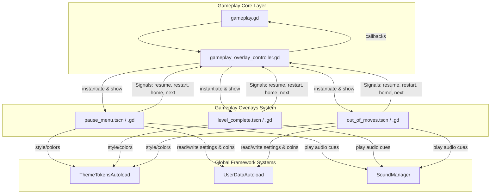

# System Design — Gameplay Overlays

Детальный технический дизайн **Gameplay Overlays** (модульные оверлеи геймплея) для Neo Soft Frost.

> **System ID**: `gameplay-overlays`  
> **Related Requirements**: [REQ-UI-606] Paused, [REQ-UI-607] Level Complete, [REQ-UI-608] Out of Moves  
> **Target Version**: `genesis/v6`

---

## 1. Overview

### Цель
Вынести программную (процедурную) сборку оверлеев Паузы, Победы и Поражения из `gameplay.gd` в отдельные, изолированные, высокопроизводительные сцены `.tscn` с чистой декларативной разметкой, разделением обязанностей и интерактивным сочным фидбеком.

---

## 2. Goals & Non-Goals

### Goals
- **Изоляция**: Геймплейный контроллер `gameplay.gd` не должен собирать UI-элементы вручную. Он должен лишь инсталлировать оверлеи и подписываться на их сигналы.
- **1к1 Визуальное Соответствие**: Достичь полного премиум-вида с матовым стеклом, неоновой окантовкой и мягкими тенями согласно референсам `(5).png`, `(6).png` и `(7).png`.
- **Сочные анимации**: Реализовать отскоки кнопок, последовательную сборку звёзд и нарастающий счётчик очков (roll-up score).
- **Синхронизация с токенами**: Использовать `ThemeTokens` для всех цветов, шрифтов и радиусов.

### Non-Goals
- Real-time 3D рендеринг внутри оверлеев.
- Сетевая валидация покупок (покупка ходов за 900 монет проверяется локально в `UserData`).

---

## 3. Architecture & Boundaries



### Границы ответственности
- **Входы (Inputs)**: Данные о результатах (очки, звёзды, награды, незавершённые цели), передаваемые через метод `setup_data()`.
- **Выходы (Outputs)**: Сигналы действий пользователя (`resume_requested`, `restart_requested`, `home_requested`, `next_level_requested`, `moves_add_requested`), передаваемые наверх.

---

## 4. Interface Design

Каждая сцена оверлея предоставляет строго типизированный интерфейс для управления:

### 4.1 PauseMenu (`pause_menu.gd`)
```gdscript
signal resume_requested
signal restart_requested
signal home_requested

# Загружает сохраненные настройки громкости и haptics
func _load_user_settings() -> void
```

### 4.2 LevelComplete (`level_complete.gd`)
```gdscript
signal next_level_requested
signal share_requested
signal home_requested

# Передает результаты победы для запуска счетчиков очков и звезд
func setup_data(result: Dictionary) -> void
```

### 4.3 OutOfMoves (`out_of_moves.gd`)
```gdscript
signal retry_requested
signal add_moves_requested
signal home_requested

# Загружает невыполненные цели для отрисовки карточек
func setup_data(remaining_goals: Array[Dictionary]) -> void
```

---

## 5. Technology Stack & Components

- **Godot 4.x Control Nodes**: `PanelContainer`, `MarginContainer`, `VBoxContainer`, `HBoxContainer`, `Label`, `Button`, `HSlider`.
- **Juicy Animations**: Использование `create_tween()` с кривыми `TRANS_BACK` и `TRANS_BOUNCE` для упругого отскока при наведении и кликах.
- **Tabular Monospace Fonts**: Числа счёта и монет используют моноширинные начертания для предотвращения мерцания (jitter) при Roll-up анимации.

---

## 6. Trade-offs & Alternatives

### Выбор: Standalone Scenes vs Programmatic Generator

| Вариант | Pros | Cons |
|---|---|---|
| **Programmatic Generator (v5)** | Меньше файлов в папке scenes, всё в одном месте | Тяжело верстать сложные адаптивные сетки, невозможно настроить визуальные переходы в редакторе |
| **Standalone Scenes (v6, Наш выбор)** | Визуальный контроль в Godot Editor, чистый код без UI-мусора, легкая полировка 1к1 | Увеличение количества файлов на 3 штуки |

*Решение*: Standalone Scenes идеально подходит под требования Premium UI и исключает design drift.

---

## 7. Performance & Security

- **Shader Performance**: Тяжелый шейдер размытия (`BackBufferCopy`) отключается наSAFE профиле (`android_safe`), заменяясь на плоскую сплошную заливку `GLASS_BG_STRONG` (white 58% opacity).
- **Audio Overlap Protection**: Все звуки кнопок проходят через `SoundManager` с подавлением дребезга (debounce) для исключения перекрытия аудио-дорожек.
- **Focus Trap**: При открытии модального оверлея фокус ввода клавиатуры/геймпада захватывается внутри панели, предотвращая случайные клики по скрытым кнопкам игрового поля.

---

## 8. Testing Strategy

- **GUT Unit Testing**:
  - Проверка корректности сигналов кнопок при эмуляции нажатий.
  - Проверкаrollup-счетчика: эмуляция завершается ровно на целевом числе очков.
- **Manual Verification**:
  - Запуск оверлеев на экранах с пропорциями 16:9, 18:9, 20:9 для тестирования верстки.
  - Проверка отключения размытия при переключении ползунка Safe Profile в настройках.
