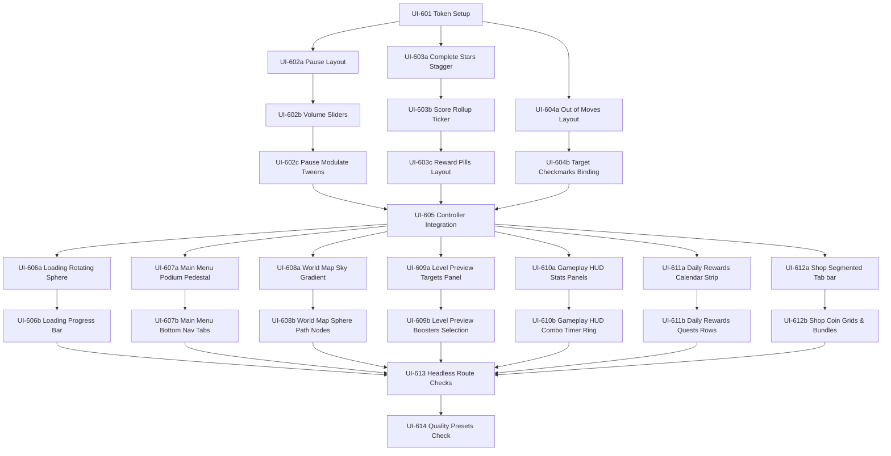

# Work Breakdown Structure — Genesis v6.1 (Highly Granular UI/UX Soft Frost Tasks)

> **System Version**: `genesis/v6.1`
> **Status**: IN PROGRESS (Extremely detailed tasks for separating overlay scenes and 1-to-1 polish)
> **Target Engine**: Godot 4.x
> **Core Principle**: strict token execution, pixel-perfect layout nodes, modular scene architectures.
> **Last Updated**: 2026-05-27

---

## 1. Обзор фаз разработки (Phase Overview)

```text
Phase 1: Foundation & Modular Overlays (Granular)
  ├─► UI-601: Design token validation
  ├─► UI-602a/b/c: Standalone Pause Menu scene, slider logic, entrance tweens
  ├─► UI-603a/b/c: Standalone Level Complete scene, star bounces, score ticker, rewards
  ├─► UI-604a/b: Standalone Out of Moves scene, sad sphere visual, objectives checkmarks
  └─► UI-605: Main gameplay controllers integration
Phase 2: Remaining 7 Screens Polish 1к1 (Granular)
  ├─► UI-606a/b: Loading screen rotating sphere, tap-to-start progress bar
  ├─► UI-607a/b: Main menu glass podium, top currency bar & bottom nav tabs
  ├─► UI-608a/b: World map sky gradient, glossy node path & locked lock states
  ├─► UI-609a/b: Level preview target cards, boosters grid & start level CTA
  ├─► UI-610a/b: Gameplay HUD stats column panels, boosters list & combo timer ring
  ├─► UI-611a/b: Daily Rewards 7-day strip list, featured podium & quest rows
  └─► UI-612a/b: Shop coins grid, booster bundles list & specials tab
Phase 3: Automated Validation & Performance Tiers
  └─► UI-613 & UI-614: Headless routes, smoke testing and shader budget gates
```

---

## 2. Глобальные правила интеграции (Integration Rules)

* **Токены**: Все цвета, скругления (RADIUS), отступы (SPACE) берутся только из `ThemeTokens.color_path()`, `ThemeTokens.spacing()`, `ThemeTokens.radius()`.
* **Юниты анимаций**: Вся входная динамика и переходы используют константы скоростей (`ThemeTokens.motion_value("modal_bounce_duration")`).
* **Мобильные лимиты**: Использование шейдеров блюра ограничивается 1 активной нодой `BackBufferCopy` на экран.

---

## 3. Граф зависимостей задач (Dependency Graph)



---

## 4. Детальный список задач (WBS Task List)

### Phase 1 — Foundation & Modular Overlays

#### - [ ] **[UI-601] Design Token Setup & Scheme Validation**
- **Goal**: Убедиться в корректности и полноте всех токенов цветов, шрифтов и радиусов в `theme_tokens.json`.
- **Input**: [ui-ux-design-system.md](file:///Users/user/3-line/genesis/v6/04_SYSTEM_DESIGN/ui-ux-design-system.md)
- **Output**: Валидированный `data/ui/theme_tokens.json`.
- **Verification**: Запуск геймплея считывает токен `shared.colors.bg_top` без предупреждений в консоли.
- **Dependencies**: None

#### - [ ] **[UI-602a] Pause Menu Glass Panel Layout**
- **Goal**: Создать сцену `pause_menu.tscn` с полупрозрачной подложкой Scrim и отцентрированным контейнером `GlassPanel` (420x720).
- **Input**: [ui_ux_system.md](file:///Users/user/3-line/genesis/v6/04_SYSTEM_DESIGN/ui_ux_system.md)
- **Output**: `scenes/gameplay/pause_menu.tscn`, `scenes/gameplay/pause_menu.gd` (базовый слой).
- **Verification**: Запуск сцены отображает размытый полупрозрачный оверлей с кнопками Resume, Restart, Home по центру.
- **Dependencies**: **[UI-601]**

#### - [ ] **[UI-602b] Pause Volume Sliders & Settings Setup**
- **Goal**: Разработать раздел настроек внутри Pause Menu: слайдеры громкости звука и музыки, тумблер Haptics.
- **Input**: `UI-602a`
- **Output**: `scenes/gameplay/pause_menu.gd` (слой настроек).
- **Verification**: Движение слайдеров сохраняет значения в `UserData` и корректно обновляет надписи; кнопка Haptics меняет текст (ON/OFF).
- **Dependencies**: **[UI-602a]**

#### - [ ] **[UI-602c] Pause Entry-Exit Scale Modulate Tweens**
- **Goal**: Реализовать плавное появление и сокрытие панели паузы с эффектом Bounce-in (`scale(0.92 -> 1.0)`) и затуханием Scrim.
- **Input**: `UI-602b`, [motion-animation-system.md](file:///Users/user/3-line/genesis/v6/04_SYSTEM_DESIGN/motion-animation-system.md)
- **Output**: `scenes/gameplay/pause_menu.gd` (анимационный слой).
- **Verification**: Клик по CloseButton запускает плавный fade-out (160ms) и удаляет ноду из дерева.
- **Dependencies**: **[UI-602b]**

#### - [ ] **[UI-603a] Level Complete Stars rating staggered animations**
- **Goal**: Разработать сцену `level_complete.tscn` и анимацию последовательного появления до 3 звёзд с bounce-эффектом (интервал 0.28с).
- **Input**: [motion-animation-system.md](file:///Users/user/3-line/genesis/v6/04_SYSTEM_DESIGN/motion-animation-system.md)
- **Output**: `scenes/gameplay/level_complete.tscn`, `scenes/gameplay/level_complete.gd` (звёздный слой).
- **Verification**: Вызов `setup_data` с `stars=3` по очереди анимирует звёзды с желтым свечением.
- **Dependencies**: **[UI-601]**

#### - [ ] **[UI-603b] Level Complete Score roll-up ticker & New Best Badge**
- **Goal**: Создать текстовый счетчик очков с плавным нарастанием значений (roll-up) и выездную розовую плашку "NEW BEST!".
- **Input**: `UI-603a`
- **Output**: `scenes/gameplay/level_complete.gd` (слой счёта).
- **Verification**: Числа плавно увеличиваются до `target_score` за 1.0 секунду; проигрывается звук "win" при достижении максимума.
- **Dependencies**: **[UI-603a]**

#### - [ ] **[UI-603c] Level Complete Gold & Stars Rewards layout**
- **Goal**: Нарисовать горизонтальные полупрозрачные плашки наград (Coins и Stars) со скруглёнными границами и морозной текстурой.
- **Input**: `UI-603b`
- **Output**: `scenes/gameplay/level_complete.gd` (слой наград).
- **Verification**: Суммы наград корректно парсятся из переданного словаря результатов.
- **Dependencies**: **[UI-603b]**

#### - [ ] **[UI-604a] Out of Moves Layout & Sad Star Visual Anchor**
- **Goal**: Создать сцену `out_of_moves.tscn` с крупной грустной полупустой звездой-сферой над заголовком "Out of Moves".
- **Input**: [ui_ux_system.md](file:///Users/user/3-line/genesis/v6/04_SYSTEM_DESIGN/ui_ux_system.md)
- **Output**: `scenes/gameplay/out_of_moves.tscn`, `scenes/gameplay/out_of_moves.gd` (визуальный слой).
- **Verification**: Звезда плавно покачивается в воздухе по синусоиде; оверлей Scrim затемняет игровое поле.
- **Dependencies**: **[UI-601]**

#### - [ ] **[UI-604b] Out of Moves Target Checkmarks Binding**
- **Goal**: Сформировать плашку текущих целей уровня в центре экрана с проставлением галочек напротив выполненных задач.
- **Input**: `UI-604a`
- **Output**: `scenes/gameplay/out_of_moves.gd` (логический слой целей).
- **Verification**: Кнопка "Add 5 Moves" активна, показывает стоимость в 900 монет и при нажатии списывает монеты у игрока.
- **Dependencies**: **[UI-604a]**

#### - [ ] **[UI-605] Gameplay Overlay Integration**
- **Goal**: Полностью интегрировать 3 новых модульных оверлея в `gameplay.gd` и `gameplay_overlay_controller.gd`, удалив старый процедурный рендеринг.
- **Input**: **[UI-602c]**, **[UI-603c]**, **[UI-604b]**
- **Output**: Модифицированные `scenes/gameplay/gameplay.gd` и `scenes/gameplay/presenters/gameplay_overlay_controller.gd`.
- **Verification**: Все три события (пауза, победа, проигрыш) успешно вызывают новые модальные окна без крашей FSM.
- **Dependencies**: **[UI-602c]**, **[UI-603c]**, **[UI-604b]**

---

### Phase 2 — Remaining 7 Screens Polish (1-to-1 Mockup Alignment)

#### - [ ] **[UI-606a] Loading Screen Holographic Sphere**
- **Goal**: Разработать центральную трехмерную вращающуюся голографическую сферу и облачный футер 1к1 по референсу `(10).png`.
- **Input**: `ui1/screens 01/ (10).png`
- **Output**: `scenes/boot/loading_screen.tscn` (визуальная часть).
- **Verification**: Сфера вращается с мягким свечением и параллаксом; на заднем фоне летят легкие пузыри.
- **Dependencies**: **[UI-605]**

#### - [ ] **[UI-606b] Loading Screen Tap-to-start progress bar**
- **Goal**: Реализовать радужный прогресс-бар загрузки и мигающий призыв "✦ Tap to Start ✦".
- **Input**: `UI-606a`
- **Output**: `scenes/boot/loading_screen.tscn` / `loading_screen.gd`.
- **Verification**: Прогресс асинхронно считывает манифест ассетов и плавно заполняется; нажатие по экрану переводит в Главное меню.
- **Dependencies**: **[UI-606a]**

#### - [ ] **[UI-607a] Main Menu Glass Podium Pedestal**
- **Goal**: Обновить главное меню по референсу `(1).png`, добавив стеклянный подиум под вращающуюся сферу и легкие подвешенные кристаллы-бриллианты.
- **Input**: `ui1/screens 01/ (1).png`
- **Output**: `scenes/menus/main_menu.tscn` (с подиумом).
- **Verification**: Кристаллы покачиваются на тонких нитях; курсор мыши создает мягкое смещение слоев (параллакс).
- **Dependencies**: **[UI-605]**

#### - [ ] **[UI-607b] Main Menu Currency pills & bottom nav tabs**
- **Goal**: Переодеть плашки монет/звезд и кнопки быстрого доступа в изящное морозное стекло со скруглениями CARD (28px).
- **Input**: `UI-607a`
- **Output**: `scenes/menus/main_menu.tscn` / `main_menu.gd`.
- **Verification**: Все кнопки поддерживают плавное наведение (scale 1.06) и упругий отскок при нажатии.
- **Dependencies**: **[UI-607a]**

#### - [ ] **[UI-608a] World Map horizontal sky gradient**
- **Goal**: Нарисовать мягкий фоновый градиент неба и парящие облака 1к1 по референсу `(2).png`.
- **Input**: `ui1/screens 01/ (2).png`
- **Output**: `scenes/menus/world_map.tscn` (задний фон).
- **Verification**: Фон плавно переливается от нежно-розового до светло-голубого.
- **Dependencies**: **[UI-605]**

#### - [ ] **[UI-608b] World Map winding sphere nodes path**
- **Goal**: Сформировать дорожку уровней из блестящих нод-сфер со звездами (0-3) и индикатором текущего положения игрока.
- **Input**: `UI-608a`
- **Output**: `scenes/menus/world_map.tscn` / `world_map.gd`.
- **Verification**: Пройденные уровни светятся; закрытые уровни имеют тусклый вид и значок замка.
- **Dependencies**: **[UI-608a]**

#### - [ ] **[UI-609a] Level Preview Targets Panel**
- **Goal**: Создать карточку предпросмотра целей уровня и карту раскладки препятствий на стеклянной основе по референсу `(3).png`.
- **Input**: `ui1/screens 01/ (3).png`
- **Output**: `scenes/menus/level_preview.tscn` (карточка целей).
- **Verification**: Отображаются иконки необходимых сфер с требуемым количеством; фон имеет нежную окантовку.
- **Dependencies**: **[UI-605]**

#### - [ ] **[UI-609b] Level Preview Boosters Selection**
- **Goal**: Реализовать строку выбора бустеров (Перемешивание, Молот, Радужная сфера) с отображением имеющегося количества.
- **Input**: `UI-609a`
- **Output**: `scenes/menus/level_preview.tscn` / `level_preview.gd`.
- **Verification**: Клик по бустеру выделяет его рамкой; кнопка "Start Level" плавно анимируется.
- **Dependencies**: **[UI-609a]**

#### - [ ] **[UI-610a] Gameplay HUD stats column panels**
- **Goal**: Переодеть панели ходов и очков в геймплее HUD в скругленные морозные плашки со скруглением MD (22px) по референсу `(4).png`.
- **Input**: `ui1/screens 01/ (4).png`
- **Output**: `scenes/gameplay/gameplay.tscn` (HUD плашки).
- **Verification**: Числа ходов и очков отлично читаются; фон плашек полупрозрачный.
- **Dependencies**: **[UI-605]**

#### - [ ] **[UI-610b] Gameplay HUD boosters list & Combo countdown ring**
- **Goal**: Отполировать нижнюю панель бустеров и радиальное неоновое кольцо Combo Window.
- **Input**: `UI-610a`
- **Output**: `scenes/gameplay/gameplay.tscn` (HUD бустеры и комбо).
- **Verification**: Бустеры показывают правильное количество; кольцо комбо плавно тает при ожидании хода.
- **Dependencies**: **[UI-610a]**

#### - [ ] **[UI-611a] Daily Rewards 7-day strip calendar**
- **Goal**: Отрисовать карточки наград на 7 дней со статусами Claimed (галочка), Current (подсветка) и Locked по референсу `(8).png`.
- **Input**: `ui1/screens 01/ (8).png`
- **Output**: `scenes/menus/daily_rewards.tscn` (календарь наград).
- **Verification**: Пройденные дни имеют легкое затемнение с зеленой галочкой; текущий день пульсирует золотом.
- **Dependencies**: **[UI-605]**

#### - [ ] **[UI-611b] Daily Rewards Quests & featured podium**
- **Goal**: Разработать витрину главной награды 7-го дня и список ежедневных квестов с полосками прогресса.
- **Input**: `UI-611a`
- **Output**: `scenes/menus/daily_rewards.tscn` / `daily_rewards.gd`.
- **Verification**: Квесты показывают прогресс-бар; кнопка "Claim" активна только при накоплении наград.
- **Dependencies**: **[UI-611a]**

#### - [ ] **[UI-612a] Shop Segmented Tab bar**
- **Goal**: Сделать красивый переключатель вкладок магазина (Монеты, Бустеры, Наборы) с плавным переливом градиента по референсу `(9).png`.
- **Input**: `ui1/screens 01/ (9).png`
- **Output**: `scenes/menus/shop.tscn` (переключатель вкладок).
- **Verification**: Активная вкладка выделяется мягкой неоновой обводкой; неактивные вкладки слегка приглушены.
- **Dependencies**: **[UI-605]**

#### - [ ] **[UI-612b] Shop coin grids & bundles layout**
- **Goal**: Сформировать карточки товаров (паки монет от Pile до Vault) с яркими значками монет и кнопками цены.
- **Input**: `UI-612a`
- **Output**: `scenes/menus/shop.tscn` / `shop.gd`.
- **Verification**: Нажатие по товару открывает подтверждение; наборы бустеров показывают ленточки "Best Value".
- **Dependencies**: **[UI-612a]**

---

### Phase 3 — Integration & Validation

#### - [ ] **[UI-613] Headless Route Checks**
- **Goal**: Проверить валидность всех переходов между 10 экранами с помощью автоматического тестового скрипта.
- **Input**: `scripts/validation/validate_ui_routes.gd`
- **Output**: Отчет о валидации переходов в консоли.
- **Verification**: Запуск команды `godot --headless --path . -s scripts/validation/validate_ui_routes.gd` завершается с exit code 0.
- **Dependencies**: All Phase 2 tasks completed.

#### - [ ] **[UI-614] Quality Presets & shader quality check**
- **Goal**: Проверить корректность отключения тяжелых шейдеров при выборе SAFE профиля на мобильных устройствах.
- **Input**: `scenes/ui/ui_screen_manager.gd`, **[UI-605]**
- **Output**: Отчет по потреблению ресурсов и FPS на SAFE-профиле.
- **Verification**: При переключении в режим SAFE тяжелый шейдерный блюр отключается, заменяясь на плоскую полупрозрачную подложку; FPS стабильно держится выше 55.
- **Dependencies**: **[UI-613]**
